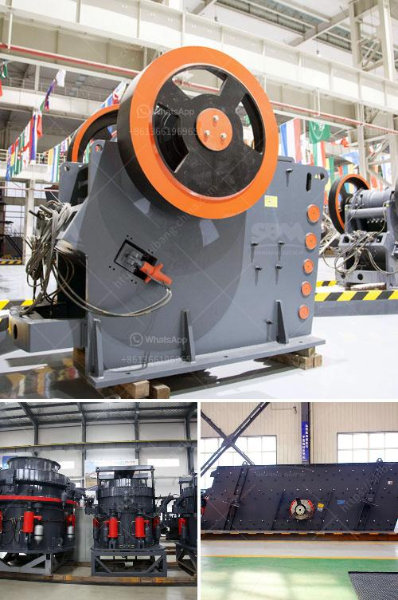

<h3>مصانع الأسمنت الحجر في أفريقيا</h3>
تعتبر صناعة الأسمنت من الصناعات الهامة والضرورية في أفريقيا، حيث يتم استخدامها في العديد من القطاعات مثل البناء والبنية التحتية. يجرى إنتاج الأسمنت الحجر في العديد من الدول الأفريقية لتلبية الاحتياجات المحلية وتعزيز اقتصادها.

تتميز مصانع الأسمنت الحجر في أفريقيا بالقدرة على إنتاج كميات كبيرة من الأسمنت، مما يساهم في تنمية الاقتصاد وتوفير فرص العمل للمواطنين. كما أن الاستثمار في صناعة الأسمنت يشجع على تطوير البنية التحتية وتوفير الإسكان والمنشآت الأخرى.

توجد العديد من الدول الأفريقية التي تمتلك مصانع إنتاج الأسمنت الحجر، مثل مصر والمغرب ونيجيريا وكينيا وتنزانيا. تمتلك مصر أكبر قدرة إنتاجية للأسمنت في القارة الأفريقية، حيث تنتج حوالي 50 مليون طن سنوياً. تليها المغرب بقدرة إنتاجية تبلغ 35 مليون طن، ونيجيريا بـ 24 مليون طن سنوياً.

تعد مصانع الأسمنت الحجر في أفريقيا مصدر للعديد من فرص العمل، حيث يتم توظيف العديد من العمال في عملية صناعة الأسمنت. وعلى الرغم من توافر فرص العمل، إلا أن هذه الصناعة تواجه بعض التحديات مثل قلة الموارد الطبيعية المستخدمة في إنتاج الأسمنت مثل الحجر الجيري والرمل والطين.

إلى جانب ذلك، تعتبر صناعة الأسمنت الحجر في أفريقيا مسؤولة عن إصدار كميات كبيرة من غازات الدفيئة، مما يؤثر على البيئة. ومن أجل تحسين الوضع البيئي، بدأت الحكومات والشركات بتبني تكنولوجيا أكثر استدامة لإنتاج الأسمنت، والتي تقلل من الانبعاثات وتستخدم مواد بديلة مثل الرماد النباتي والخبث.

بالإضافة إلى ذلك، تعمل شركات الأسمنت في أفريقيا على تعزيز الابتكار ودعم الأبحاث والتطوير لتحسين حجم الإنتاج وتقديم منتجات أكثر جودة. ويتم ذلك من خلال التعاون مع الجامعات والمؤسسات الأكاديمية والتقنية.

في الختام، تتطلب الاحتياجات المتنامية في أفريقيا من الأسمنت الحجر زيادة الاستثمار في هذه الصناعة الحيوية. يجب أن تعمل الحكومات والشركات على تنمية مصانع الأسمنت الحجر وتحسين تكنولوجيا الإنتاج لتلبية الاحتياجات المحلية وزيادة الصادرات، وفي نفس الوقت الحفاظ على البيئة وتعزيز التنمية المستدامة.
<h3>Contact us</h3><ul><li><strong>Whatsapp:&nbsp;<a href="https://wa.me/8613661969651">+8613661969651</a></strong></li><li><a href="https://swt.shibang-china.com/?git&amp;zhl&amp;مصانع الأسمنت الحجر في أفريقيا"><strong>Online Service(chat now)</strong></a></li></ul><h3>Related</h3><ul><li><a href='معدات مصنع حجر الرمل.md'>معدات مصنع حجر الرمل</a></li><li><a href='مكاتب CAD لمعدات التعدين.md'>مكاتب CAD لمعدات التعدين</a></li><li><a href='كسارات تأجير.md'>كسارات تأجير</a></li><li><a href='أحجام كسارة الفك الحجر الجيري.md'>أحجام كسارة الفك الحجر الجيري</a></li><li><a href='أسعار مصنع الكسارة بوزولانا 50 طن في الساعة.md'>أسعار مصنع الكسارة بوزولانا 50 طن في الساعة</a></li></ul>