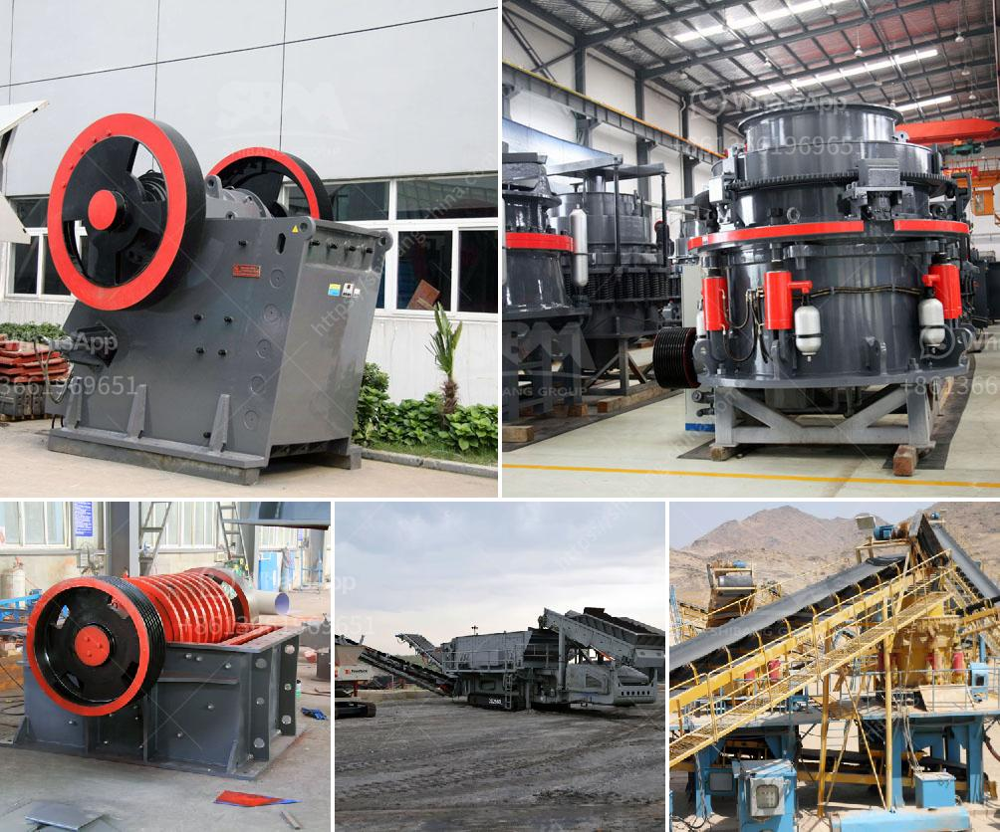

<h3>مصانع الإسمنت للبيع في باكستان</h3>
تشتهر باكستان بصناعتها القوية للإسمنت، حيث تضم العديد من المصانع التي تنتج الإسمنت عالي الجودة. ولأولئك الذين يبحثون عن فرصة للاستثمار في هذا القطاع، توفر السوق الباكستانية العديد من المصانع والوحدات الصناعية المتاحة للبيع.

تعد صناعة الإسمنت من الصناعات الرئيسية في باكستان، حيث يعتبر الإسمنت أحد المواد الأساسية في قطاع البناء والتشييد. تستخدم الإسمنت في إنشاء المباني والطرق والجسور والأعمال الإنشائية الأخرى. وبالنظر إلى نمو السكان والتطور العمراني في البلاد، فإن هناك طلب متزايد على الإسمنت.

تتوفر في باكستان العديد من المصانع المتخصصة في إنتاج الإسمنت. هذه المصانع تعمل على توفير الإسمنت عالي الجودة وفقًا للمعايير الصناعية المحلية والدولية. وبالإضافة إلى ذلك، تعمل بعض المصانع على تطوير تقنيات جديدة لإنتاج الإسمنت بطرق أكثر اقتصادية وكفاءة.

وتشمل مصانع الإسمنت في باكستان أكثر من 20 وحدة صناعية. وتتوزع هذه المصانع على مختلف المناطق في البلاد، مثل كراتشي، لاهور، وفيصل آباد. وتستخدم هذه المصانع أحدث التقنيات في عمليات الإنتاج والتصنيع.

تتوفر في السوق الباكستانية فرص للاستثمار في مصانع الإسمنت. يمكن للمستثمرين شراء وحدات صناعية جاهزة للإنتاج، أو استثمار في إنشاء مصنع جديد. وتوفر الحكومة الباكستانية العديد من التسهيلات والامتيازات للمستثمرين في قطاع الإسمنت، مثل التخفيضات الضريبية والدعم الحكومي.

وباعتبار صناعة البناء والتشييد من أسرع القطاعات ازدهارًا في باكستان، فإن الطلب على الإسمنت متوقع أن يزداد في السنوات القادمة. وبالتالي، فإن استثمارات في صناعة الإسمنت ستكون فرصة مثالية للمستثمرين الذين يسعون للدخول إلى سوق البناء في البلاد.

باختصار، صناعة الإسمنت في باكستان توفر فرصًا واعدة للاستثمار. ومع الاعتماد المتزايد على المواد الإنشائية والبناء في البلاد، يوجد طلب متزايد على الإسمنت عالي الجودة. لذلك، يمكن للمستثمرين الاستفادة من هذه الفرصة من خلال شراء مصانع الإسمنت المتاحة في السوق الباكستانية والاستفادة من التوسع السريع في قطاع البناء.
<h3>Contact us</h3><ul><li><strong>Whatsapp:&nbsp;<a href="https://wa.me/8613661969651">+8613661969651</a></strong></li><li><a href="https://swt.shibang-china.com/?git&amp;zhl&amp;مصانع الإسمنت للبيع في باكستان"><strong>Online Service(chat now)</strong></a></li></ul><h3>Related</h3><ul><li><a href='مصنع تحسين الكروميت في ماليزيا.md'>مصنع تحسين الكروميت في ماليزيا</a></li><li><a href='مصنع كسارة الفك في ولاية جوجارات الهند.md'>مصنع كسارة الفك في ولاية جوجارات الهند</a></li><li><a href='مطحنة ريموند في تشيناي.md'>مطحنة ريموند في تشيناي</a></li><li><a href='كسارات متنقلة في قطر.md'>كسارات متنقلة في قطر</a></li><li><a href='بيع كسارة الحجر 400 طن في الساعة.md'>بيع كسارة الحجر 400 طن في الساعة</a></li></ul>