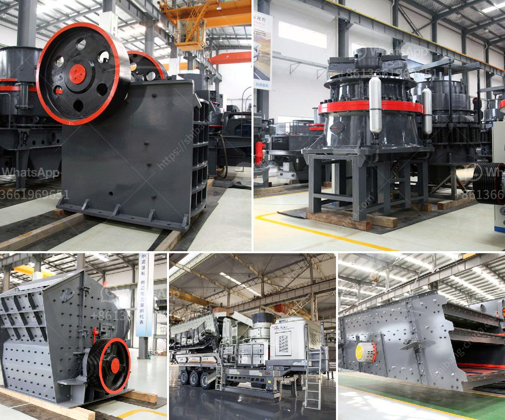

<h3>مصانع التعدين في مصر</h3>
تعد صناعة التعدين من الصناعات الحيوية في مصر، حيث تلعب دوراً هاماً في اقتصاد البلاد. تشتهر مصر بوجود مجموعة واسعة من المعادن القيمة مثل الفوسفات والزنك والذهب والحديد والفضة والرخام والجبس والكاولين. نظرًا لوفرة الموارد المعدنية في البلاد، توجد العديد من المصانع التعدينية في مصر.

أحد المصانع التعدينية الرئيسية في مصر هو مصنع الفوسفات الذي ينتج الفوسفات الطبيعي الخام، ويعتبر مصر واحدة من أكبر الدول المنتجة للفوسفات في العالم. يتم استخراج الفوسفات من مناجم الجبل الخاص بالصحراء الشرقية، ويتم تصنيعه وتكريره في المصنع ثم يتم تصديره إلى العديد من الدول الأخرى.

بالإضافة إلى مصنع الفوسفات، توجد أيضًا مصانع أخرى تنتج المعادن الأخرى مثل الحديد والذهب. تمتلك مصر العديد من مناجم الحديد وتعتبر واحدة من أكبر منتجي الآهن في الشرق الأوسط وشمال أفريقيا. تستخدم معظم المصانع التعدينية في مصر تقنيات حديثة لاستخلاص وتصنيع المعادن وتحسين العملية بشكل عام.

بالإضافة إلى هذه المصانع، تسعى الحكومة المصرية لجذب المزيد من الاستثمارات في قطاع التعدين. تهدف الجهود الحكومية إلى جذب المزيد من الشركات العالمية للاستثمار في المناجم التعدينية الجديدة وتنمية الموارد المعدنية الأخرى. يتم توفير العديد من الحوافز المالية والمرافق الحديثة للشركات الراغبة في الاستثمار في هذه الصناعة.

ومع ذلك، تواجه صناعة التعدين في مصر بعض التحديات. تتضمن هذه التحديات مشاكل البيروقراطية والتنظيم البيئي الصارم وعدم وجود بنية تحتية قوية في المناطق النائية. ومع ذلك، فإن الحكومة المصرية تعمل على تجاوز هذه التحديات وتقديم الدعم اللازم للصناعة.

باختصار، يعد قطاع التعدين في مصر مهمًا لاقتصاد البلاد، حيث يوفر فرص عمل وإيرادات مالية. توجد العديد من المصانع التعدينية في مصر التي تنتج العديد من المعادن المختلفة. تعمل الحكومة على جذب المزيد من الاستثمارات في هذا القطاع ودعم تطويره.
<h3>Contact us</h3><ul><li><strong>Whatsapp:&nbsp;<a href="https://wa.me/8613661969651">+8613661969651</a></strong></li><li><a href="https://swt.shibang-china.com/?git&amp;zhl&amp;مصانع التعدين في مصر"><strong>Online Service(chat now)</strong></a></li></ul><h3>Related</h3><ul><li><a href='تعدين الكاولين في إندونيسيا.md'>تعدين الكاولين في إندونيسيا</a></li><li><a href='معدات ترقية خام الحديد.md'>معدات ترقية خام الحديد</a></li><li><a href='كسارات فك متنقلة للبيع في المملكة المتحدة.md'>كسارات فك متنقلة للبيع في المملكة المتحدة</a></li><li><a href='مصنع كسارة كامل للبيع في جنوب أفريقيا.md'>مصنع كسارة كامل للبيع في جنوب أفريقيا</a></li><li><a href='آلات معالجة الأحجار الكريمة لإثيوبيا.md'>آلات معالجة الأحجار الكريمة لإثيوبيا</a></li></ul>