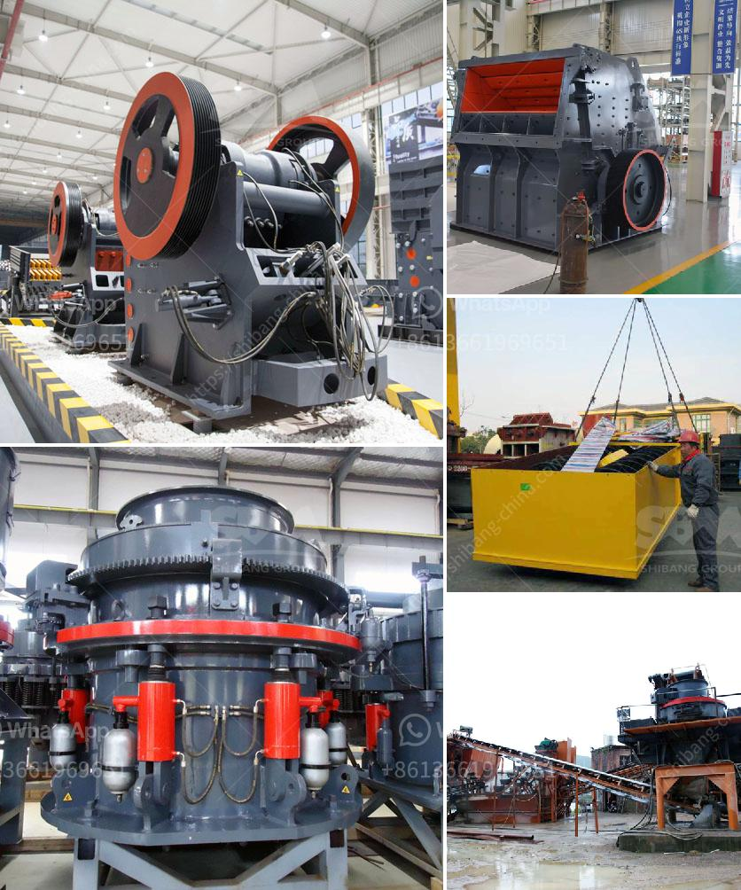

<h3>مصانع التعدين</h3>
تُعد مصانع التعدين أحد أهم القطاعات الصناعية في العالم، حيث تشهد تطورًا كبيرًا في السنوات الأخيرة. فبفضل التقنيات الحديثة والابتكارات التكنولوجية، أصبحت هذه المصانع تلعب دورًا أساسيًا في تعزيز الاقتصادات الوطنية وتوفير فرص العمل.

تعتبر مصانع التعدين مراكزًا تستخدم فيها التقنيات المتطورة لاستخراج المعادن والموارد الأخرى من باطن الأرض. تتضمن هذه المصانع مجموعة من المعدات والأجهزة مثل الحفارات والشاحنات والكسارات والطواحين وغيرها، التي تعمل بتقنيات متقدمة لزيادة الكفاءة وتحسين الإنتاجية.

تتميز مصانع التعدين بوجود احتياطيات كبيرة من الموارد الطبيعية، مثل الذهب والفضة والنحاس والفحم وغيرها. وبفضل هذه المصانع، يتمكن البلدان من استغلال هذه الموارد وتحويلها إلى منتجات قيمة يمكن بيعها في الأسواق المحلية والعالمية.

تُعد مصانع التعدين أيضًا مصدرًا هامًا لتوفير فرص العمل، فهي تعمل بشكل مستمر طوال العام وتوظف عددًا كبيرًا من العمالة الماهرة وغير الماهرة. بالإضافة إلى ذلك، فإن هذه المصانع تدعم البنية التحتية للمناطق المحيطة بها، حيث تحتاج إلى خدمات النقل والاتصالات والطاقة والماء والإسكان والمرافق الأخرى.

ومع ذلك، فإن مصانع التعدين تواجه تحديات كبيرة، فالاستخراج المتواصل للموارد الطبيعية يمكن أن يؤدي إلى نضوبها وتلوث البيئة. ولذلك، يجب أن تعمل هذه المصانع بمسؤولية وتتبنى ممارسات مستدامة لحماية البيئة والحفاظ على الموارد الطبيعية للأجيال القادمة.

بالاستثمار في البحث والتطوير والابتكار، يمكن تطوير تقنيات جديدة لتعزيز كفاءة استخراج الموارد وتحسين العمليات البيئية. من خلال استخدام تقنيات التحليل البياني والذكاء الاصطناعي، يمكن تحسين إدارة المصانع وتوفير فوائد اقتصادية وبيئية أكثر.

بالختام، تُعد مصانع التعدين إحدى الموارد الاقتصادية الرئيسية في العالم. تلعب هذه المصانع دورًا فعالًا في استخراج وتحويل الموارد الطبيعية إلى منتجات ذات قيمة، وتوفير فرص العمل، وتحسين البنية التحتية للمناطق المحيطة بها. ومن خلال التركيز على التحسين المستمر والابتكار والمسؤولية الاجتماعية والبيئية، يمكن تحقيق استدامة هذا القطاع وتحقيق مصالح الجميع.
<h3>Contact us</h3><ul><li><strong>Whatsapp:&nbsp;<a href="https://wa.me/8613661969651">+8613661969651</a></strong></li><li><a href="https://swt.shibang-china.com/?git&amp;zhl&amp;مصانع التعدين"><strong>Online Service(chat now)</strong></a></li></ul><h3>Related</h3><ul><li><a href='دراسة جدوى لإنشاء محجر.md'>دراسة جدوى لإنشاء محجر</a></li><li><a href='شاشة اهتزاز عالية التردد.md'>شاشة اهتزاز عالية التردد</a></li><li><a href='حساب قطر كرة الطحن لمطحنة الكرة.md'>حساب قطر كرة الطحن لمطحنة الكرة</a></li><li><a href='مصنع كرة متنقل من ألمانيا.md'>مصنع كرة متنقل من ألمانيا</a></li><li><a href='مصنع تكسير الحجارة المستعمل للبيع في إسبانيا.md'>مصنع تكسير الحجارة المستعمل للبيع في إسبانيا</a></li></ul>