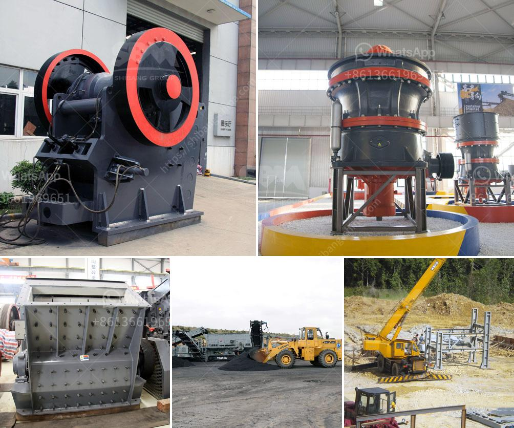

<h3>مصانع التكسير الكاملة في جيرميستون</h3>
تعتبر مصانع التكسير الكاملة في جيرميستون أحد أهم الصناعات الحديثة في المدينة، حيث تلعب دورًا رئيسيًا في عملية تكسير وتحويل المواد الخام إلى منتجات نهائية قابلة للاستخدام. تعتبر هذه المصانع حلقة الوصل الرئيسية بين صناعة التعدين وصناعة البناء والأشغال العامة.

تقوم مصانع التكسير الكاملة بتحطيم المواد الخام مثل الصخور والحجارة والركام وتحويلها إلى مواد صغيرة الحجم ومناسبة للاستخدام في البناء. تشمل عملية التكسير الكاملة عدة خطوات رئيسية مثل الكسر الأولي والطحن والفصل الجاذبي والتجفيف والتصنيف. يتم استخدام معدات متطورة وتقنيات حديثة لضمان جودة وكفاءة المنتجات النهائية.

تعتبر مصانع التكسير الكاملة في جيرميستون مناسبة للعديد من الصناعات المختلفة مثل صناعة البناء، حيث تستخدم المواد المكسرة لإنتاج الخرسانة والإسفلت والركام اللازم لبناء الطرق والمباني. يعتبر استخدام المواد المكسرة المنتجة في هذه المصانع بديلاً مستدامًا واقتصاديًا عن استخدام المواد الطبيعية الأولية مثل الحصى الطبيعي.

بالإضافة إلى صناعة البناء، تستخدم مصانع التكسير الكاملة في جيرميستون أيضًا في صناعة إعادة التدوير. فبدلاً من رمي المواد المنتهية الصلاحية في المطامر، يتم استخدامها مرة أخرى في عمليات التكسير لإنتاج مواد جديدة. هذا النوع من التدوير يساعد في الحفاظ على الموارد الطبيعية وتقليل التلوث البيئي.

وتتميز مصانع التكسير الكاملة في جيرميستون بالاهتمام بالاستدامة البيئية والجودة. تعمل هذه المصانع على تطبيق إجراءات صارمة للمحافظة على البيئة، مثل استخدام تكنولوجيا متقدمة للتحكم في الانبعاثات الضارة وإعادة تدوير المياه المستخدمة في عمليات التصنيع. يتم أيضا مراقبة جودة المنتجات المنتجة من قبل خبراء ذوي خبرة لضمان جودة ومطابقة للمواصفات.

باختصار، تعد مصانع التكسير الكاملة في جيرميستون العماد الأساسي لأنشطة البناء والتعدين في المنطقة. تلعب هذه المصانع دورًا حيويًا في إعادة تدوير وتحويل المواد الخام إلى منتجات صالحة للاستخدام في البناء. بفضل الاهتمام بالاستدامة البيئية والجودة، تساهم هذه المصانع في تعزيز التنمية المستدامة في المدينة وتلبية احتياجات السوق المحلية والعالمية.
<h3>Contact us</h3><ul><li><strong>Whatsapp:&nbsp;<a href="https://wa.me/8613661969651">+8613661969651</a></strong></li><li><a href="https://swt.shibang-china.com/?git&amp;zhl&amp;مصانع التكسير الكاملة في جيرميستون"><strong>Online Service(chat now)</strong></a></li></ul><h3>Related</h3><ul><li><a href='اقتراح مشروع تجاري لكسارة الحجر.md'>اقتراح مشروع تجاري لكسارة الحجر</a></li><li><a href='مواصفات كسارة المخروط.md'>مواصفات كسارة المخروط</a></li><li><a href='سعر رخيص لآلة تصنيع حبيبات الفحم.md'>سعر رخيص لآلة تصنيع حبيبات الفحم</a></li><li><a href='تكسير النبات بتنسيق PDF.md'>تكسير النبات بتنسيق PDF</a></li><li><a href='معدات معالجة الجبس والكالسينيشن.md'>معدات معالجة الجبس والكالسينيشن</a></li></ul>