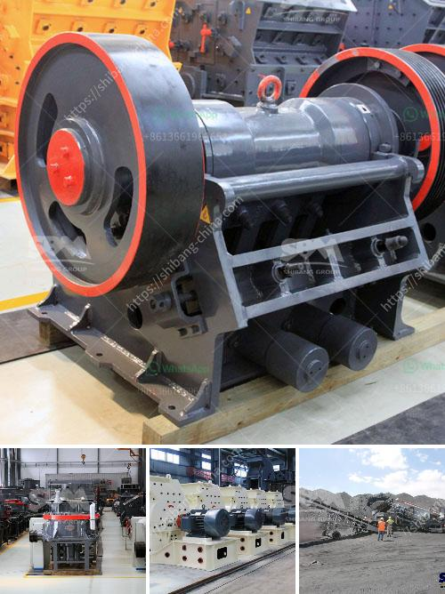

<h3>مصانع التكسير والفحص</h3>
تعتبر مصانع التكسير والفحص من أهم المنشآت في صناعة البناء. فهي تقوم بتحويل المواد الخام إلى مواد جاهزة للاستخدام في الإنشاءات والبنية التحتية. وتعتمد عملية التكسير والفحص على استخراج المواد الخام من المحاجر والتعدين، وبعد ذلك يتم تحويلها وتكسيرها إلى قطع صغيرة مناسبة للاستخدام.

يتم تصنيع مجموعة واسعة من المنتجات في مصانع التكسير والفحص، مثل الرمال والحصى والأحجار المجروشة والخرسانة الجاهزة والأسفلت، والتي تستخدم في البناء والطرق والمشاريع العمرانية الأخرى. وقد تتطلب بعض المشاريع منتجات معينة، مثل الزلط لرصف الطرق أو الخرسانة الجاهزة لبناء المباني.

تعد عمليات التكسير والفحص من أكثر عمليات الإنتاج المهمة في صناعة البناء. حيث تؤثر على جودة المنتج النهائي ومواصفاته، وبالتالي تؤثر على جودة المشاريع وعمرها الافتراضي. فعلى سبيل المثال، يجب أن يكون للمنتجات قدرة عالية على تحمل الضغط والاهتزازات، وأن تكون متينة ومستدامة. لذا فإن مصانع التكسير والفحص تهتم بالحفاظ على معايير الجودة العالية والاستخدام المستدام للموارد.

بالإضافة إلى ذلك، تلعب مصانع التكسير والفحص دورًا هامًا في الحد من التلوث الناتج عن عمليات البناء والتشييد. فبفضل هذه المصانع، يمكن إعادة تدوير المواد الخام بدلاً من التخلص منها بشكل غير صحيح، مما يقلل من احتياجنا لاستخراج المزيد من الموارد الطبيعية ويقلل من تأثيرنا البيئي.

بالاعتماد على مصانع التكسير والفحص، يتسنى للمشاريع البنائية تحقيق أهدافها بشكل أكثر كفاءة واقتصادية. فعندما يتم تصنيع المنتجات داخل البلد وفي مكان الاستخدام، يمكن توفير التكاليف التي تنجم عن توريدها من الخارج والشحن، مما يؤدي إلى توفير المال والوقت.

في الختام، فإن مصانع التكسير والفحص تلعب دورًا حاسمًا في صناعة البناء والتشييد. فهي توفر المنتجات الأساسية التي يحتاجها القطاع، وتسهم في تحقيق المشاريع بطريقة فعالة من حيث التكلفة والجودة والاستدامة. وبالتالي، لا يمكن تجاهل أهمية مصانع التكسير والفحص في تلبية احتياجات قطاع البناء ودفع تطوره نحو الاستدامة والابتكار.
<h3>Contact us</h3><ul><li><strong>Whatsapp:&nbsp;<a href="https://wa.me/8613661969651">+8613661969651</a></strong></li><li><a href="https://swt.shibang-china.com/?git&amp;zhl&amp;مصانع التكسير والفحص"><strong>Online Service(chat now)</strong></a></li></ul><h3>Related</h3><ul><li><a href='كسارة سريلانكا.md'>كسارة سريلانكا</a></li><li><a href='مناجم الكوبالت والنحاس في زامبيا.md'>مناجم الكوبالت والنحاس في زامبيا</a></li><li><a href='معدات صنع مسحوق كربونات الكالسيوم في ألمانيا.md'>معدات صنع مسحوق كربونات الكالسيوم في ألمانيا</a></li><li><a href='شاشة اهتزاز الحصى.md'>شاشة اهتزاز الحصى</a></li><li><a href='كيفية بدء عمل في مجال صناعة الكتل الخرسانية.md'>كيفية بدء عمل في مجال صناعة الكتل الخرسانية</a></li></ul>