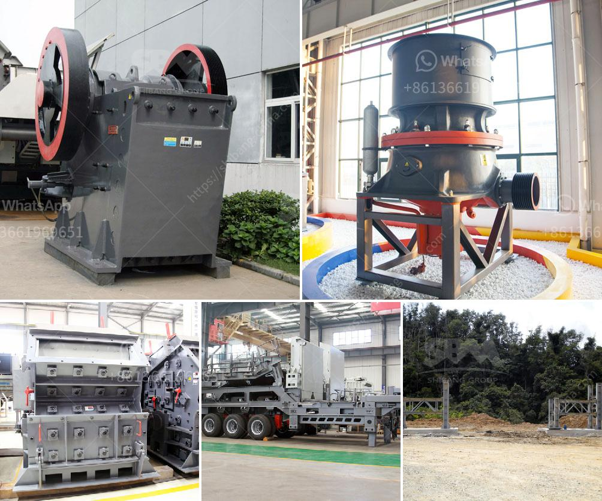

<h3>مصانع الغسيل للفحم المتنقلة والقابلة للتحجيم</h3>
تعتبر مصانع الغسيل للفحم المتنقلة والقابلة للتحجيم تكنولوجيا حديثة تسهم في تنظيف الفحم من الشوائب والملوثات قبل استخدامه في محطات توليد الكهرباء والصناعات الأخرى. تعد هذه المصانع مفيدة جدًا لأنها تعمل بشكل متنقل، مما يتيح إمكانية نقلها بسهولة إلى المواقع المناسبة وفقًا للاحتياجات.

تستخدم مصانع الغسيل للفحم المتنقلة تقنيات غسيل متطورة لإزالة الأوساخ والشوائب من الفحم. يتم نقل الفحم إلى المصنع حيث يتم فصله عن أي مواد غير مرغوب فيها مثل الصخور والرمال والماء. تتكون المصانع من أجزاء متعددة تتضمن المغسلة ومنشآت التجفيف والسيور الناقلة. تعمل هذه الأجزاء بتناغم متناسق لغسل وتنقية الفحم بفعالية عالية.

تقدم مصانع الغسيل للفحم المتنقلة العديد من الفوائد. أحد أهم هذه الفوائد هو تخفيض نسبة الشوائب في الفحم، مما يقلل من تأثير الانبعاثات الضارة على البيئة والصحة العامة. ولأن المصانع قابلة للتحجيم، يمكن تعديل حجم إنتاجها وفقًا لاحتياجات المستخدمين والتوجهات البيئية. هذا يعني أنه يمكن تكبيرها أو تصغيرها بسهولة حسب الحاجة.

بالإضافة إلى ذلك، تتميز المصانع المتنقلة بسهولة النقل والتركيب. يمكن نقلها إلى الموقع المطلوب وتجميعها في وقت قصير، مما يعني أنه يمكن إقامة وتشغيل المصنع بصورة سريعة وكفاءة. وبفضل هذه القابلية للتحرك، يمكن استخدامها في المواقع النائية التي تحتاج إلى غسل الفحم.

في الختام، تعتبر مصانع الغسيل المتنقلة والقابلة للتحجيم تكنولوجيا رائعة تساهم في تحسين جودة الوقود الأحفوري وتقليل تأثيره البيئي. إن القدرة على نقلها وتجميعها بسرعة تجعلها ملائمة للمواقع المختلفة، مما يجعلها حلاً مثاليًا في الصناعات التي تعتمد على الفحم كمصدر للطاقة الأساسي. نتوقع أن تستمر مصانع الغسيل المتنقلة في التطور والتحسين في المستقبل لتلبية المزيد من الاحتياجات والمتطلبات البيئية.
<h3>Contact us</h3><ul><li><strong>Whatsapp:&nbsp;<a href="https://wa.me/8613661969651">+8613661969651</a></strong></li><li><a href="https://swt.shibang-china.com/?git&amp;zhl&amp;مصانع الغسيل للفحم المتنقلة والقابلة للتحجيم"><strong>Online Service(chat now)</strong></a></li></ul><h3>Related</h3><ul><li><a href='رسم مصنع غسيل الفحم.md'>رسم مصنع غسيل الفحم</a></li><li><a href='أسعار مطاحن المطرقة في الرأس الشرقي.md'>أسعار مطاحن المطرقة في الرأس الشرقي</a></li><li><a href='كسارات صخور cec للبيع.md'>كسارات صخور cec للبيع</a></li><li><a href='قائمة الشركات المحاجر في نيجيريا.md'>قائمة الشركات المحاجر في نيجيريا</a></li><li><a href='مطحنة ريموند لمعالجة البازلت الجاف.md'>مطحنة ريموند لمعالجة البازلت الجاف</a></li></ul>