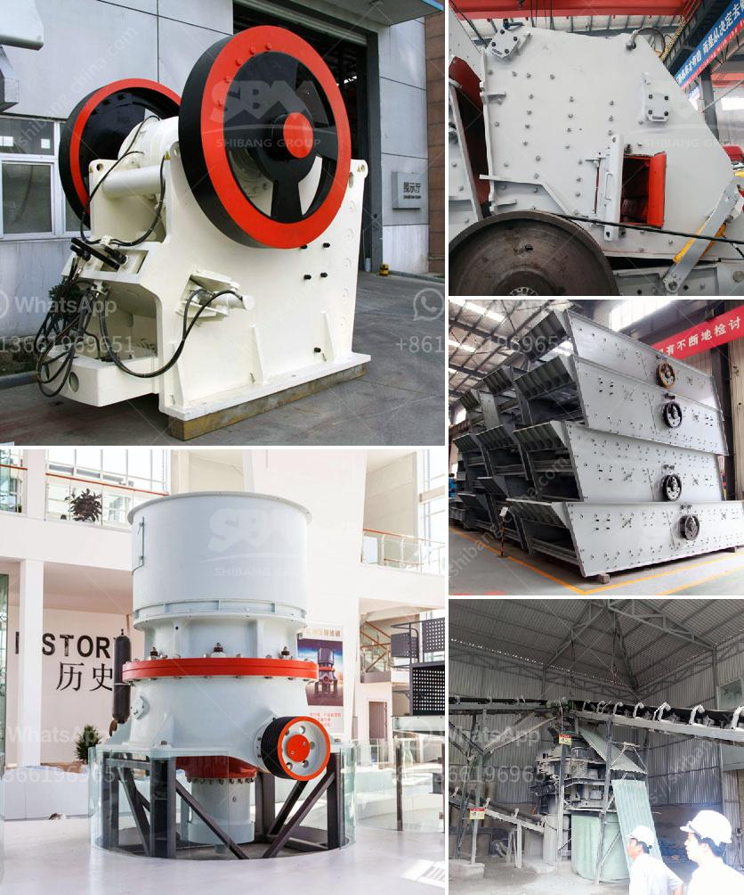

<h3>مصانع الفرز للبيع</h3>
تعتبر مصانع الفرز فرصة استثمارية مثالية لمن يرغبون في الدخول في صناعة إعادة التدوير والحفاظ على البيئة. يتم استخدام هذه المصانع لفصل المواد المستدامة من النفايات وإعادة استخدامها أو إعادة تصنيعها.

تعد مصانع الفرز أساسية في عملية إدارة النفايات في المجتمعات الحديثة. حيث تواجه الدول التحديات المتعلقة بالتخلص من النفايات بطريقة صحيحة، وإعادة التدوير واستغلال المواد القابلة للتدوير أصبحت جزءًا رئيسيًا من تلك العملية. وتعتبر مصانع الفرز الحل الأمثل لتلك التحديات، حيث تستخدم تكنولوجيا متطورة لفصل النفايات المختلفة، وتمكن من استخلاص المواد القابلة للتدوير بكفاءة وفاعلية.

تتألف مصانع الفرز من عدة أقسام ومراحل. تتضمن المرحلة الأولية جمع وفحص النفايات المختلفة بواسطة أجهزة فحص آلية تعتمد على التقنيات الحديثة مثل الأشعة السينية وجهاز الرؤية الحاسوبية لفحص المخلفات التي تعتبر ضارة أو غير مرغوب فيها. بعد ذلك، يتم ضغط النفايات وتوجيهها إلى أقسام الفرز الثانوية حيث يتم تصنيفها حسب نوعها، مثل الورق، البلاستيك، المعادن والزجاج. وتتم هذه العملية بتقنيات فحص أخرى تعتمد على الاهتزاز والتدوير والفصل المغناطيسي والترشيح.

بعد ذلك، تتم عمليات إعادة التدوير والمعالجة للمواد المصنفة، حيث يتم تقطيعها وغسلها وتجهيزها لأن تُعاد استخدامها في صناعات أخرى. ويعتبر هذا الجانب من الصناعة مربحًا، حيث يمكن بيع هذه المواد المعاد تدويرها بأسعار مرتفعة. فالورق والبلاستيك والمعادن والزجاج يمكن بيعها للشركات التي تستخدمها في عملياتها. فعلى سبيل المثال، يمكن استخدام البلاستيك في صناعة الأثاث المعاد تدويره أو إعادة استخدامه في صناعة العبوات والمنتجات البلاستيكية الأخرى.

يمكن لمصانع الفرز العمل بطاقة استيعابية متنوعة ، حيث يمكن أن تكون القدرة التشغيلية من 5 إلى 100 طن يوميًا ، وفقًا لحجم الطلب المحلي والاستثمار المتاح. يسهم ازدياد الوعي البيئي والقوانين البيئية الصارمة في زيادة الطلب على مصانع الفرز. لذلك ، تعتبر هذه الصناعة فرصة رائعة للعمل على تحقيق الربح والاستدامة في نفس الوقت.

للختام، تعتبر مصانع الفرز أحد الاستثمارات المستدامة والمربحة في صناعة إعادة التدوير. تقنيات الفرز المتطورة تجعل من الممكن استخلاص واستغلال المواد القابلة للتدوير بكفاءة وفاعلية. إضافة إلى ذلك، يمكن بيع هذه المواد المعاد تدويرها بأسعار مرتفعة. لذلك، إذا كنت مهتمًا بالاستثمار في صناعة إعادة التدوير والحفاظ على البيئة، يمكنك النظر في شراء مصنع فرز سعة تتراوح بين 200 و400 طن يوميًا.
<h3>Contact us</h3><ul><li><strong>Whatsapp:&nbsp;<a href="https://wa.me/8613661969651">+8613661969651</a></strong></li><li><a href="https://swt.shibang-china.com/?git&amp;zhl&amp;مصانع الفرز للبيع"><strong>Online Service(chat now)</strong></a></li></ul><h3>Related</h3><ul><li><a href='قائمة أسعار آلة سحق البنتونيت.md'>قائمة أسعار آلة سحق البنتونيت</a></li><li><a href='معدات طحن مطحنة ريموند.md'>معدات طحن مطحنة ريموند</a></li><li><a href='شاشة جريزلي للبيع نيوزيلندا.md'>شاشة جريزلي للبيع نيوزيلندا</a></li><li><a href='مصانع التكسير الكاملة في جيرميستون.md'>مصانع التكسير الكاملة في جيرميستون</a></li><li><a href='مصانع إعادة تدوير النحاس في الصين.md'>مصانع إعادة تدوير النحاس في الصين</a></li></ul>