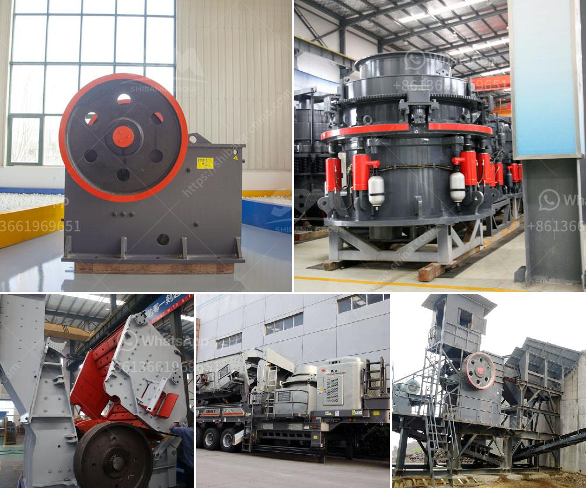

<h3>مصانع الكرات الصناعية</h3>
تعد مصانع الكرات الصناعية أحد أبرز الصناعات التي تلعب دورًا هامًا في العديد من القطاعات، بدءًا من الصناعات النفطية والغازية وصولاً إلى صناعة السيارات والطيران. تتخصص هذه المصانع في إنتاج الكرات الدقيقة المصنوعة من مواد مختلفة مثل الصلب والسيراميك والبلاستيك، وتتراوح حجمها من الأقلام الرصاص الصغيرة إلى الكرات الكبيرة المستخدمة في آلات البناء الثقيلة.

تتميز مصانع الكرات الصناعية بتقنياتها المتقدمة والمعدات الحديثة التي تستخدم لتصنيع الكرات بأعلى درجة من الدقة والجودة. تشمل هذه التقنيات آلات التشغيل المبرمجة بالكمبيوتر والروبوتات التي تستخدم للتحكم في عملية الإنتاج وضمان دقة الأبعاد ونوعية السطح. بفضل هذه التقنيات، يمكن لمصانع الكرات الصناعية تلبية الطلب المتزايد على منتجاتها وتقديم حلول مخصصة لاحتياجات العملاء.

تُستخدم الكرات الصناعية في العديد من التطبيقات، حيث يتم استخدامها للتحميل والتفريغ والتوجيه في العديد من الآلات والمعدات الصناعية، بما في ذلك الآلات الطبية وآلات النظافة والروبوتات الصناعية والآلات الزراعية. تعتبر هذه الكرات أساسية في تلك الصناعات، حيث تعمل على تحسين كفاءة العمل والحد من التآكل وتحمل الضغوط العالية.

واحدة من أهم جوانب مصانع الكرات الصناعية هي الجودة والاعتمادية. حيث يتم فحص الكرات بدقة وفحصها في عملية التصنيع لضمان جودتها ومقاومتها للتآكل والاستخدام الطويل الأمد. تتطلب هذه الصناعة أيضًا الامتثال للمعايير الدولية المتعلقة بالجودة والموثوقية والبيئة.

في الختام، تعتبر مصانع الكرات الصناعية جزءًا حيويًا في العديد من الصناعات، حيث توفر منتجات ذات جودة عالية واعتمادية للاستخدام في العديد من التطبيقات الصناعية المختلفة. من خلال استخدام تقنيات متقدمة وتكنولوجيا متطورة، تساهم مصانع الكرات الصناعية في تعزيز الإنتاجية وتحسين كفاءة العمل، وتلبية احتياجات العملاء والمعايير الدولية.
<h3>Contact us</h3><ul><li><strong>Whatsapp:&nbsp;<a href="https://wa.me/8613661969651">+8613661969651</a></strong></li><li><a href="https://swt.shibang-china.com/?git&amp;zhl&amp;مصانع الكرات الصناعية"><strong>Online Service(chat now)</strong></a></li></ul><h3>Related</h3><ul><li><a href='كسارة حجر الجرانيت المحمولة.md'>كسارة حجر الجرانيت المحمولة</a></li><li><a href='عملية تصنيع بروميد الكالسيوم.md'>عملية تصنيع بروميد الكالسيوم</a></li><li><a href='محطة سحق ثابتة بسعة 200 طن في الساعة.md'>محطة سحق ثابتة بسعة 200 طن في الساعة</a></li><li><a href='مصنع تكسير خام البوكسيت.md'>مصنع تكسير خام البوكسيت</a></li><li><a href='الكسارة المحمولة ١٥٠ طن في الساعة.md'>الكسارة المحمولة ١٥٠ طن في الساعة</a></li></ul>