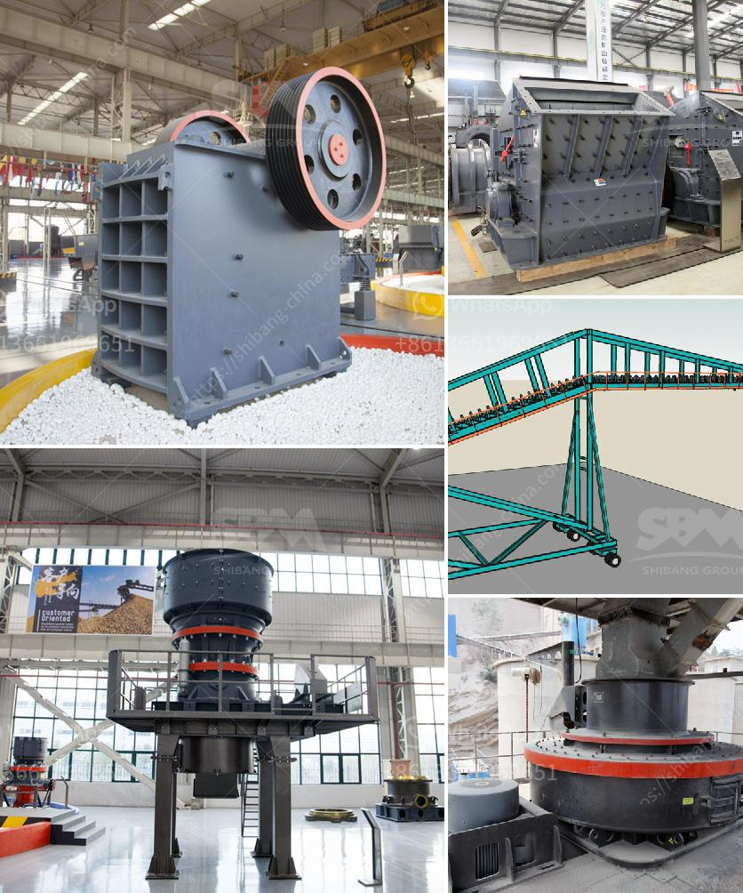

<h3>مصانع الكسارات الصينية</h3>
تعد الصين من أبرز الدول المصنعة للكسارات في العالم. فهي تنتج وتصدر مجموعة واسعة من الكسارات التي تستخدم في صناعات مختلفة مثل البناء والتعدين والطاقة والصناعات الكيماوية. تتمتع مصانع الكسارات الصينية بسمعة جيدة عالمياً بفضل جودة منتجاتها وتكنولوجيا عالية.

تتنوع مصانع الكسارات الصينية في حجمها ونطاق إنتاجها. فبينما تنتج بعض المصانع الكبيرة آلاف الوحدات سنوياً، تنتج المصانع الصغيرة مئات الوحدات فقط. وبغض النظر عن حجم هذه المصانع، تسعى جميعها إلى تحقيق أعلى مستويات الجودة والأداء.

تتميز مصانع الكسارات الصينية بتطبيق التكنولوجيا المتقدمة في عمليات الإنتاج. فهي تستخدم الآلات والمعدات الحديثة لتحقيق الكفاءة العالية والإنتاجية الممتازة. كما أنها تهتم بالابتكار والتطوير المستمر لتقديم منتجات بأعلى مستويات الجودة والأداء.

تشمل منتجات مصانع الكسارات الصينية مجموعة واسعة من الكسارات المختلفة. فمن بينها الكسارات الفكية، والكسارات الصدمية، والكسارات المخروطية، والكسارات الهيدروليكية، والكسارات الرملية، والكسارات المتنقلة، وغيرها الكثير. وتتميز هذه المنتجات بأداء ممتاز وجودة عالية وقدرة على معالجة مختلف أنواع الصخور والمواد الخام.

تستخدم مصانع الكسارات الصينية في العديد من الصناعات. ففي صناعة البناء، تستخدم الكسارات لسحق الصخور والحصى لإعداد المواد الخام اللازمة للخرسانة والرصف والأسفلت. وفي صناعة التعدين، تستخدم لسحق وتكسير الصخور والمعادن لاستخلاص المعادن الثمينة مثل الذهب والفضة والنحاس. وفي صناعة الطاقة، تستخدم لسحق الفحم والصخور الحجرية لإنتاج الوقود.

علاوة على ذلك، تعمل مصانع الكسارات الصينية على تطوير حلول مبتكرة لتلبية احتياجات العملاء المحليين والعالميين. فهي تقدم خدمات ما بعد البيع الممتازة مثل الصيانة والدعم الفني وقطع الغيار لضمان استمرارية العمل وعمر التشغيل الطويل للمعدات.

باختصار، تعتبر مصانع الكسارات الصينية مرجعية عالمية في صناعة تصنيع الكسارات. فهي تتمتع بسمعة ممتازة بفضل جودة منتجاتها وتكنولوجيا عالية، وتعمل على تقديم حلول متكاملة ومبتكرة لتلبية احتياجات العملاء. وبفضل هذه الأسباب، فإن مصانع الكسارات الصينية تحظى بشعبية كبيرة وطلب مستمر في الأسواق العالمية.
<h3>Contact us</h3><ul><li><strong>Whatsapp:&nbsp;<a href="https://wa.me/8613661969651">+8613661969651</a></strong></li><li><a href="https://swt.shibang-china.com/?git&amp;zhl&amp;مصانع الكسارات الصينية"><strong>Online Service(chat now)</strong></a></li></ul><h3>Related</h3><ul><li><a href='شركات تصنيع الكسارات في ماليزيا.md'>شركات تصنيع الكسارات في ماليزيا</a></li><li><a href='شركة تصنيع كسارات صغيرة في الصين.md'>شركة تصنيع كسارات صغيرة في الصين</a></li><li><a href='آلة صنع مسحوق الرخام.md'>آلة صنع مسحوق الرخام</a></li><li><a href='كسارة الصخور 250 طن في الساعة.md'>كسارة الصخور 250 طن في الساعة</a></li><li><a href='كسارات الفك مسحوق كربيد التنجستن.md'>كسارات الفك مسحوق كربيد التنجستن</a></li></ul>