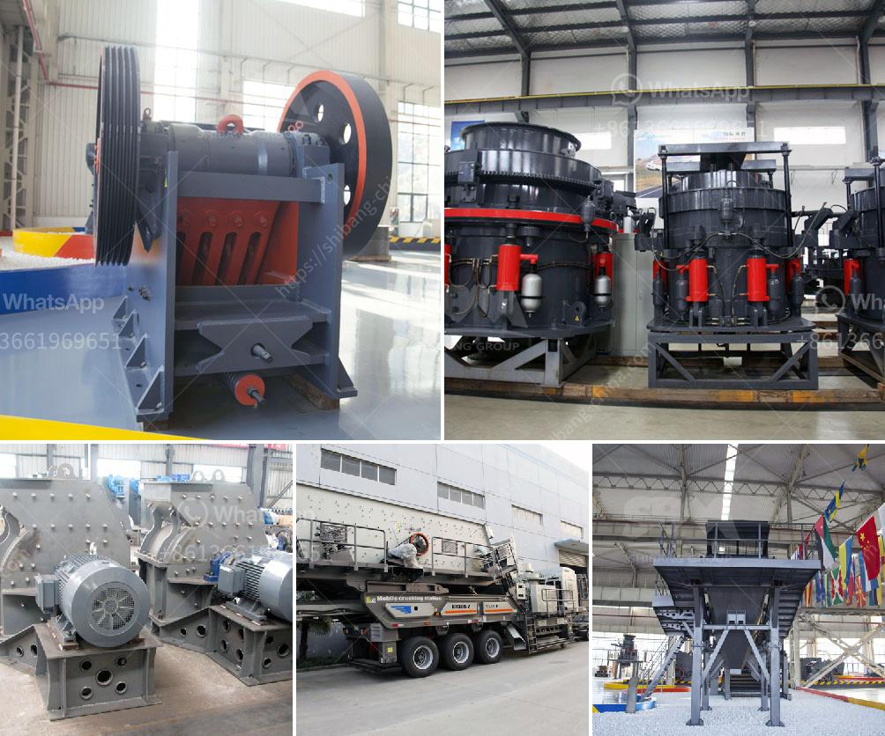

<h3>مصانع الكسارات تصنع</h3>
تعتبر مصانع الكسارات من أهم الصناعات في قطاع التعدين والإنشاءات. فهي تقوم بتكسير الصخور والأحجار الكبيرة لتحويلها إلى حجم صغير يمكن استخدامه في البناء والإنشاءات المختلفة. وتعتبر هذه المصانع ضرورية لتلبية الطلب المتزايد على المواد الخام في قطاع البناء.

تحولت مصانع الكسارات من العمل اليدوي البدائي إلى العمل الميكانيكي المتطور. حيث يتم استخدام المعدات الثقيلة والتقنيات الحديثة لتحقيق عملية كسر الحجارة بسرعة وكفاءة. تعتمد عملية الكسر على استخدام المطارق الضخمة والكسارات الأسطوانية والكسارات الفكية والكسارات المخروطية. وتخضع هذه المعدات للكثير من الاختبارات والمراجعات لضمان عملية الكسر السليمة والآمنة.

يتم تصميم مصانع الكسارات لتلبية الاحتياجات المتنوعة لعملاء مختلفين في مجالات عديدة مثل البناء الطرقي والبناء العام واستخراج المعادن. وتوفر هذه المصانع مجموعة متنوعة من المنتجات من حيث الحجم والشكل والجودة. فتفاوت أحجام الكسرات المنتجة في هذه المصانع بين أحجام صغيرة للخرسانة المسلحة وأحجام كبيرة للطرق والمشاريع الكبيرة.

تعتبر مصانع الكسارات جزءًا هامًا من سلسلة التصنيع بالإضافة إلى المحاجر التي توفر المواد الخام. فكلاهما يتعاونان لتلبية الطلب المتزايد على المواد الخام والمنتجات النهائية في سوق البناء. وتتطلب إدارة مصانع الكسارات الاهتمام بالموارد البشرية المدربة والاستمرار في تطوير التقنيات المستخدمة لتحسين كفاءة الإنتاج وتقليل التأثير البيئي لهذه المصانع.

علاوة على ذلك، تكمن الأهمية البيئية في تصميم وتشغيل مصانع الكسارات. فتحتاج هذه المصانع لاتباع المعايير البيئية المحلية والعالمية لتقليل الانبعاثات الضارة وتحسين جودة الهواء والمياه المستخدمة في العملية. وتعتبر المصانع الحديثة قادرة على إعادة تدوير كمية كبيرة من المواد الخام واستخدامها في عملية الكسر، مما يحقق الاستدامة البيئية وتوفير الطاقة.

في الختام، تعتبر مصانع الكسارات أساسية في صناعة البناء والإنشاءات، حيث تلعب دورًا حاسمًا في توفير المواد الخام والمنتجات النهائية. كما تسهم في تحقيق الاستدامة البيئية وتوفير كميات كبيرة من الموارد الطبيعية. لذا، يجب الاهتمام بتطوير هذه المصانع واستخدام تقنيات حديثة لتلبية الاحتياجات المتنوعة للعملاء والحفاظ على البيئة.
<h3>Contact us</h3><ul><li><strong>Whatsapp:&nbsp;<a href="https://wa.me/8613661969651">+8613661969651</a></strong></li><li><a href="https://swt.shibang-china.com/?git&amp;zhl&amp;مصانع الكسارات تصنع"><strong>Online Service(chat now)</strong></a></li></ul><h3>Related</h3><ul><li><a href='استيراد كسارة الفك الصين في باكستان.md'>استيراد كسارة الفك الصين في باكستان</a></li><li><a href='مصنع طحن كلنكر الإسمنت في الهند.md'>مصنع طحن كلنكر الإسمنت في الهند</a></li><li><a href='الحجر الجيري المستخدم لصنع الزجاج.md'>الحجر الجيري المستخدم لصنع الزجاج</a></li><li><a href='مصانع غسيل صغيرة للبيع.md'>مصانع غسيل صغيرة للبيع</a></li><li><a href='مصانع VSI في الإمارات.md'>مصانع VSI في الإمارات</a></li></ul>