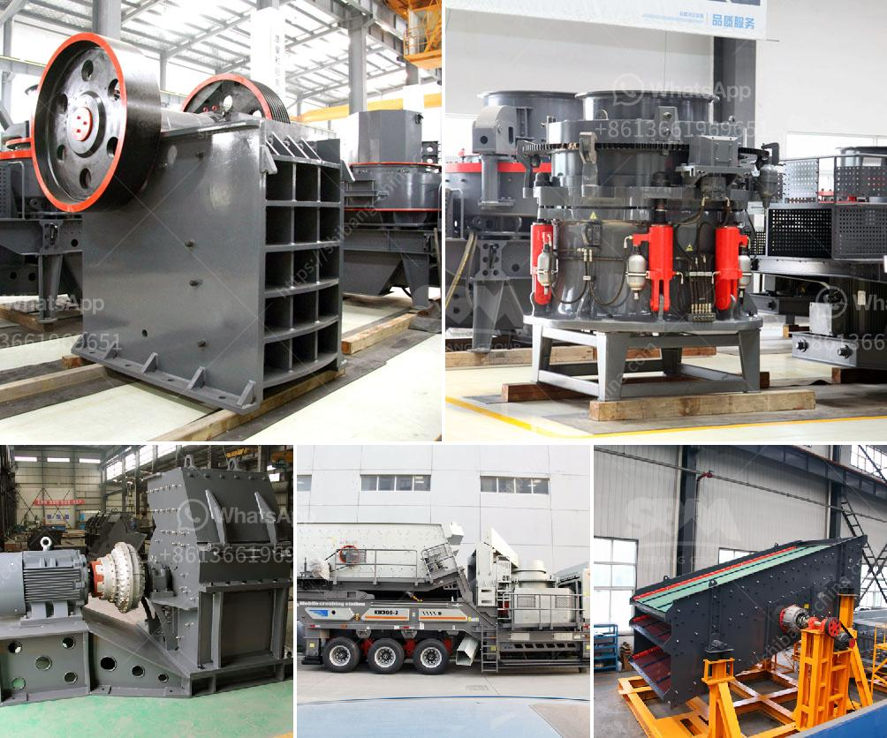

<h3>مصانع الكسارات للبيع في جنوب أفريقيا</h3>
تُعتبر جنوب أفريقيا وجهة مشهورة للكسارات التي تُستخدم في صناعة البناء والبنية التحتية. تضم البلاد العديد من المصانع المتخصصة في تصنيع وبيع الكسارات، وتسهم هذه المصانع في تلبية الطلب المستمر على المواد الخام للبناء.

تتميز مصانع الكسارات في جنوب أفريقيا بتوافر الموارد الطبيعية الغنية، مثل الرمال، الصخور، والحصى. بالإضافة إلى ذلك، تحتوي البلاد على ثروة من المعادن المختلفة مثل الذهب والفحم والألماس، مما يساهم في توفير مواد خام عالية الجودة لصناعة الكسارات.

تعد مصانع الكسارات في جنوب أفريقيا من العوامل الحيوية في تطوير الاقتصاد المحلي وتوفير فرص العمل للسكان. حيث توفر هذه المصانع فرص عمل للمهندسين والفنيين والعمال المهرة في عمليات التصنيع والصيانة. بالإضافة إلى ذلك، تساهم مبيعات الكسارات في جذب الاستثمارات إلى البلاد وزيادة إيرادات الحكومة.

تُعتبر الكسارات من المعدات الرئيسية في صناعة البناء والبنية التحتية، حيث تُستخدم لسحق الصخور والحجارة الكبيرة للحصول على مواد خام صغيرة الحجم. تتواجد العديد من أنواع الكسارات، بما في ذلك الكسارات الفكية والتصادمية والمخروطية، وتُختار حسب طبيعة المشروع واحتياجات العملاء.

بفضل الابتكارات التقنية، تتميز مصانع الكسارات في جنوب أفريقيا بالكفاءة والأداء العالي، مما يُسهم في تحسين جودة المنتجات وزيادة الإنتاجية. يمكن أن تعمل الكسارات على تجهيز مئات الأطنان من المواد الخام يوميًا، مما يعزز القدرة التنافسية للصناعة المحلية ويسهم في استقرار السوق المحلية.

للخروج بأفضل عرض في السوق، يجب أن تواصل مصانع الكسارات الابتكار وتحديث تقنياتها باستمرار. يمكن تطوير تقنيات مثل الأتمتة والتحكم عن بعد لتحسين كفاءة الإنتاج وتقليل التكاليف التشغيلية. كما يتوجب أن تولي المصانع اهتمامًا خاصًا لسلامة العمال والحفاظ على البيئة، من خلال تطبيق إجراءات صارمة للسلامة والتحكم في التلوث.

في الختام، تُعد مصانع الكسارات في جنوب أفريقيا جزءًا حيويًا من صناعة البناء والتشييد. تعمل هذه المصانع على توفير مواد خام ذات جودة عالية وتلبية الطلبات المستمرة للسوق المحلية والدولية. بفضل المهندسين المهرة والتقنيات المبتكرة، تتمتع مصانع الكسارات في جنوب أفريقيا بسمعة طيبة وتلقى طلبًا كبيرًا في السوق المحلية والعالمية.
<h3>Contact us</h3><ul><li><strong>Whatsapp:&nbsp;<a href="https://wa.me/8613661969651">+8613661969651</a></strong></li><li><a href="https://swt.shibang-china.com/?git&amp;zhl&amp;مصانع الكسارات للبيع في جنوب أفريقيا"><strong>Online Service(chat now)</strong></a></li></ul><h3>Related</h3><ul><li><a href='شركة تصنيع كرات الكرة في مومباي.md'>شركة تصنيع كرات الكرة في مومباي</a></li><li><a href='سعر الشاشة الاهتزازية في الهند.md'>سعر الشاشة الاهتزازية في الهند</a></li><li><a href='مصنع كسارة متنقلة مثبتة على الطرق.md'>مصنع كسارة متنقلة مثبتة على الطرق</a></li><li><a href='نوع من مطحنة الكرة.md'>نوع من مطحنة الكرة</a></li><li><a href='مصنع كسارة حجر محمول في تركيا.md'>مصنع كسارة حجر محمول في تركيا</a></li></ul>