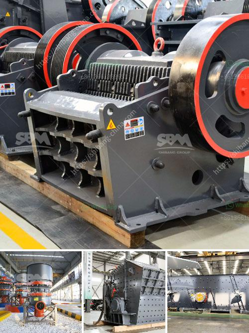

<h3>مصانع الكسارات للبيع</h3>
تعتبر مصانع الكسارات من الصناعات الحديثة التي تلبي احتياجات قطاعات عديدة مثل البناء والتشييد والرصف والبناء الهيكلي والإعمار وغيرها. إن استخدام المصانع الكسارات يساعد على تكسير وطحن المواد الخام بطريقة فعالة لإنتاج مواد قابلة للتطبيق في مجموعة واسعة من الصناعات.

تتكون مصانع الكسارات من معدات متخصصة تقوم بتكسير المواد الخام مثل الصخور والحصى والركام إلى مقاسات أصغر. وعادةً ما تتضمن هذه المعدات الكسارات الفكية والكسارات الصدمية والكسارات المخروطية وغيرها من المعدات المساعدة مثل الناقلات والمغسلة والغربال الاهتزازي.

مصانع الكسارات للبيع تتميز بعدة ميزات. أولاً، فإنها توفر نوعية عالية من الإنتاج والمواد المطروحة للبيع. يتم تكسير المواد بطريقة متقنة وفعالة لإنتاج صخور وحصى ذات جودة عالية وتلبي احتياجات المشترين. ثانياً، فهي تعتبر استثماراً مربحًا قابلًا للتوسع. حيث أن هذه المصانع يتم تشغيلها على مدار العام وتحقق أرباحًا مستمرة. بالإضافة إلى ذلك، يمكن للمصانع توسيع نطاق عملها وإضافة معدات إضافية عندما تزداد الطلبات.

يتوجب على المشترين الاهتمام بعدة عوامل عندما يفكرون في شراء مصنع كسارات. أولاً، يجب تحديد نوعية المواد التي يرغبون في إنتاجها ومدى توافرها في المنطقة. يجب أيضًا تقييم تكلفة الاستثمار والسعر المطلوب للمصنع مع الأخذ في الاعتبار القدرة الإنتاجية والجودة المتوقعة للمواد المنتجة.

من الجدير بالذكر أن مصانع الكسارات قد تتطلب تراخيص وتصاريح خاصة حسب قوانين ولوائح البلدان المختلفة. يجب على المشترين أن يدرسوا القوانين المحلية والدولية ذات الصلة قبل الشروع في عملية الشراء. إضافةً إلى ذلك، يجب أن ينصح المشترين بالتعاون مع متخصصين في هذا المجال لضمان أن المصنع المعروض للبيع يلبي المعايير الفنية والبيئية المطلوبة وأن جميع الأوراق والمستندات القانونية تكون سليمة.

باختصار، تعتبر مصانع الكسارات للبيع فرصة للمستثمرين للدخول إلى صناعة حيوية ومربحة. مع تزايد الطلب على المواد البنائية في معظم أنحاء العالم، فإن مصانع الكسارات توفر إمكانية تحقيق أرباح جيدة وتلبي احتياجات السوق. ومع الاهتمام المناسب بالقوانين المحلية، يمكن للمستثمرين تحقيق نجاح قوي في هذا المجال.
<h3>Contact us</h3><ul><li><strong>Whatsapp:&nbsp;<a href="https://wa.me/8613661969651">+8613661969651</a></strong></li><li><a href="https://swt.shibang-china.com/?git&amp;zhl&amp;مصانع الكسارات للبيع"><strong>Online Service(chat now)</strong></a></li></ul><h3>Related</h3><ul><li><a href='سعر مصنع التكسير.md'>سعر مصنع التكسير</a></li><li><a href='تكلفة مصنع الأسمنت.md'>تكلفة مصنع الأسمنت</a></li><li><a href='عملية تدمير صخور الحجر الجيري آلة كسارة الحجر.md'>عملية تدمير صخور الحجر الجيري آلة كسارة الحجر</a></li><li><a href='مصنع غسيل الرمال للبيع في الإمارات.md'>مصنع غسيل الرمال للبيع في الإمارات</a></li><li><a href='مشكلة الناقل الفحم.md'>مشكلة الناقل الفحم</a></li></ul>