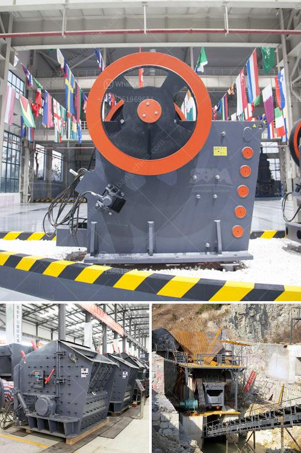

<h3>مصانع المعالجة في الصين للحجر الجيري</h3>
تعتبر الصين واحدة من أكبر الدول المنتجة والمصدرة للحجر الجيري في العالم. تمتاز المصانع في الصين بتطبيق تكنولوجيا حديثة وإجراءات معالجة فعالة للحجر الجيري، مما يضمن جودة عالية وكميات إنتاج كبيرة تلبي الاحتياجات العالمية.

تستخدم مصانع المعالجة في الصين تقنيات متقدمة لاستخراج الحجر الجيري من المحاجر. تستخدم المعدات الثقيلة مثل الحفارات والجرافات الهيدروليكية لاستخراج قطع كبيرة من الحجر الجيري. يتم تنظيف الحجر وفرزه لإزالة الأوساخ والشوائب المتواجدة عليه، ويتم ذلك باستخدام معدات متطورة تستخدم أنظمة الغسيل والفرز الأوتوماتيكية.

بعد استخراج الحجر الجيري، يتم نقله إلى مصانع المعالجة حيث يخضع لعمليات متعددة تهدف إلى تحويله إلى منتج نهائي قابل للاستخدام في العديد من الصناعات المختلفة. يتم تكسير الحجر الجيري إلى حجم صغير باستخدام الكسارات والمطاحن، ومن ثم يتم فصله وفرزه وفقًا للحجم والجودة.

يتمتع مصانع المعالجة في الصين بمعدات تقنية عالية لتحسين جودة المنتج النهائي. تستخدم المعدات المتطورة مثل مصانع التكسير والطحن بالأشعة فوق الصوتية والناقلات الآلية للتحكم في عمليات المعالجة بشكل دقيق. يتمتع العاملون في المصانع بخبرة واسعة وتدريب مناسب للتعامل مع المعدات والمواد الخام بطريقة فعالة وآمنة.

تشمل منتجات مصانع المعالجة في الصين الحجر الجيري المكسر والمجروش والمفرز. يستخدم الحجر الجيري في العديد من الصناعات مثل صناعة الأسمنت والحديد والصلب والزجاج والبتروكيماويات. يتميز الحجر الجيري الصيني بجودته العالية وتوفره الكبير، مما يجعله مطلوبًا على نطاق واسع في الأسواق العالمية.

بالإضافة إلى ذلك، تعزز الحكومة الصينية الصناعة المعدنية بدعم قوانين وسياسات تشجع على التوسع في إنتاج الحجر الجيري وتحسين جودته. هذا التحسين المستمر في إجراءات المعالجة يسهم في تلبية احتياجات السوق المتزايدة وتحقيق الاكتفاء الذاتي للبلاد في هذا القطاع.

في الختام، تعتبر مصانع المعالجة في الصين من أكبر وأكثر الوحدات الصناعية تقدمًا في تصنيع وتصدير الحجر الجيري. تقنيات المعالجة المتقدمة والمعدات العالية الجودة تضمن جودة المنتج، بينما القوانين الحكومية والدعم المستمر يساهمان في نمو هذه الصناعة وتحقيق الاكتفاء الذاتي
<h3>Contact us</h3><ul><li><strong>Whatsapp:&nbsp;<a href="https://wa.me/8613661969651">+8613661969651</a></strong></li><li><a href="https://swt.shibang-china.com/?git&amp;zhl&amp;مصانع المعالجة في الصين للحجر الجيري"><strong>Online Service(chat now)</strong></a></li></ul><h3>Related</h3><ul><li><a href='تسعير حزام الناقل في ماليزيا.md'>تسعير حزام الناقل في ماليزيا</a></li><li><a href='قطع غيار آلة المطحنة ووظيفتها.md'>قطع غيار آلة المطحنة ووظيفتها</a></li><li><a href='كسارات الحجر المستعملة في كوريا الجنوبية.md'>كسارات الحجر المستعملة في كوريا الجنوبية</a></li><li><a href='آلة صنع الرمل الحجر في نيجيريا.md'>آلة صنع الرمل الحجر في نيجيريا</a></li><li><a href='إعداد مصنع كسارة الحجر.md'>إعداد مصنع كسارة الحجر</a></li></ul>