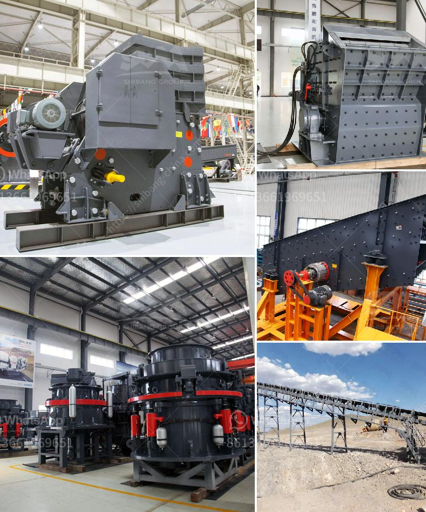

<h3>مصانع تجفيف رمل الفراك للبيع</h3>
تتمثل مقالتي في شرح فوائد واهمية مصانع تجفيف رمل الفراك المستخدمة في صناعة البناء وأسباب طلبها عالية الجودة في الأسواق. وايضاً شرح عن عملية التجفيف والطرق المستخدمة لتحقيق النتائج المطلوبة.

يعتبر الرمل الفراك من المواد الأساسية المستخدمة في صناعة البناء والإنشاءات العامة. فهو يستخدم في مجموعة واسعة من التطبيقات مثل إنتاج الخرسانة والجص وإنتاج المواد البنائية الأخرى. وبسبب الطلب المتزايد على هذا النوع من الرمل، اصبحت مصانع تجفيف رمل الفراك عالية الكفاءة هي حلول مثالية للحفاظ على جودة الرمل وتلبية الطلب.

تعمل مصانع تجفيف رمل الفراك على إزالة الرطوبة والرطوبة الزائدة من الرمل. فعملية التجفيف تساعد في تعزيز جودة الرمل وخصائصه الميكانيكية. فعند استخدام رمل الفراك الجاف، يصبح أسهل في التعامل معه ومزجه مع مواد أخرى في عمليات البناء. وهذا يؤدي إلى تحسين قوة البناء واستدامته.

توفر مصانع تجفيف رمل الفراك أيضاً مرونة أكبر للشركات التي تعمل في صناعة البناء. حيث يمكنها تجفيف الرمل بطرق مختلفة وفقًا لمتطلبات العملاء. وبالتالي ، يمكن تلبية تسليم الرمل واحتياجات العملاء في الوقت المحدد وبالجودة المطلوبة.

من الجدير بالذكر أن عملية التجفيف تعزز أيضاً استدامة رمل الفراك. حيث يتم تقليل النفايات والفواضل الناتجة عن تجفيف الرمل، وهذا يساهم في الحفاظ على البيئة والاستدامة البيئية. كما أن التجفيف يحد من تراكم الطين والأتربة في الرمل وبالتالي يزيد من جودته وقابليته للتطبيق في العديد من الأغراض.

بالإضافة إلى ذلك، فإن مصانع تجفيف رمل الفراك تشكل فرص عمل مهمة ومساهمة اقتصادية للمجتمعات المحلية. يتطلب تشغيل هذه المصانع مجموعة من العمال الماهرين وفرق الصيانة والإدارة. وبالتالي، يساهم ذلك في دفع النمو الاقتصادي وتحسين مستوى المعيشة في المنطقة.

تختلف مصانع تجفيف رمل الفراك في القدرات والميزات والتقنيات المستخدمة. لذلك، يجب على المشترين المهتمين بشراء مصنع تجفيف رمل الفراك أخذ الوقت الكافي للبحث عن الشركة المصنعة الرائدة والمتخصصة. يجب أيضاً مراعاة السعر والجودة والدعم الفني المقدم من الشركة المصنعة.

في الختام، يمكن القول أن مصانع تجفيف رمل الفراك تعتبر مفيدة وضرورية في صناعة البناء. فهي تساعد في تعزيز جودة الرمل وتحسين خصائصه الميكانيكية، وتوفر مرونة واستدامة للشركات، وتسهم في دفع النمو الاقتصادي للمجتمعات المحلية.
<h3>Contact us</h3><ul><li><strong>Whatsapp:&nbsp;<a href="https://wa.me/8613661969651">+8613661969651</a></strong></li><li><a href="https://swt.shibang-china.com/?git&amp;zhl&amp;مصانع تجفيف رمل الفراك للبيع"><strong>Online Service(chat now)</strong></a></li></ul><h3>Related</h3><ul><li><a href='مصانع VSI في الإمارات.md'>مصانع VSI في الإمارات</a></li><li><a href='مصنع سحق في ماليزيا.md'>مصنع سحق في ماليزيا</a></li><li><a href='آلة تكسير وطحن مناجم الذهب.md'>آلة تكسير وطحن مناجم الذهب</a></li><li><a href='مطرقة الذهب المستخدمة للبيع في زيمبابوي.md'>مطرقة الذهب المستخدمة للبيع في زيمبابوي</a></li><li><a href='سعر تكسير الخرسانة في جنوب أفريقيا.md'>سعر تكسير الخرسانة في جنوب أفريقيا</a></li></ul>