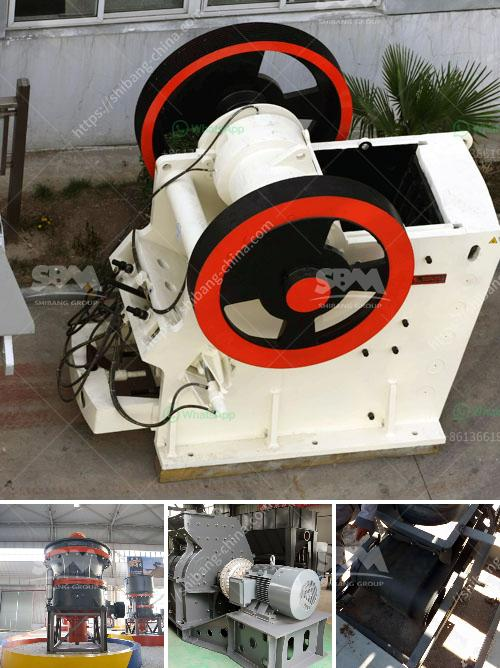

<h3>مصانع تحسين الكوارتز في الهند</h3>
تعد الهند واحدة من البلدان التي تعمل على تحسين الكوارتز بشكل مكثف. تتواجد العديد من المصانع في البلاد التي تقوم بتحويل الكوارتز الخام إلى منتج نهائي عالي الجودة ومستخدم في العديد من الصناعات.

تعد مصانع تحسين الكوارتز في الهند هامة جداً نظراً لارتفاع الطلب على هذه المادة في العديد من الصناعات مثل الزجاج والسيراميك والطلاء والمواد الكيميائية. تعتبر الهند واحدة من أكبر المنتجين والمصدرين للكوارتزيت في العالم، وتحتل مركز رائد في صناعة تحسين الكوارتز.

تعد الطرق التي تتبعها مصانع تحسين الكوارتز في الهند متقدمة تكنولوجيا، حيث يتم استخدام معدات وأجهزة حديثة لتحسين جودة المنتج النهائي. تتضمن عملية تحسين الكوارتز عدة خطوات مثل التكسير، والغسيل، والتجفيف، والطبخ، والتحجيم، والتصنيف. يهدف كل هذه الخطوات إلى إزالة الشوائب والشوائب الأخرى من الكوارتز الخام والحصول على منتج نهائي خالٍ من الشوائب وذو جودة عالية.

تستخدم مصانع تحسين الكوارتز في الهند أيضاً تقنيات متقدمة في عملياتها لتلبية متطلبات السوق بشكل أفضل. يتم اختيار واستخدام المواد الكيميائية بعناية لضمان تحقيق جودة المنتج النهائي. كما تتبع هذه المصانع معايير الجودة العالمية لضمان تنفيذ عمليات الإنتاج بطريقة صحيحة وتلبية احتياجات العملاء.

بالإضافة إلى ذلك، تعمل مصانع تحسين الكوارتز في الهند على تطوير وابتكار منتجات جديدة تلبي متطلبات السوق المتغيرة. تهدف هذه المصانع إلى تحسين خواص الكوارتز بحيث يمكن استخدامه في مجموعة واسعة من التطبيقات.

في الختام، يمكن القول إن مصانع تحسين الكوارتز في الهند تعد مهمة لاستفادة العديد من الصناعات وتلبية متطلبات السوق المتزايدة. تعمل هذه المصانع بجد لتحقيق جودة وكفاءة عالية في منتجاتها، كما تسعى باستمرار للابتكار والتطوير لتلبية احتياجات العملاء بشكل أفضل.
<h3>Contact us</h3><ul><li><strong>Whatsapp:&nbsp;<a href="https://wa.me/8613661969651">+8613661969651</a></strong></li><li><a href="https://swt.shibang-china.com/?git&amp;zhl&amp;مصانع تحسين الكوارتز في الهند"><strong>Online Service(chat now)</strong></a></li></ul><h3>Related</h3><ul><li><a href='تصميم وتخطيط محطة تكسير الحجارة pdf.md'>تصميم وتخطيط محطة تكسير الحجارة pdf</a></li><li><a href='مشروع محجر للبيع في نيجيريا.md'>مشروع محجر للبيع في نيجيريا</a></li><li><a href='موردين لمصانع سحق ld slag في الهند.md'>موردين لمصانع سحق ld slag في الهند</a></li><li><a href='أسطوانات لكسارات في بوغوتا.md'>أسطوانات لكسارات في بوغوتا</a></li><li><a href='كسارة مخروطية غير مستخدمة في إثيوبيا للبيع.md'>كسارة مخروطية غير مستخدمة في إثيوبيا للبيع</a></li></ul>