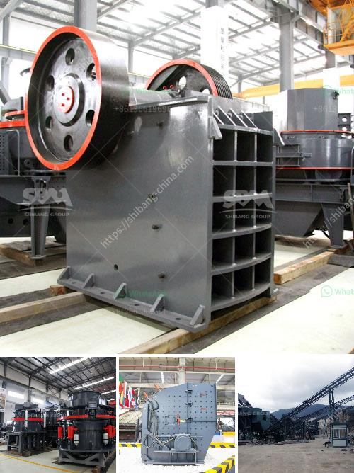

<h3>مصانع تكسير الأحجار قرب الدوران</h3>
مصانع تكسير الأحجار تعتبر جزءًا أساسيًا من صناعة البناء والتشييد. تُستخدم هذه المصانع لتكسير الأحجار الكبيرة إلى قطع أصغر ومرغوب فيها، وذلك لاستخدامها في العديد من التطبيقات البنائية.

تعمل مصانع تكسير الأحجار بواسطة العديد من الآلات والمعدات المتطورة التي تعمل على تكسير الأحجار بطرق مختلفة. تشمل هذه الآلات الكسارات الفكية، وكسارات الصدم، والكسارات المخروطية وغيرها من المعدات المتخصصة، ولا تتوقف الأمور عند هذا الحد، حيث يجب أن يتم الاعتناء بمعدات الفحص والفرز والناقلات لنقل الأحجار الجاهزة إلى المكان المطلوب.

تعزز مصانع تكسير الأحجار الإنتاجية وتضمن الكفاءة والجودة في عملية التصنيع. يتم استخدام الأحجار المتميزة بقوة ومتانة للتأكد من أنها تستطيع تحمل الضغط والقوى الميكانيكية المتعددة الناتجة عن تطبيقها في المشاريع البنائية.

واحدة من مناطق مصانع تكسير الأحجار المشهورة تقع بالقرب من الدوران. يتواجد في هذه المنطقة مصانع تنتج أنواعًا مختلفة من الأحجار المكسرة التي يعتمد عليها في صناعة الأسفلت والخرسانة. إن استخدام الأحجار المكسرة في هذه المشروعات يعزز متانتها ويزيد من عمرها الافتراضي، مما يقلل تكاليف الصيانة على المدى الطويل.

بالإضافة إلى ذلك، توفر مصانع تكسير الأحجار فرص عمل للعديد من العمال وتساهم في توفير الاقتصاد المحلي، حيث تحتاج هذه المصانع إلى عمال مهرة في مجالات متعددة مثل العمالة الفنية والإدارية والفنونية وغيرها.

ومع زيادة الطلب على المواد البنائية، فإن وجود مصانع تكسير الأحجار بالقرب من الدوران يعزز الكفاءة والسرعة في التصنيع وتوفير المواد في وقت قياسي.

وفي الختام، يُعد تواجد مصانع تكسير الأحجار بالقرب من الدوران خطوة استراتيجية حاسمة لتلبية الاحتياجات المتزايدة في صناعة البناء. تلتزم هذه المصانع بأعلى معايير الجودة والسلامة لضمان تقديم منتجات ممتازة ومتينة تلبي متطلبات العملاء والمشاريع البنائية.
<h3>Contact us</h3><ul><li><strong>Whatsapp:&nbsp;<a href="https://wa.me/8613661969651">+8613661969651</a></strong></li><li><a href="https://swt.shibang-china.com/?git&amp;zhl&amp;مصانع تكسير الأحجار قرب الدوران"><strong>Online Service(chat now)</strong></a></li></ul><h3>Related</h3><ul><li><a href='معدات استخراج الحجر.md'>معدات استخراج الحجر</a></li><li><a href='آلة كسارة الفحم 5 طن في الساعة.md'>آلة كسارة الفحم 5 طن في الساعة</a></li><li><a href='كسارة صخور وشاشات في الفلبين.md'>كسارة صخور وشاشات في الفلبين</a></li><li><a href='غسالة مواد خام جرايستون مستعملة.md'>غسالة مواد خام جرايستون مستعملة</a></li><li><a href='مصنع تكسير الكروم.md'>مصنع تكسير الكروم</a></li></ul>