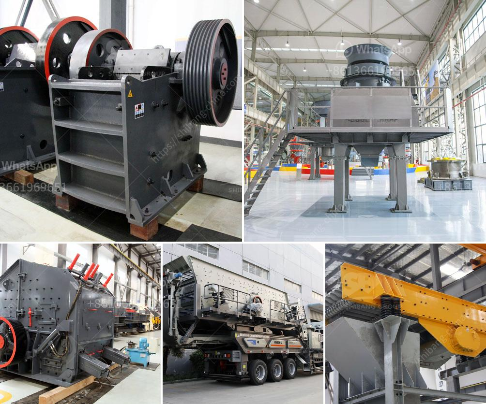

<h3>مصانع تكسير الحجر في الهند</h3>
تُعتبر صناعة تكسير الحجر من الصناعات الهامة في الهند، حيث تلعب دورًا حيويًا في تلبية احتياجات البناء والبنية التحتية في البلاد. وتعد الهند واحدة من أكبر المنتجين للحجر الطبيعي في العالم، مع تنوع كبير في الأنواع والألوان المتاحة.

تتواجد المصانع التي تقوم بتكسير الحجر في مختلف أنحاء الهند، بما في ذلك ولاية راجاستان وغوا وأندرا براديش وحيدر أباد وغيرها من المناطق. تعتبر هذه المصانع مهمة لاستخراج الحجر الطبيعي، وتكسيره وتجهيزه للإستخدام في العديد من التطبيقات المختلفة مثل البناء والعمارة وتجهيز الطرق والجسور والمشاريع الأخرى.

تستخدم المصانع في الهند تقنيات حديثة لتكسير الحجر، فضلاً عن استخدام أحدث معدات التجهيز والأدوات. يتم استخدام كسارات الحجر الحديثة وطواحين الكرة وأجهزة الفرز والغرابيل للحجر المكسر وغربلته وتجهيزه بمستويات عالية من الجودة. تتمتع المصانع بمهارات فنية عالية وخبرة في تصميم وتصنيع الحلول المناسبة وفقًا لاحتياجات العملاء.

تعتبر مصانع تكسير الحجر في الهند من القطاعات الأساسية للاقتصاد الوطني، حيث توفر فرص عمل مهمة للعديد من العمال والفنيين. وتحرص هذه الصناعة على توفير فرص عمل للعمال المهرة وصناعة الحجر المحلي، مما يسهم في تعزيز التنمية المستدامة والاقتصادية في البلاد.

بالإضافة إلى ذلك، فإن توفر المصانع التكسير في الهند يعني أيضًا توفر تكاليف تنافسية للحجر المكسر. فعندما تتواجد مصانع التكسير في مكان قريب من موقع الحجر، يتم توفير النقل الواهن والتكاليف ذات الصلة، مما يؤدي إلى توفير تكاليف الإنتاج وتقليل تكلفة الحجر المكسر للعملاء.

مع زيادة الطلب على الحجر المكسر في الهند وفي السوق العالمية بشكل عام، فقد شهدت مصانع تكسير الحجر تطورًا وتوسعًا مستمرًا. فقد تم تحديث معدات التكسير وتنويع منتجات الحجر المكسر وتطويرها بشكل مستمر، مما يؤدي إلى تحسين جودة الإنتاج وتلبية احتياجات العملاء المتنوعة.

وفي الختام، تلعب مصانع تكسير الحجر في الهند دورًا حيويًا في تلبية احتياجات البناء والتشييد في البلاد. تعمل هذه المصانع بتقنيات حديثة وتجهيزات متطورة، مع التركيز على توفير فرص عمل للعمال المحليين وتقديم حجر مكسر بتكلفة مناسبة وجودة عالية للعملاء. تعتبر الهند بذلك واحدة من الوجهات الرائدة في مجال تكسير الحجر على مستوى العالم.
<h3>Contact us</h3><ul><li><strong>Whatsapp:&nbsp;<a href="https://wa.me/8613661969651">+8613661969651</a></strong></li><li><a href="https://swt.shibang-china.com/?git&amp;zhl&amp;مصانع تكسير الحجر في الهند"><strong>Online Service(chat now)</strong></a></li></ul><h3>Related</h3><ul><li><a href='تكسير النبات بتنسيق PDF.md'>تكسير النبات بتنسيق PDF</a></li><li><a href='بناء مطحنة الكرة.md'>بناء مطحنة الكرة</a></li><li><a href='مطحنة للحجر الجيري في إيطاليا في بيرجامو.md'>مطحنة للحجر الجيري في إيطاليا في بيرجامو</a></li><li><a href='شاشة تهتز الفحم المصنعين في جنوب أفريقيا.md'>شاشة تهتز الفحم المصنعين في جنوب أفريقيا</a></li><li><a href='شركة تصنيع آلات كسارة الرخام.md'>شركة تصنيع آلات كسارة الرخام</a></li></ul>