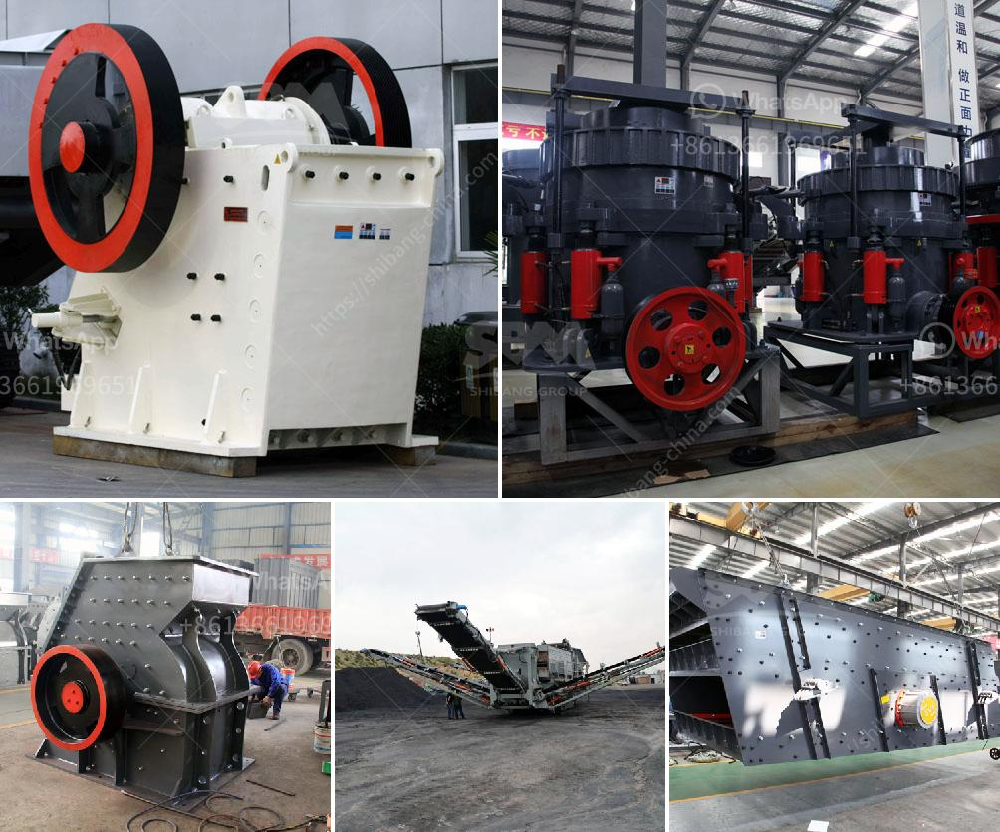

<h3>مصانع تكسير الفك في المملكة العربية السعودية</h3>
تعتبر مصانع تكسير الفك من أهم المصانع في المملكة العربية السعودية، حيث تلعب دورًا حاسمًا في عملية البناء والتطوير العمراني في البلاد. تعد هذه المصانع من أكثر المنشآت استخداماً لأجهزة تكسير الصخور في السعودية بوجود العديد من الموارد الطبيعية كالحصى والرمل والصخور الجيرية.

تعمل مصانع تكسير الفك على تحويل الصخور والحجارة الكبيرة إلى حجم صغير يمكن تداوله ونقله بسهولة. يتم ذلك بواسطة آلات تكسير الفك المتقدمة التي تستخدم القوة الهيدروليكية لتحطيم الصخور وتفتيتها إلى قطع صغيرة. يتم تحطيم الصخور بفعل القوة الضغطية التي يولدها الفك المتحرك الموجود في الجزء العلوي من الجهاز على الصخرة الموجودة في الجزء السفلي من الجهاز.

تعتبر مصانع تكسير الفك ضرورية في صناعات البناء والتشييد والطرق، حيث يتم استخدام المواد المكسورة لصناعة الخرسانة والأسفلت والحصى، وهي تحتاج إلى وجود مصانع تكسير الفك لتحقيق هذا الغرض بكفاءة وسهولة.

تتميز مصانع تكسير الفك في المملكة العربية السعودية بالتكنولوجيا المتطورة والمعدات المتقدمة التي تعمل بكفاءة عالية وتوفر الوقت والجهد. كما تلتزم هذه المصانع بمعايير الجودة العالمية، مما يضمن منتجات عالية الجودة تلبي احتياجات السوق المحلية والدولية.

وتلعب المصانع العديد من الدور الإيجابية في المملكة العربية السعودية، حيث تساهم في تلبية الطلب المتزايد على المواد البناء وتقليل الاعتماد على الاستيراد، وبالتالي تعزز الاستقلالية الاقتصادية للبلاد وتوفر فرص العمل الكثيرة للسكان المحليين.

بالإضافة إلى ذلك، تسهم مصانع تكسير الفك في الحفاظ على البيئة، فبدلاً من استخراج المزيد من الموارد الطبيعية، يتم إعادة تدوير واستغلال الصخور الموجودة بالفعل في البيئة المحلية.

لخلاصة القول، تعد مصانع تكسير الفك أحد العوامل الرئيسية في عملية البناء والتطوير في المملكة العربية السعودية. تلعب هذه المصانع دورًا حاسمًا في استخراج الموارد الطبيعية وتحويلها إلى منتجات صالحة للاستخدام في العديد من الصناعات. كما تعزز استقلالية البلاد الاقتصادية وتوفر فرص العمل وتسهم في الحفاظ على البيئة.
<h3>Contact us</h3><ul><li><strong>Whatsapp:&nbsp;<a href="https://wa.me/8613661969651">+8613661969651</a></strong></li><li><a href="https://swt.shibang-china.com/?git&amp;zhl&amp;مصانع تكسير الفك في المملكة العربية السعودية"><strong>Online Service(chat now)</strong></a></li></ul><h3>Related</h3><ul><li><a href='معالجة الذهب في الفلبين.md'>معالجة الذهب في الفلبين</a></li><li><a href='كسارة ومطحنة للذهب.md'>كسارة ومطحنة للذهب</a></li><li><a href='مطحنة الأسطوانة العمودية للإسمنت.md'>مطحنة الأسطوانة العمودية للإسمنت</a></li><li><a href='معدات مصنع الإسمنت اللازمة.md'>معدات مصنع الإسمنت اللازمة</a></li><li><a href='كسارة حجرية للبيع.md'>كسارة حجرية للبيع</a></li></ul>