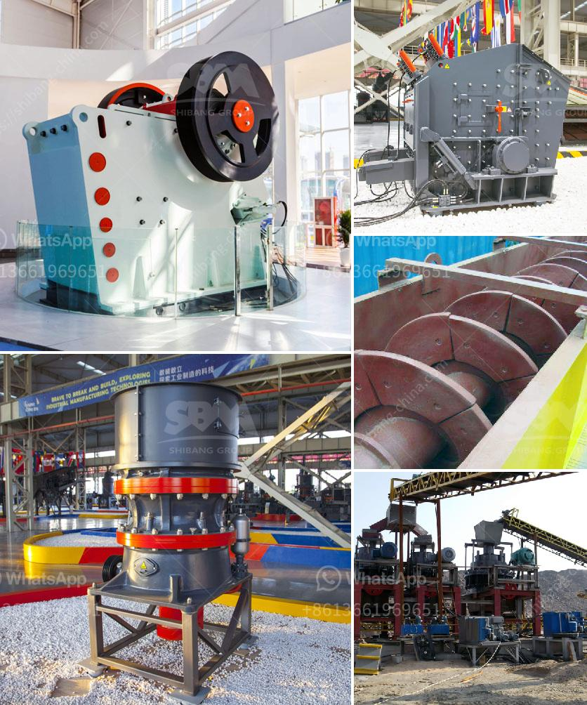

<h3>مصانع طحن الأحجار في تايلاند</h3>
تايلاند هي واحدة من الوجهات السياحية الرائعة في جنوب شرق آسيا. إنها تشتهر بطبيعتها الخلابة وثقافتها الغنية وتراثها العريق. ومن بين الصناعات الهامة في تايلاند هي صناعة طحن الأحجار.

تجذب مصانع طحن الأحجار في تايلاند الكثير من الزوار من جميع أنحاء العالم. إنها تتميز بتقنيتها المتقدمة في تحويل الأحجار الطبيعية إلى منتجات جميلة وعالية الجودة. تستخدم هذه المصانع آلات حديثة وعمال ماهرين لضمان الحصول على الشكل واللمس المثاليين للأحجار.

تستخدم مصانع طحن الأحجار العديد من الأحجار المحلية والمستوردة لإنتاج منتجات متنوعة مثل البلاط والمدافئ والنوافير والتماثيل والمجسمات الديكورية. وبفضل الديكورات الفريدة والملمس الرائع لهذه المنتجات، أصبحت مرغوبة لدى العديد من المشترين في جميع أنحاء العالم.

بجانب الاستخدامات الديكورية، فإن منتجات مصانع طحن الأحجار تستخدم أيضًا في مجال البناء والتشييد. يتم استخدامها في بناء المباني والجدران والأرضيات والحدائق. فهي متينة ومقاومة للتآكل وتضفي لمسة جمالية على المساحات التي يتم استخدامها فيها.

تعد مصانع طحن الأحجار أيضًا مصدرًا مهمًا للعمل في تايلاند. توظف هذه المصانع العديد من العمال المهرة وتساهم في تعزيز الاقتصاد المحلي. تقدم لهم الفرصة لكسب العيش وتطوير مهاراتهم في صناعة الحجر.

بفضل جودة منتجاتها وفنيتها العالية في العمل، ازداد الطلب على منتجات مصانع طحن الأحجار في تايلاند. انتشرت منتجاتها في الأسواق العالمية وأصبحت مرغوبة لدى العديد من الشركات والمستهلكين.

في الختام، صناعة طحن الأحجار في تايلاند تعتبر من الصناعات الناجحة والرائدة. إنها تجمع بين التقنية المتقدمة والمهارة الحرفية لإنتاج منتجات ذات جودة عالية وقيمة فنية. تساهم في تنمية الاقتصاد المحلي وخلق فرص عمل للعديد من العمال المهرة. وتعزز سمعة تايلاند كوجهة مشهورة لصناعة الحجر.
<h3>Contact us</h3><ul><li><strong>Whatsapp:&nbsp;<a href="https://wa.me/8613661969651">+8613661969651</a></strong></li><li><a href="https://swt.shibang-china.com/?git&amp;zhl&amp;مصانع طحن الأحجار في تايلاند"><strong>Online Service(chat now)</strong></a></li></ul><h3>Related</h3><ul><li><a href='آلات مستخدمة للطحن في تاميل نادو، الهند.md'>آلات مستخدمة للطحن في تاميل نادو، الهند</a></li><li><a href='تكلفة أنظمة حزام النقل للتعدين.md'>تكلفة أنظمة حزام النقل للتعدين</a></li><li><a href='الطحن بالكرات في بنغالور.md'>الطحن بالكرات في بنغالور</a></li><li><a href='تجار في محطم الفحم وآلة طحن في الهند.md'>تجار في محطم الفحم وآلة طحن في الهند</a></li><li><a href='مطاحن هامر زراعية مستعملة.md'>مطاحن هامر زراعية مستعملة</a></li></ul>