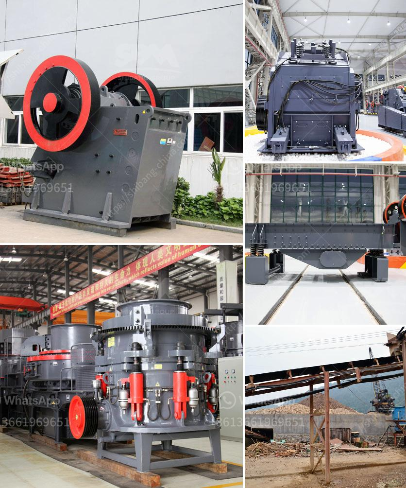

<h3>مصانع طحن الكرات</h3>
مصانع طحن الكرات هي وحدات صناعية تستخدم في عملية طحن المواد الصلبة. تستخدم هذه الكرات المعدنية أو السيراميكية لسحق وطحن المواد الخام، مثل الألغام والخامات المعدنية والمواد الكيميائية والمواد الغذائية والمواد البلاستيكية والخشب والعديد من المواد الأخرى.

1. مطحنة الكرة الرطبة: تعمل عن طريق إدخال المواد الخام والماء في الوحدة، ثم تدور الكرة الكبيرة داخل الطاحونة لطحن الخامات.

2. مطحنة الكرة الجافة: تعمل بنفس الطريقة لكن دون إضافة الماء. تستخدم هذه الطاحونة عندما يكون المواد الخام جافة أو عندما يكون هناك خطر على حدوث تلوث بالماء.

3. مطحنة الكرة المتعددة الأغراض: تستخدم لطحن مجموعة واسعة من المواد الخام، ويمكن ضبط سرعة الدوران ونوع الكرات المستخدمة وحجمها لتلبية متطلبات العملية.

فائدة استخدام مصانع طحن الكرات هي تحويل المواد الخام غير المطحونة إلى مواد مطحونة ناعمة، وهذا يزيد من سطح المواد المطحونة ويجعلها أكثر تفاعلاً مع المواد الأخرى، مثل المذيبات أو الحموض. يجعل ذلك المنتجات النهائية أكثر فعالية في الاستخدام وأقل تكلفة في الإنتاج.

وتجدر الإشارة إلى أن مصانع طحن الكرات تختلف في الحجم والقدرة، وتستخدم في العديد من الصناعات، مثل صناعة الأسمنت والتعدين والكيميائيات وصناعة الأغذية. عملية طحن الكرات هي عملية أساسية في هذه الصناعات وتعد جزءًا هامًا من سلسلة إنتاج المنتجات النهائية.

في الختام، تعتبر مصانع طحن الكرات هي وحدات صناعية حيوية تستخدم لتحويل المواد الخام إلى منتجات نهائية مطحونة وتستخدم في العديد من الصناعات المختلفة. تساهم هذه المصانع في تحسين الكفاءة والجودة وتقليل التكلفة في صناعات مختلفة، مما يجعلها ضرورية وأساسية في العملية الصناعية الحديثة.
<h3>Contact us</h3><ul><li><strong>Whatsapp:&nbsp;<a href="https://wa.me/8613661969651">+8613661969651</a></strong></li><li><a href="https://swt.shibang-china.com/?git&amp;zhl&amp;مصانع طحن الكرات"><strong>Online Service(chat now)</strong></a></li></ul><h3>Related</h3><ul><li><a href='شركة تصنيع معدات التكسير.md'>شركة تصنيع معدات التكسير</a></li><li><a href='دراسة جدوى لمصنع تكسير بذور جوز النخيل.md'>دراسة جدوى لمصنع تكسير بذور جوز النخيل</a></li><li><a href='مصنع كسارة في الهند.md'>مصنع كسارة في الهند</a></li><li><a href='اليابان لمصنع تكسير متنقل.md'>اليابان لمصنع تكسير متنقل</a></li><li><a href='مورد آلة كسارة الأسطوانة.md'>مورد آلة كسارة الأسطوانة</a></li></ul>