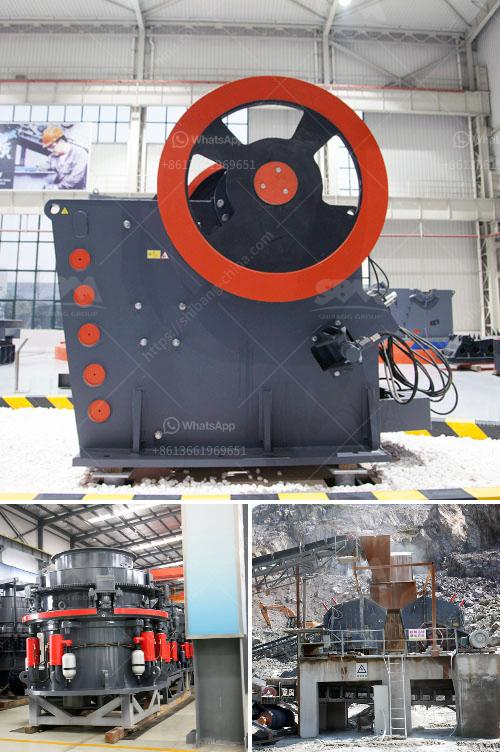

<h3>مصانع غسل الفحم المحمولة</h3>
تعتبر مصانع غسل الفحم المحمولة من التكنولوجيا الحديثة في صناعة الفحم. تقوم هذه المصانع بتنقية الفحم من الشوائب والأتربة قبل استخدامه في توليد الطاقة. تتميز هذه المصانع بأهمية عالية بسبب قدرتها على عمليات التنقية الفعالة والمرنة.

إحدى المزايا الرئيسية لمصانع غسل الفحم المحمولة هي قدرتها على العمل في أماكن عدم توفر البنية التحتية الثابتة. يمكن نقل هذه المصانع بسهولة إلى المناطق النائية أو المواقع التي يصعب الوصول إليها، مما يوفر وقتًا وجهدًا كبيرًا في إعداد المنشآت.

تعتمد مصانع الفحم المحمولة على تقنيات متقدمة في عمليات تنقية الفحم، حيث تستخدم الغسيل والفرز والطحن بشكل متزامن. يتم تكسير الفحم إلى قطع صغيرة ومن ثم يتم نقلها عبر أنظمة الغسيل والفصل المختلفة. يتم إزالة الشوائب والأتربة بشكل فعال للحصول على فحم نقي وجاهز للإستخدام.

واحدة من أهم مزايا مصانع الفحم المحمولة أيضًا هي قدرتها على تقليل الأثر البيئي. تعمل هذه المصانع بأساليب ذات كفاءة عالية للطاقة وتقلل من انبعاثات الغازات الضارة. تم تصميم هذه المصانع لتكون صديقة للبيئة وذات استهلاك منخفض للمياه، مما يساهم في المحافظة على البيئة والحفاظ على الصحة العامة.

مصانع غسل الفحم المحمولة تعتبر حلاً مثاليًا لتلبية احتياجات صناعة الفحم المتزايدة. فهي توفر القدرة على معالجة الفحم في مكان الانتاج والحصول على منتج نهائي عالي الجودة بشكل سريع وفعال. كما تعتبر هذه المصانع تكلفة أقل من المصانع التقليدية وتوفر مرونة أكبر في التشغيل والصيانة.

في الختام، تعد مصانع غسل الفحم المحمولة تقنية حديثة ومبتكرة تساهم في تحسين صناعة الفحم. فهي تحقق التنقية الفعالة والمرنة للفحم وتقليل الأثر البيئي. وبفضل قدرتها على العمل في المواقع النائية وتوفير الوقت والجهد في إعداد المنشآت، تعتبر هذه المصانع الخيار المثالي للعديد من الشركات المصنعة في صناعة الفحم.
<h3>Contact us</h3><ul><li><strong>Whatsapp:&nbsp;<a href="https://wa.me/8613661969651">+8613661969651</a></strong></li><li><a href="https://swt.shibang-china.com/?git&amp;zhl&amp;مصانع غسل الفحم المحمولة"><strong>Online Service(chat now)</strong></a></li></ul><h3>Related</h3><ul><li><a href='صيانة محطة توليد الفحم بصيغة PDF.md'>صيانة محطة توليد الفحم بصيغة PDF</a></li><li><a href='تقرير تفصيلي حول مصنع مسحوق الكوارتز.md'>تقرير تفصيلي حول مصنع مسحوق الكوارتز</a></li><li><a href='معدات تكسير وطحن التلك.md'>معدات تكسير وطحن التلك</a></li><li><a href='مطحنة هامر مختبرية.md'>مطحنة هامر مختبرية</a></li><li><a href='مصنع معالجة كروشر في ماليزيا.md'>مصنع معالجة كروشر في ماليزيا</a></li></ul>