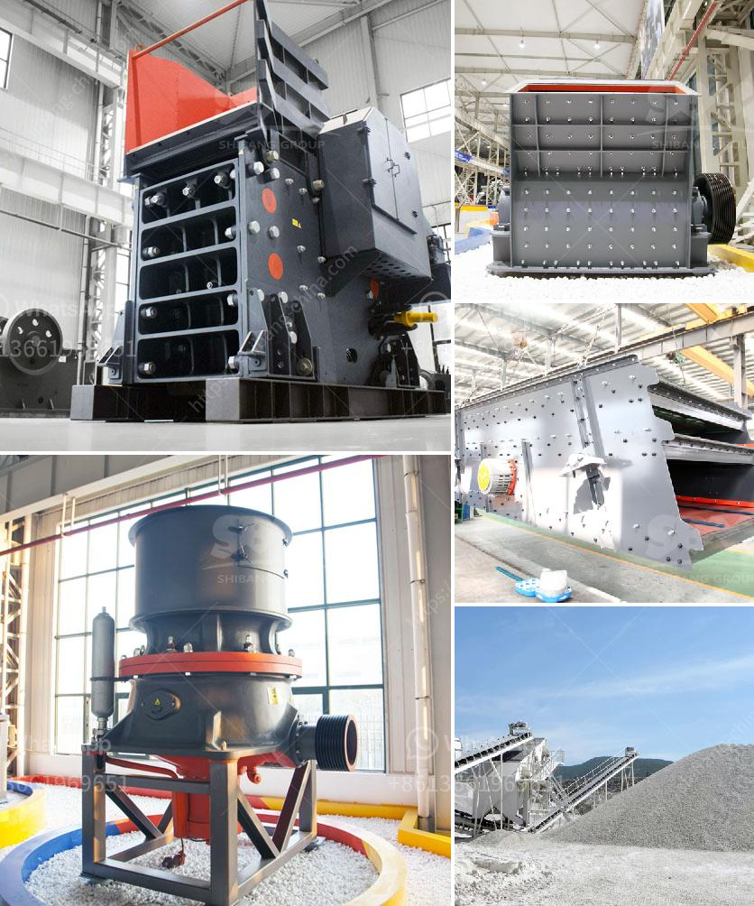

<h3>مصانع غسيل الذهب للبيع في غانا</h3>
تُعتبر غانا واحدة من أبرز الدول المنتجة للذهب في العالم، حيث تحتل المرتبة العاشرة عالمياً من حيث إنتاج الذهب. ومنذ فترة طويلة، استخدم سكان غانا تقنيات غسيل الذهب التقليدية لاستخراج الذهب من الأنهار والأنهار الجانبية والتربة. ومع تطور الصناعة وتوسعها، توجد اليوم العديد من المصانع المتخصصة في غسيل الذهب للبيع في غانا.

تتميز مصانع غسيل الذهب في غانا بتقديم تجهيزات ومعدات عالية الكفاءة وفعالة لاستخراج الذهب. فهي تستخدم تكنولوجيا حديثة وأدوات متطورة تسهل عملية فصل الذهب عن المواد المعدنية الأخرى. كما أنها توفر خدمات صيانة ودعم فني فوري للعملاء لضمان سلامة واستمرارية عملية استخراج الذهب.

تقوم المصانع بتوفير الحلول المختلفة لاحتياجات العملاء، بدءًا من الآلات الصغيرة المحمولة التي يمكن استخدامها في عمليات الغسيل البسيطة، وصولاً إلى الآلات الأكبر والمعقدة التي تستخدم في مشاريع الاستخراج الكبيرة. وبالإضافة إلى ذلك، يمكن للعملاء الاستفادة من خدمات ما بعد البيع مثل تزويد قطع الغيار والصيانة والتدريب على استخدام المعدات.

تعتبر مصانع غسيل الذهب للبيع في غانا فرصة ممتازة لرواد الأعمال والاستثمار. فاستخراج الذهب يُعد من التجارات الرابحة والتي تحقق أرباحاً كبيرة. ونظرًا لتوفر المصادر المحلية للذهب في غانا، يمكن للمستثمرين الاستفادة من الأسواق المحلية والعالمية لبيع المنتجات.

ومع ذلك، يجب على المستثمرين أخذ بعض العوامل في الاعتبار قبل شراء مصنع غسيل الذهب في غانا. ينبغي على المستثمرين التحقق من السمعة والتاريخ المهني للشركة المصنعة، وفحص الضمانات والخدمات المقدمة، واستشارة الخبراء في هذا النوع من الأعمال.

وفي الختام، تعد مصانع غسيل الذهب للبيع في غانا فرصة رائعة للأشخاص الذين يرغبون في الاستثمار في صناعة استخراج الذهب. فهي توفر المعدات المتطورة والتكنولوجيا العالية التي تساعد على زيادة الكفاءة وتحقيق الأرباح المالية. ومع الطلب المستمر على الذهب في الأسواق المحلية والعالمية، يمكن لهذا الاستثمار أن يكون مربحًا وناجحًا في المستقبل.
<h3>Contact us</h3><ul><li><strong>Whatsapp:&nbsp;<a href="https://wa.me/8613661969651">+8613661969651</a></strong></li><li><a href="https://swt.shibang-china.com/?git&amp;zhl&amp;مصانع غسيل الذهب للبيع في غانا"><strong>Online Service(chat now)</strong></a></li></ul><h3>Related</h3><ul><li><a href='كسارات الحجر الرئيسية.md'>كسارات الحجر الرئيسية</a></li><li><a href='أنواع السيور الناقلة.md'>أنواع السيور الناقلة</a></li><li><a href='سعر كسارة الفحم القدرة.md'>سعر كسارة الفحم القدرة</a></li><li><a href='شراء وبيع حجر الكسارة في ماليزيا.md'>شراء وبيع حجر الكسارة في ماليزيا</a></li><li><a href='أسعار كسارات الجيرة.md'>أسعار كسارات الجيرة</a></li></ul>