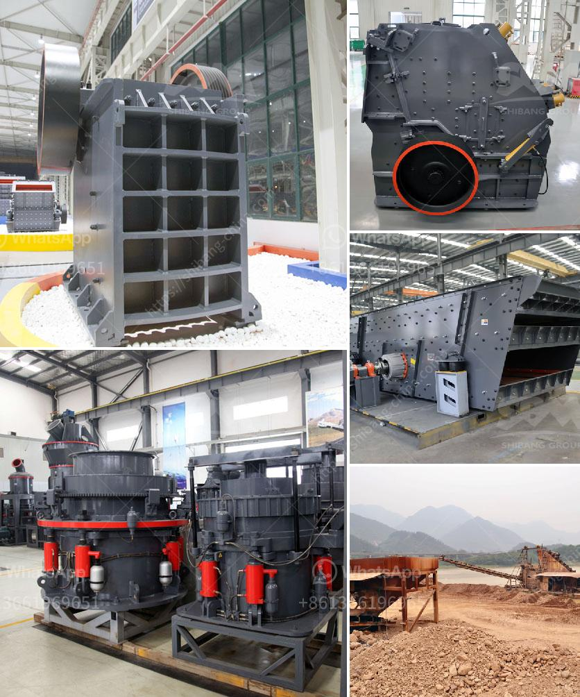

<h3>مصانع غسيل الفحم المستخدمة للبيع في الهند</h3>
تعد الهند واحدة من أكبر الدول المنتجة والمستهلكة للفحم في العالم، حيث يعتبر الفحم من الوقود الأساسي في قطاعات الطاقة والصناعة في البلاد. ولتحسين جودة الفحم المستخدم وزيادة كفاءته، توجد مصانع غسيل الفحم في الهند.

تعمل مصانع غسيل الفحم على إزالة الشوائب والرواسب من الفحم وتحسين جودته بحيث يصبح أكثر قدرة على الاحتراق وتقليل الانبعاثات الضارة. وتساهم هذه المصانع أيضًا في تقليل استهلاك المياه وتلوثها، بفضل استخدام تقنيات حديثة لتنقية الماء المستخدم في عملية الغسيل. 

تتوفر مصانع غسيل الفحم المستخدمة للبيع في الهند بمختلف الأحجام والقدرات، مما يتيح الاختيار المناسب لمتطلبات العملاء. وتتميز تلك المصانع بالتكنولوجيا المتقدمة والقدرة على العمل بكفاءة عالية ودقة لإنتاج الفحم المغسول بجودة عالية.

يعتبر الفحم المغسول مطلوبًا في العديد من الصناعات، مثل صناعة الحديد والصلب وصناعة توليد الكهرباء، حيث يحسن من جودة الإنتاج ويزيد من كفاءة الأعمال. كما يتم استخدام الفحم المغسول في الصناعات الكيماوية وإنتاج الأسمدة.

تطبق مصانع غسيل الفحم في الهند أيضًا معايير السلامة والصحة المهنية لضمان سلامة العاملين وحماية البيئة. تعتبر هذه الصناعة فرصة اقتصادية مهمة للبلاد وتساهم في توفير فرص عمل للكثير من العاملين في قطاع الطاقة والصناعة.

إن توفر مصانع غسيل الفحم المستخدمة للبيع في الهند يعزز قدرة الشركات والمستثمرين على الاستفادة من هذه الفرصة الاقتصادية المهمة. يمكن بيع المعدات لمصانع الغسيل بأسعار تتراوح بين 200 و400 ألف دولار تقريبًا، وفقًا للحجم والنموذج المطلوب. بالإضافة إلى ذلك، تتوفر خدمات ما بعد البيع والدعم الفني للمستخدمين للحفاظ على أداء المعدات بأعلى مستوياته.

باختصار، مصانع غسيل الفحم المستخدمة للبيع في الهند توفر فرصًا لتحسين جودة الفحم وزيادة كفاءته. إنها فرصة استثمارية هامة للشركات والمستثمرين الذين يرغبون في الاستفادة من الاقتصاد النامي في الهند والاستفادة من الاحتياجات المتزايدة للفحم في البلاد.
<h3>Contact us</h3><ul><li><strong>Whatsapp:&nbsp;<a href="https://wa.me/8613661969651">+8613661969651</a></strong></li><li><a href="https://swt.shibang-china.com/?git&amp;zhl&amp;مصانع غسيل الفحم المستخدمة للبيع في الهند"><strong>Online Service(chat now)</strong></a></li></ul><h3>Related</h3><ul><li><a href='كسارة الكرة للحديد فقط الشركة.md'>كسارة الكرة للحديد فقط الشركة</a></li><li><a href='تخطيط منشأة تعدين الماس.md'>تخطيط منشأة تعدين الماس</a></li><li><a href='معالجة تكسير البازلت.md'>معالجة تكسير البازلت</a></li><li><a href='مصنع كسارة مستعمل بسعر 100 طن في الساعة للبيع.md'>مصنع كسارة مستعمل بسعر 100 طن في الساعة للبيع</a></li><li><a href='أجزاء آلة الطحن ووظائفها.md'>أجزاء آلة الطحن ووظائفها</a></li></ul>