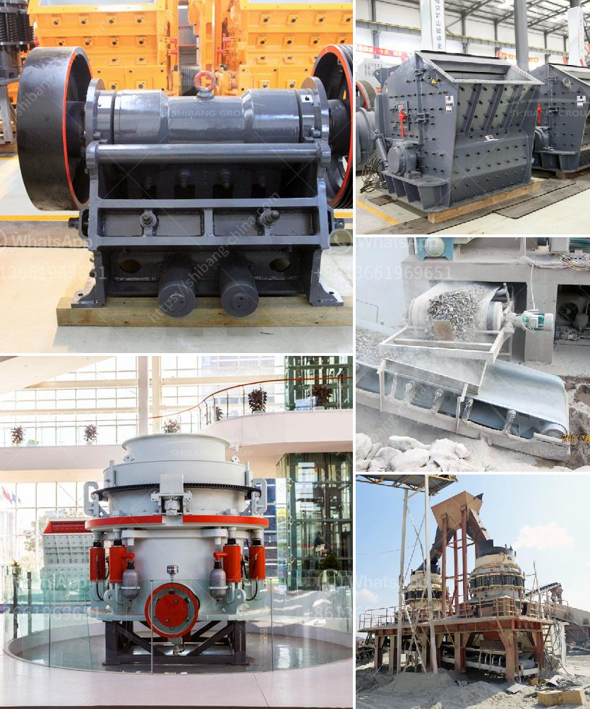

<h3>مصانع غسيل الكروم في جنوب أفريقيا</h3>
تعتبر صناعة غسيل الكروم في جنوب أفريقيا أحد القطاعات الهامة التي تساهم في تحسين الاقتصاد المحلي وتوفير فرص العمل للعديد من السكان. تعد مصانع غسيل الكروم من أكبر مصادر الإيرادات في البلاد وتعد شركات التعدين الرئيسية هي التي تمتلك هذه المصانع.

تقع مصانع غسيل الكروم في مناطق مهمة جغرافيًا في جنوب أفريقيا، حيث تتواجد كميات كبيرة من خام الكروم. تعد مقاطعة ليمبوبو ومقاطعة مبومالانغا من أبرز المناطق التي تحصل فيها صناعة غسيل الكروم على قرب مصادر الموارد.

تعتبر شركات التعدين في جنوب أفريقيا من بين أفضل الشركات في هذا المجال. فهي تستخدم التكنولوجيا الحديثة لاستخراج ومعالجة خام الكروم بكفاءة عالية. يتم تنقية الخام وفصل الكروم عن الشوائب والزرنيخ الضار بشكل فعال. يطلق على هذه العملية "غسيل الكروم" حيث يتم استخدام الماء والمواد الكيميائية للحصول على نسبة عالية من الكروم النقي.

تلعب صناعة غسيل الكروم دورًا حاسمًا في توفير فرص العمل للمجتمع المحلي. يعمل العديد من العمال في هذه المصانع وتوفرلهم فرص العمل المستدامة والأجور الجيدة. يعمل العمال في عمليات إنتاج الكروم وصيانة المعدات وإدارة الإنتاج والأبحاث العلمية.

تعتبر الصناعة العائدة جدًا، حيث يتزايد الطلب على الكروم في الأسواق المحلية والعالمية. يُستخدم الكروم في العديد من الصناعات مثل صناعة الفولاذ والسيارات وصناعة الإضاءة والصناعات الكيماوية. يتجه العالم نحو استخدام المزيد من الكروم في التكنولوجيا الحديثة مثل صناعة الطاقة الشمسية والإلكترونيات.

تواجه صناعة غسيل الكروم في جنوب أفريقيا بعض التحديات. يشمل ذلك الارتفاع في تكاليف الطاقة والماء وضرورة الالتزام بقوانين الحماية البيئية المشددة. لذلك، تعمل الشركات الرئيسية على تخفيف هذه التحديات من خلال استثمار في تحسين كفاءة الإنتاج واستخدام تقنيات الاستدامة البيئية.

وفي الختام، تشكل مصانع غسيل الكروم في جنوب أفريقيا أحد القطاعات الهامة التي تعزز اقتصاد البلاد وتوفر فرص العمل. تعتبر هذه الصناعة حاسمة بالنسبة للمجتمع المحلي وصناعات أخرى في العالم التي تعتمد على الكروم. تعمل الشركات الرئيسية على تحسين تقنيات الإنتاج والاستدامة لضمان استمرارية هذه الصناعة في المستقبل.
<h3>Contact us</h3><ul><li><strong>Whatsapp:&nbsp;<a href="https://wa.me/8613661969651">+8613661969651</a></strong></li><li><a href="https://swt.shibang-china.com/?git&amp;zhl&amp;مصانع غسيل الكروم في جنوب أفريقيا"><strong>Online Service(chat now)</strong></a></li></ul><h3>Related</h3><ul><li><a href='كسارة متنقلة قابلة للنقل بسعة 200 طن.md'>كسارة متنقلة قابلة للنقل بسعة 200 طن</a></li><li><a href='أسعار آلات تكسير الحجر في زيمبابوي.md'>أسعار آلات تكسير الحجر في زيمبابوي</a></li><li><a href='طحن معدات الطحن الطحن.md'>طحن معدات الطحن الطحن</a></li><li><a href='مصنع معالجة خام الذهب 200 طن في الساعة.md'>مصنع معالجة خام الذهب 200 طن في الساعة</a></li><li><a href='البحث عن كسارة الحجر.md'>البحث عن كسارة الحجر</a></li></ul>