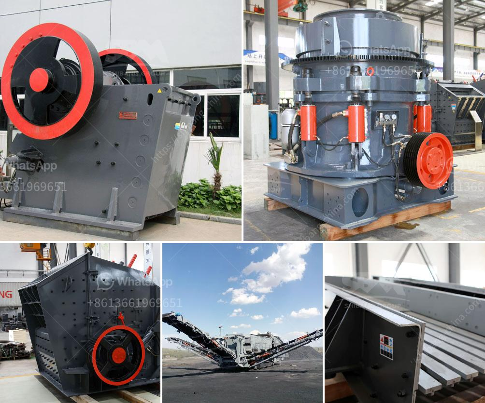

<h3>مصانع غسيل صغيرة للبيع</h3>
إن امتلاك مصنع غسيل صغيرة هو فرصة رائعة لرجال الأعمال الراغبين في الدخول إلى صناعة الخدمات وتحقيق أرباح مستدامة. تعتبر هذه الأنشطة التجارية مثالية للأشخاص الذين يرغبون في العمل بشكل مستقل وتنموية نسبيا، فضلا عن الأشخاص الذين يريدون توسيع شبكة أعمالهم الحالية.

في البداية، تعد مصانع غسيل الصغيرة فرصة مهمة لتقديم خدمات الغسيل والتنظيف للعديد من العملاء المحتملين. باتباع استراتيجية جيدة وتوفير جودة عالية في العمل، يمكن أن تصبح هذه العملية ذات ربحية كبيرة. 

تعتمد نجاح مصنع غسيل صغير على عوامل عديدة منها التحكم في التكاليف والحفاظ على جودة الخدمات المقدمة. يجب أن تكون المعدات المستخدمة عالية الجودة ومتطورة، بالإضافة إلى القدرة على معالجة كميات كبيرة من الملابس في وقت قصير. إن استخدام تكنولوجيا حديثة في عمليات الغسيل يمكن أن يوفر الكثير من الوقت والطاقة والقوى العاملة، وبالتالي يعزز ربحية العملية.

يجب أيضا أن يتم اختيار الموقع المثالي لإقامة المصنع. ينبغي أن يكون الموقع قريبا من الأسواق الرئيسية والمدن الكبيرة، مما يسهل وصول العملاء ونقل الملابس إليهم بسهولة. يفضل أيضا أن يكون الموقع بالقرب من المناطق السكنية الكبيرة حيث يكون هناك طلب كبير على خدمات الغسيل.

علاوة على ذلك، يجب أن يتم توظيف موظفين مدربين ومؤهلين تأهيلا جيدا لضمان جودة الخدمات. يتطلب عمل مصنع غسيل صغير عددا قليلا من العمال، ولكن يجب التأكد من أنهم متخصصين وقادرين على التعامل مع جميع أنواع الملابس والأقمشة.

والأهم من ذلك، يجب أن يكون لدى المصنع استراتيجية تسويقية فعالة. يمكن ذلك من خلال إنشاء صفحة ويب أو تطبيق للهواتف الذكية لتسهيل حجز الخدمات وتوفير معلومات حول الأسعار وجدوى الغسيل المقدم. يمكن أيضا تقديم عروض خاصة للعملاء المدراء والشركات والمراكز التجارية.

في النهاية، فإن امتلاك مصنع غسيل صغيرة يمثل فرصة ممتازة للربح والنجاح وتوفير خدمات عالية الجودة للعملاء. على الرغم من أن الدخول إلى صناعة الخدمات قد يحتاج إلى بعض الجهود والاستثمارات، إلا أنه يمكن تحقيق أرباح مستدامة ونمو محتمل في المستقبل.
<h3>Contact us</h3><ul><li><strong>Whatsapp:&nbsp;<a href="https://wa.me/8613661969651">+8613661969651</a></strong></li><li><a href="https://swt.shibang-china.com/?git&amp;zhl&amp;مصانع غسيل صغيرة للبيع"><strong>Online Service(chat now)</strong></a></li></ul><h3>Related</h3><ul><li><a href='مطحنة الأسطوانة مطحنة السميكة.md'>مطحنة الأسطوانة مطحنة السميكة</a></li><li><a href='تكلفة كسارة المعدات في ماليزيا.md'>تكلفة كسارة المعدات في ماليزيا</a></li><li><a href='حسابات في مطحنة الأسطوانة العمودية.md'>حسابات في مطحنة الأسطوانة العمودية</a></li><li><a href='كسارات حجر مستعملة للبيع.md'>كسارات حجر مستعملة للبيع</a></li><li><a href='بيع كسارة الحجر 400 طن في الساعة.md'>بيع كسارة الحجر 400 طن في الساعة</a></li></ul>