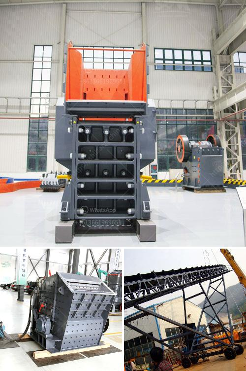

<h3>مصانع فحص الركام</h3>
تعتبر مصانع فحص الركام من المصانع الهامة في صناعة البناء والانشاءات. فهي تقوم بفحص وتجهيز الركام (الحصى والرمال) المستخدم في الخرسانة وفي عمليات البناء الأخرى. تعتبر جودة الركام أحد العوامل المهمة في ضمان جودة الخرسانة والمنتج النهائي. ولذا فإن مصانع فحص الركام تلعب دورًا حيويًا في صناعة البناء.

تعمل مصانع فحص الركام على فصل الحصى والرمال بحسب حجمها وخصائصها الميكانيكية. حيث يتم إدخال الركام إلى آلات الفرز التي تقوم بفصل الحصى عن الرمال بناءً على حجم الجسيمات. وفي هذه العملية تستخدم الشاشات والفرز الجاذبية الذي يستند إلى قوة الجاذبية لفصل الجسيمات حسب وزنها وحجمها.

بعد ذلك، يتم فحص الحصى والرمال المفصولة للتأكد من جودتها ومطابقتها للمواصفات والمعايير المطلوبة. يتم قياس خصائص الركام، مثل الوزن النوعي، ونسبة الامتصاص، والمقاومة للتآكل، والتوزيع الحبيبي. يتم استخدام مجموعة متنوعة من الاختبارات والتحليلات لضمان أن الركام يلبي المواصفات المطلوبة للاستخدام في البناء.

يتم تجهيز الركام المفحوص بطرق مختلفة حسب الاحتياجات. في حالة استخدامه في صناعة الخرسانة، يتم خلط الركام بالمواد اللازمة مثل الأسمنت والماء والمواد الكيميائية والإضافات الأخرى لتشكيل خليط الخرسانة المطلوب. ويتم تجفيف الخليط وتشكيله في القوالب المناسبة ومن ثم سحبها وذلك للحصول على المنتج النهائي المطلوب.

عملية فحص وتجهيز الركام تؤثر بشكل كبير على جودة البناء النهائية. فإن استخدام ركام ذو جودة منخفضة يمكن أن يؤدي إلى ضعف المتانة وقصر العمر الافتراضي للبناء. ولذا فإن مصانع فحص الركام تلعب دورًا حيويًا في ضمان جودة المنتج النهائي وتقوم أيضًا بدور مهم في المحافظة على البيئة. فانتقاء وفحص الركام المناسب يقلل من استخدام المواد الغير ضرورية ويساهم في استدامة البناء.

باختصار، تعتبر مصانع فحص الركام أحد الأعمال الحيوية في صناعة البناء. فهي تقوم بفصل وفحص الركام المستخدم في البناء لضمان جودته وتجهيزه بطرق ملائمة. وبذلك تساهم في تحسين جودة البناء والمحافظة على البيئة.
<h3>Contact us</h3><ul><li><strong>Whatsapp:&nbsp;<a href="https://wa.me/8613661969651">+8613661969651</a></strong></li><li><a href="https://swt.shibang-china.com/?git&amp;zhl&amp;مصانع فحص الركام"><strong>Online Service(chat now)</strong></a></li></ul><h3>Related</h3><ul><li><a href='آلة حبيبات الجبس في الهند.md'>آلة حبيبات الجبس في الهند</a></li><li><a href='آلة كسارة حجر للبيع.md'>آلة كسارة حجر للبيع</a></li><li><a href='مصنع كسارة 150 طن في الساعة.md'>مصنع كسارة 150 طن في الساعة</a></li><li><a href='سعر كسارة مخروطية 250 طن.md'>سعر كسارة مخروطية 250 طن</a></li><li><a href='مصانع المعالجة في الصين للحجر الجيري.md'>مصانع المعالجة في الصين للحجر الجيري</a></li></ul>