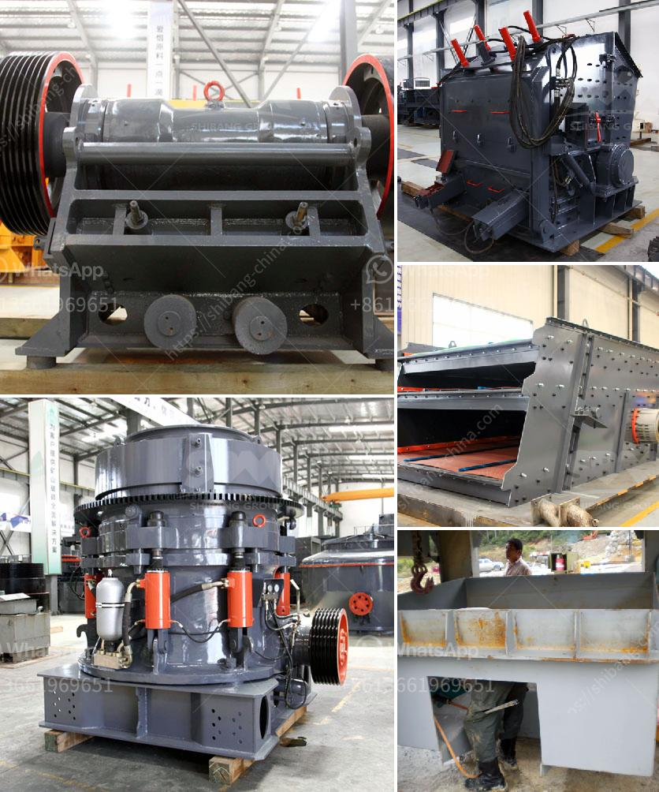

<h3>مصانع قديمة للبيع، استخدمت مطاحن الكرات</h3>
تعد مصانع القديمة المكان المثالي للتجارة العقارية واستثمار مربح. تاريخيًا، كانت هذه المصانع تستخدم في صناعات مختلفة، واليوم تكون متاحة للشراء والتحويل إلى وحدات سكنية أو تجارية أخرى. من بين هذه الصناعات هي استخدام مطاحن الكرات.

تعد مطاحن الكرات جزءًا مهمًا من عمليات التكسير والطحن في معالجة المعادن والمواد الأخرى. تحوي هذه المصانع على معدات يمكن استخدامها لطحن المواد الخام إلى حجم أصغر، مثل الخامات المعدنية أو الخامات السيراميكية. تتكون هذه المطاحن من برميل دوار يحتوي على كرات صلبة تم تحميلها داخله. عندما يتم تشغيل المطحنة، تتحرك الكرات بطريقة تطحن المواد الخام بسبب قوة الاحتكاك المتولدة بسبب حركة البرميل الدوار. تكمن القوة الكبيرة للمطاحن في تكسير المواد الخام وطحنها إلى حجم صغير يمكن استخدامه في العمليات التالية.

يمتزج التاريخ والجمالية بشكل رائع في المصانع القديمة. في بعض الأحيان، تم بناء هذه المصانع في القرن التاسع عشر أو في بداية القرن العشرين، وتحمل طابعاً تاريخياً فريداً. قد يكون للمباني القديمة ميزات معمارية جميلة، مثل الأعمدة الرخامية والشرفات الواسعة والنوافذ الكبيرة. هذه التفاصيل الفريدة تجعل من المصنع القديم مكانًا جذابًا للمستثمرين الذين يبحثون عن شراء عقار يحمل تاريخاً وفرصة للتحويل إلى وحدة سكنية فريدة أو مساحة عمل تجارية تستغل هذه السحر.

استثمار في مصنع قديم يمنح المستثمر فرصة للإبداع والتحويل. يمكن للمصنع القديم أن يكون قاعدة لبناء المشاريع الإبداعية، مثل استوديو فني أو معرض للفن أو مساحة للمشاريع العملية مثل تصميم الأزياء أو تشغيل استوديو لتصوير الأفلام. بالإضافة إلى ذلك، فإن المصانع القديمة يتمتعوا بموقع استراتيجي يمكن استغلاله لأغراض تجارية. يمكن تحويل المصنع إلى متجر تجزئة أو ملعب رياضي أو مسرح أو حتى فندق.

في الختام، يمثل شراء مصنع قديم يحتوي على مطاحن الكرات فرصة استثمارية فريدة. تجمع بين جمالية المبنى التاريخي ومرونة استخدامه. سواء تم تحويله إلى وحدات سكنية أو تجارية، يمكن للمصنع القديم أن يوفر فرصًا للتجارة العقارية المربحة وخلق مشاريع إبداعية جديدة. بالتزامن مع الاستفادة من الموقع الاستراتيجي للمصنع، تعتبر هذه الأماكن جذابة بشكل خاص للمستثمرين الباحثين عن خيارات استثمار آمنة ومربحة.
<h3>Contact us</h3><ul><li><strong>Whatsapp:&nbsp;<a href="https://wa.me/8613661969651">+8613661969651</a></strong></li><li><a href="https://swt.shibang-china.com/?git&amp;zhl&amp;مصانع قديمة للبيع، استخدمت مطاحن الكرات"><strong>Online Service(chat now)</strong></a></li></ul><h3>Related</h3><ul><li><a href='سعر كسارة الفك في نيجيريا.md'>سعر كسارة الفك في نيجيريا</a></li><li><a href='آلة معالجة الرماد الطائر.md'>آلة معالجة الرماد الطائر</a></li><li><a href='مصانع الفرز للبيع.md'>مصانع الفرز للبيع</a></li><li><a href='كسارات في المملكة العربية السعودية.md'>كسارات في المملكة العربية السعودية</a></li><li><a href='كسارة لقاعدة الطريق الزرقاء.md'>كسارة لقاعدة الطريق الزرقاء</a></li></ul>