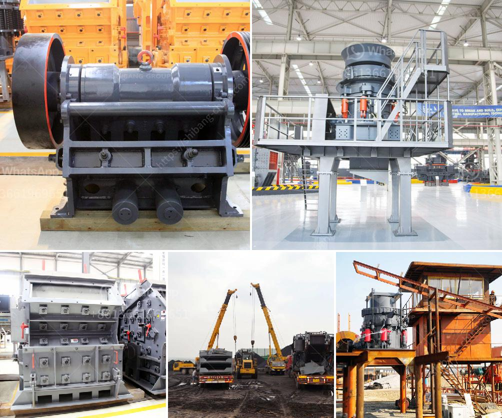

<h3>مصانع كسارة في مونتيري</h3>
تقع مدينة مونتيري في ولاية نويفو ليون في شمال شرق المكسيك. تُعتبر مونتيري واحدة من أهم المدن الصناعية في المكسيك، حيث تضم العديد من المصانع والشركات الكبيرة. أحد القطاعات الهامة في مونتيري هو قطاع مصانع الكسارات.

توفر مصانع الكسارات في مونتيري مجموعة واسعة من الخدمات لمجال البناء والتشييد والحفريات. تُعتبر الكسارات مهمة جدًا في عملية استخراج وتكسير الصخور والمواد الصلبة الأخرى لإنتاج الركام، الحصى، والرمل. تستخدم هذه المواد في مشاريع البناء المختلفة مثل الطرق والجسور والأبنية والتحسينات العامة.

تتميز مصانع الكسارات في مونتيري بتطبيق تقنيات حديثة ومتقدمة في تكسير وطحن المواد الخام. تعتمد هذه المصانع على معدات خاصة ومتطورة تسمح بإنتاج منتجات عالية الجودة بكفاءة عالية. يتم اختبار المواد الخام قبل البدء في عملية التكسير لضمان الحصول على منتج نهائي متميز ومطابق للمواصفات المطلوبة.

كما تُولي مصانع الكسارات في مونتيري اهتماماً كبيرًا للتحسين المستمر والابتكار في عملياتها. يتم توظيف مهندسين وفنيين ذوي خبرة عالية لتحليل العمليات وتحسينها بشكل مستمر. يتم استخدام أحدث التقنيات لتحقيق الكفاءة والاستدامة البيئية في العمليات. يُولى الاهتمام بالمحافظة على البيئة أيضًا عن طريق اتباع مبادئ الاستدامة والحد من التأثير البيئي السلبي لعمليات التعدين.

وبفضل وجود مصانع الكسارات في مونتيري، تم تعزيز النمو الاقتصادي في المنطقة وتوفير فرص العمل للكثير من الناس. قد تترافق عملية التعدين والتكسير مع عمليات تابعة مثل النقل والتوزيع والتسويق، وهذا يؤدي إلى تعزيز الاقتصاد المحلي وتوفير فرص عمل إضافية في المنطقة.

باختصار، تعد مصانع الكسارات في مونتيري أحد الموردين الرئيسيين لمواد البناء في المكسيك. تضمن جودة المنتجات، الابتكار، والاستدامة تطور هذه الصناعة وتعزز النمو الاقتصادي للمنطقة. كما توفر هذه المصانع فرص عمل مهمة للكثير من الأفراد، مما يسهم في رفع مستوى المعيشة في المدينة وتعزيز البنية التحتية.
<h3>Contact us</h3><ul><li><strong>Whatsapp:&nbsp;<a href="https://wa.me/8613661969651">+8613661969651</a></strong></li><li><a href="https://swt.shibang-china.com/?git&amp;zhl&amp;مصانع كسارة في مونتيري"><strong>Online Service(chat now)</strong></a></li></ul><h3>Related</h3><ul><li><a href='كسارات Canica 1200 VSI المستعملة.md'>كسارات Canica 1200 VSI المستعملة</a></li><li><a href='جوال محطم الحجر الجيري.md'>جوال محطم الحجر الجيري</a></li><li><a href='طحن الرمل السيليكا.md'>طحن الرمل السيليكا</a></li><li><a href='السعر على مطحنة التعدين 10 طن في الساعة.md'>السعر على مطحنة التعدين 10 طن في الساعة</a></li><li><a href='كسارة محمولة للشراء.md'>كسارة محمولة للشراء</a></li></ul>