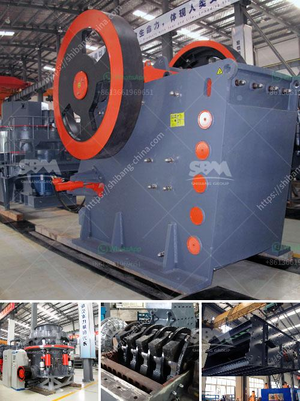

<h3>مصانع محمولة للبيع في جنوب أفريقيا</h3>
تعد الصناعة من القطاعات الحيوية لأي اقتصاد ناجح، وتعتبر القدرة على الانتاج الصناعي السريع والمرن أحد العوامل الرئيسية للتنمية الاقتصادية. ولذلك، فإن وجود مصانع محمولة أصبح أمرًا مهمًا في جنوب أفريقيا وفي دول أخرى حول العالم. تتميز هذه المصانع بقابليتها للتحرك والتشغيل في أماكن مختلفة عن طريق نقلها بالشاحنات أو الحاويات.

تتيح المصانع المحمولة للشركات والأفراد القدرة على بدء الإنتاج بشكل سريع وفعال. بفضل التكنولوجيا المتقدمة، أصبح بالإمكان تصنيع منتجات عالية الجودة من المكان الذي يعيْش فيه المستهلك. بالإضافة إلى ذلك، تعتبر هذه المصانع مفيدة في المناطق النائية أو أماكن الكوارث الطبيعية حيث يكون الوصول إلى البنية التحتية محدودًا.

في جنوب أفريقيا، يتم استخدام المصانع المحمولة في عدة قطاعات. على سبيل المثال، يتم استخدامها في صناعة الخشب والبلاستيك والتعدين والنفط والغاز. تعد هذه المصانع بديلاً مرنًا وفعالًا بالنسبة للشركات الصغيرة والمتوسطة التي تتطلب إمكانية توسيع الإنتاج في أي وقت وفقًا للطلب. كما أنها توفر فرصًا كبيرة لريادة الأعمال وتشجيع الابتكار.

بالإضافة إلى المزايا التجارية، توفر المصانع المحمولة أيضًا فوائد بيئية. تساعد على تقليل التلوث من خلال استخدام تقنيات متقدمة للتحكم في الانبعاثات والتخلص الآمن من النفايات. كما أنها تستخدم مصادر طاقة مستدامة مثل الطاقة الشمسية والرياح.

يعزز توفر المصانع المحمولة في جنوب أفريقيا الاستثمار ويعزز النمو الاقتصادي، حيث تساهم في خلق فرص عمل جديدة وتعزيز القدرات الصناعية للدولة. تدعم الحكومة الجنوب أفريقية اعتبار المصانع المحمولة كأداة لتعزيز التنمية الاقتصادية والاجتماعية في الدولة.

في الختام، فإن المصانع المحمولة للبيع في جنوب أفريقيا تُعَدُّ حلاً مرنًا للشركات والأفراد الذين يهدفون إلى الاستفادة من فرص الإنتاج السريع والفعال في أماكن مختلفة. تعزز هذه المصانع قدرة الدولة الصناعية وتشجع على الاستثمار وتحقق فوائد بيئية أيضًا. بالتالي، يُعَدُّ اقتناء مصنع محمول في جنوب أفريقيا خيارًا جيدًا للتنمية الاقتصادية والاجتماعية في البلاد.
<h3>Contact us</h3><ul><li><strong>Whatsapp:&nbsp;<a href="https://wa.me/8613661969651">+8613661969651</a></strong></li><li><a href="https://swt.shibang-china.com/?git&amp;zhl&amp;مصانع محمولة للبيع في جنوب أفريقيا"><strong>Online Service(chat now)</strong></a></li></ul><h3>Related</h3><ul><li><a href='مستعملة vsi كسارة للبيع في الهند.md'>مستعملة vsi كسارة للبيع في الهند</a></li><li><a href='كسارة الحجر للبيع في سريلانكا.md'>كسارة الحجر للبيع في سريلانكا</a></li><li><a href='كيفية صنع آلة كسارة خام الحديد.md'>كيفية صنع آلة كسارة خام الحديد</a></li><li><a href='كسارات جنوب أفريقيا.md'>كسارات جنوب أفريقيا</a></li><li><a href='كم تكلف مصنع التكسير.md'>كم تكلف مصنع التكسير</a></li></ul>