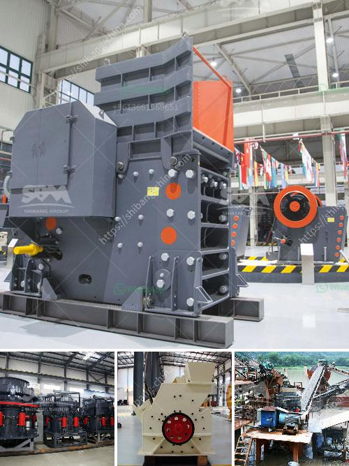

<h3>مصانع مطاحن الأسمنت</h3>
تعتبر مصانع مطاحن الأسمنت من أهم المصانع الصناعية التي تلعب دوراً حيوياً في قطاع البناء والتشييد. تستخدم هذه المصانع العملية التي تهدف إلى تحويل المواد الخام إلى الأسمنت، وهو المكون الرئيسي للخرسانة المستخدمة في قواعد البنية التحتية والمباني.

تعتمد مصانع مطاحن الأسمنت على مجموعة من العمليات الهندسية والكيميائية المعقدة لتحقيق هذا الهدف. تشمل هذه العمليات طحن وخلط المكونات الخام، وهي الحجر الجيري والطين والحجر الجيري الوسيط والحديد المسطح. يتم تكسير وطحن هذه المكونات للحصول على مسحوق الأسمنت، الذي يمر بعدة مراحل من التنقية والتحليل الكيميائي لضمان جودة المنتج النهائي.

يهدف عمل مصانع مطاحن الأسمنت إلى إنتاج الأسمنت بمعايير عالية الجودة والمتطلبات البيئية. فبعد إنتاج المسحوق، يتم طحنه بعدة مراحل حتى يتم الحصول على حجم جسيمات محدد وفقاً للأغراض المقصودة. كما يتم تحقيق عملية تنقية المنتج من الشوائب والمواد الغريبة التي يمكن أن تؤثر سلباً على جودة الخرسانة.

ومن الجوانب الأخرى، فإن مصانع مطاحن الأسمنت تعمل على الحفاظ على البيئة والصحة العامة. فهي تستخدم تقنيات متطورة للتحكم في انبعاثات الغازات الضارة ومكافحة التلوث البيئي. تقوم هذه المصانع بجمع وتصفية الغبار والدخان الصادر عن عملية الإنتاج واستخدام أنظمة الفلترة والعوادم للحد من انتشار الملوثات في الهواء.

بصفة عامة، تعتبر مصانع مطاحن الأسمنت من الصناعات الحيوية للتنمية الاقتصادية. فهي تساهم في توفير فرص عمل للعديد من الأفراد وتعزز التنمية الصناعية. كما تعد مصادر رئيسية للدخل الوطني من خلال تصدير منتجات الأسمنت إلى الأسواق العالمية. وبذلك، تسهم في استدامة الاقتصاد وتعزيز الاكتفاء الذاتي.

ولا يمكن إغفال المسؤولية الاجتماعية التي تتحملها هذه المصانع. فهي تعمل على تعزيز التواصل مع المجتمعات المحلية وتقديم الدعم للمشاريع الخدمية والبيئية التي تعمل على تطوير المنطقة المحيطة بها.

باختصار، تعتبر مصانع مطاحن الأسمنت أحد أهم الصناعات الصناعية في قطاع البناء والتشييد. فهي تساهم في توفير الخرسانة الضرورية للبنية التحتية والمباني، بجودة تلبي الاحتياجات العالمية وتحترم المعايير البيئية. كما تساهم في تحقيق التنمية الاقتصادية وتوفير فرص العمل، وتعمل على تعزيز التواصل مع المجتمعات المحلية وتقديم الدعم المستدام للمشاريع الاجتماعية والبيئية.
<h3>Contact us</h3><ul><li><strong>Whatsapp:&nbsp;<a href="https://wa.me/8613661969651">+8613661969651</a></strong></li><li><a href="https://swt.shibang-china.com/?git&amp;zhl&amp;مصانع مطاحن الأسمنت"><strong>Online Service(chat now)</strong></a></li></ul><h3>Related</h3><ul><li><a href='كسارة مستعملة للبيع في تنزانيا.md'>كسارة مستعملة للبيع في تنزانيا</a></li><li><a href='نوع من مطحنة الكرة.md'>نوع من مطحنة الكرة</a></li><li><a href='سعر آلة طحن الرخام في الهند.md'>سعر آلة طحن الرخام في الهند</a></li><li><a href='كسارة الحجر بسعة 200 طن في الساعة.md'>كسارة الحجر بسعة 200 طن في الساعة</a></li><li><a href='شراء كسارة حجرية صغيرة في الفلبين.md'>شراء كسارة حجرية صغيرة في الفلبين</a></li></ul>