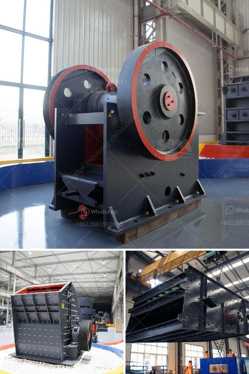

<h3>مصانع معالجة الخام الصينية</h3>
تعتبر الصين واحدة من أكبر الدول المنتجة للخامات في العالم، وتمتلك العديد من المصانع التي تقوم بمعالجة وتصنيع هذه الخامات. تتميز مصانع معالجة الخام الصينية بالتكنولوجيا المتقدمة والكفاءة العالية، وهذا ما يجعلها مصدرًا مهمًا للمنتجات الخام.

تتواجد هذه المصانع في عدة مناطق في الصين، مثل مقاطعة خبي ومقاطعة شانشي ومنطقة البحر الصين الشرقي. تعمل هذه المصانع على تحويل الخامات الطبيعية إلى منتجات نهائية، وتشمل ذلك عمليات التنقية والتكرير والتصفية.

تستخدم المصانع الصينية أحدث التقنيات في معالجة الخامات، مثل التقنيات الحيوية والكيميائية والفيزيائية. تعتمد هذه التقنيات على استخدام المواد الكيميائية والعوامل الحيوية للتخلص من الملوثات وفصل المواد الغير مرغوب فيها، مما يؤدي إلى إنتاج منتجات ذات جودة عالية.

بالإضافة إلى ذلك، تسعى الصين لتطوير وتحسين التكنولوجيا المستخدمة في مصانعها لمعالجة الخامات. فهي تستثمر في البحث والتطوير لتطوير تقنيات جديدة تساهم في زيادة الإنتاجية وتقليل التكاليف. وقد أثبتت هذه الجهود فعاليتها في تعزيز الصناعة الصينية وتعزيز دور الصين كلاعب رئيسي في سوق الخامات.

علاوة على ذلك، تهتم الصين بتنويع منتجاتها المعالجة والمصنعة من الخامات. فهي تعمل على إضافة القيمة للمنتجات من خلال تحويلها إلى منتجات نهائية ذات قيمة عالية، مثل الأدوية والمنتجات الإلكترونية والسيارات. وهذا يساهم في زيادة قيمة الصادرات الصينية وتعزيز التجارة الخارجية.

بشكل عام، تعتبر مصانع معالجة الخام الصينية من الأكثر تقدمًا وكفاءة في العالم. فهي تستخدم التقنيات الحديثة وتستثمر في البحث والتطوير لتحسين الإنتاجية والجودة. وبفضل هذه الجهود، تحتل الصين مركزًا رائدًا في صناعة تصنيع الخامات وتلعب دورًا هامًا في سوق الخامات العالمية.
<h3>Contact us</h3><ul><li><strong>Whatsapp:&nbsp;<a href="https://wa.me/8613661969651">+8613661969651</a></strong></li><li><a href="https://swt.shibang-china.com/?git&amp;zhl&amp;مصانع معالجة الخام الصينية"><strong>Online Service(chat now)</strong></a></li></ul><h3>Related</h3><ul><li><a href='سعر آلة الكسارة في سريلانكا.md'>سعر آلة الكسارة في سريلانكا</a></li><li><a href='سعر ناقل الحزام للتعدين.md'>سعر ناقل الحزام للتعدين</a></li><li><a href='أفكار مشروع مصفاة النحاس صغيرة المقياس.md'>أفكار مشروع مصفاة النحاس صغيرة المقياس</a></li><li><a href='كسارة لقاعدة الطريق الزرقاء.md'>كسارة لقاعدة الطريق الزرقاء</a></li><li><a href='البحث عن كسارة الحجر.md'>البحث عن كسارة الحجر</a></li></ul>