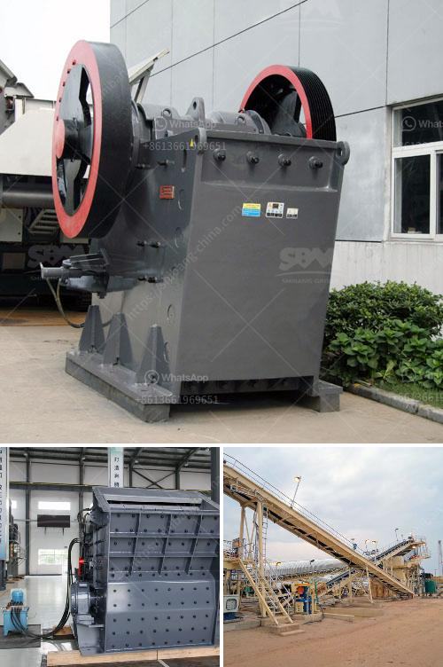

<h3>مصانع معالجة الدولوميت من ألمانيا</h3>
توجد في ألمانيا عدة مصانع لمعالجة الدولوميت، وهو معدن يستخدم في الصناعات المختلفة بسبب خصائصه المميزة. تُعتبر هذه المصانع من أبرز موردي الدولوميت في العالم، حيث تتميز بتقنيات متقدمة وجودة عالية في إنتاج المنتجات.

تعد مصانع معالجة الدولوميت في ألمانيا من أهم القطاعات الصناعية المحلية، وتسهم بشكل كبير في الاقتصاد الوطني. تعمل هذه المصانع على استخراج الدولوميت من المناجم وتحميصه وتكسيره وفرزه، وذلك للحصول على منتج نهائي ذا جودة عالية.

يستخدم الدولوميت بشكل واسع في عدة صناعات، منها صناعة الزجاج والسيراميك والمواد الكيميائية. كما يستخدم في صناعة الصلصال والرخام الصناعي، ويعد أيضًا مكملاً هامًا في صناعة الحديد والفولاذ. بفضل خصائصه الفريدة مثل قدرته على تحسين نوعية الماء وتقليل الاهتزازات، يُستخدم الدولوميت أيضًا في صناعة الأسمدة والأعلاف.

تحرص مصانع معالجة الدولوميت في ألمانيا على الاستدامة البيئية والمسؤولية الاجتماعية. فهي تعمل على تقليل استهلاك الموارد وتحسين كفاءة الإنتاج، كما تهتم بإعادة تدوير النفايات ومعالجتها بشكل صحيح.

بالإضافة إلى ذلك، تمتاز مصانع معالجة الدولوميت في ألمانيا بتطبيق أحدث التقنيات في عمليات التصنيع والمعالجة. فهي تعتمد على الآلات والمعدات الحديثة وتستخدم التكنولوجيا الرقمية لتحقيق أعلى مستويات الجودة والكفاءة في إنتاجها.

في النهاية، تعد مصانع معالجة الدولوميت في ألمانيا من أهم اللاعبين في صناعة المعادن، حيث تقدم المنتجات ذات الجودة العالية للأسواق المحلية والعالمية. وباستمرار الابتكار والتطوير، تعزز هذه المصانع مكانتها كواحدة من أكبر شركات معالجة الدولوميت على مستوى العالم.
<h3>Contact us</h3><ul><li><strong>Whatsapp:&nbsp;<a href="https://wa.me/8613661969651">+8613661969651</a></strong></li><li><a href="https://swt.shibang-china.com/?git&amp;zhl&amp;مصانع معالجة الدولوميت من ألمانيا"><strong>Online Service(chat now)</strong></a></li></ul><h3>Related</h3><ul><li><a href='كسارات الحجر للبيع في كينيا.md'>كسارات الحجر للبيع في كينيا</a></li><li><a href='خط إنتاج البوكسيت.md'>خط إنتاج البوكسيت</a></li><li><a href='شركة تصنيع مطحنة الكرة الدقيقة في الهند.md'>شركة تصنيع مطحنة الكرة الدقيقة في الهند</a></li><li><a href='معلومات عن الكسارة المحمولة.md'>معلومات عن الكسارة المحمولة</a></li><li><a href='تكلفة كسارة الصدم.md'>تكلفة كسارة الصدم</a></li></ul>