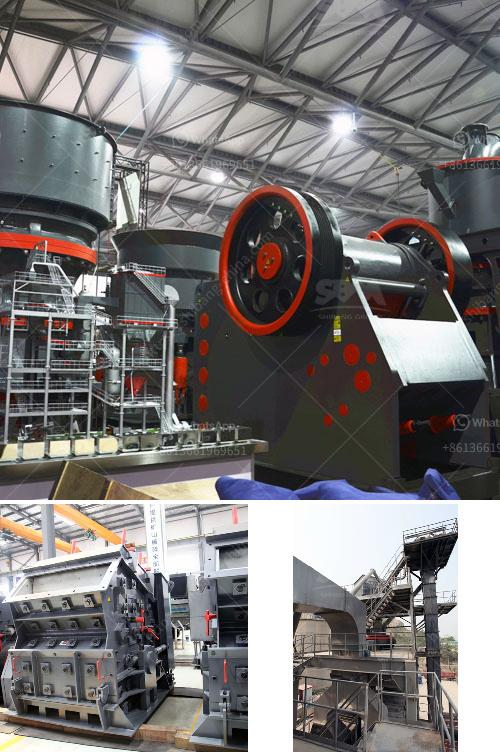

<h3>مصانع معدات مصانع رمال الفراك</h3>
تلعب مصانع معدات مصانع رمال الفراك دورًا حاسمًا في صناعة البناء والبنية التحتية. وتستخدم في تصنيع الرمال الاصطناعية التي تستخدم في العديد من التطبيقات مثل البناء والطرق وبناء السدود وصناعة السيراميك والزجاج والمزيد.

تعمل مصانع معدات مصانع رمال الفراك على تحويل المواد الخام الطبيعية مثل الصخور والحصى إلى رمل اصطناعي عالي الجودة، وذلك باستخدام تقنيات متقدمة. فعلى سبيل المثال، يتم استخدام الكسارات والمطارق الهيدروليكية لتكسير المواد الخام إلى قطع صغيرة. ثم تمر تلك القطع بعملية التنقية والغربلة للحصول على حجم وشكل موحد.

تتميز مصانع معدات مصانع رمال الفراك بالكفاءة والدقة في العملية الإنتاجية. فهي قادرة على إنتاج كميات كبيرة من الرمل الاصطناعي في وقت قصير، مما يسهم في تلبية احتياجات صناعة البناء. وبفضل إجراءات التحكم المتقدمة، يتم التحكم في جودة المنتج النهائي لضمان تلبية المواصفات والمعايير القياسية.

يعتبر الرمل الاصطناعي الناتج عن مصانع معدات مصانع رمال الفراك بديلاً ممتازًا للرمل الطبيعي. فهو يتمتع بخواص ممتازة مثل المقاومة العالية للضغط، والبناء الجيد، والمقاومة للأحماض والقلويات، ومناسب للاستخدام في العديد من التطبيقات المختلفة. كما أنه يسهم في حماية المواضع الترابية والأنهار من الاستنزاف والتصحر.

بصفة عامة، تلعب مصانع معدات مصانع رمال الفراك دورًا حيويًا في تلبية احتياجات صناعة البناء بطريقة مستدامة وفعالة من حيث التكلفة. كما تساهم في تعزيز التنمية الاقتصادية وتوفير فرص العمل وتشجيع الابتكار في صناعة البناء.

وفي الختام، يمكن القول أنه بفضل مصانع معدات مصانع رمال الفراك، يتم تلبية الطلب المتزايد على الرمل الاصطناعي في صناعة البناء. وتلعب هذه المصانع دورًا حاسمًا في تعزيز التنمية المستدامة والإسهام في بناء مستقبل أفضل للبنية التحتية والبناء بشكل عام.
<h3>Contact us</h3><ul><li><strong>Whatsapp:&nbsp;<a href="https://wa.me/8613661969651">+8613661969651</a></strong></li><li><a href="https://swt.shibang-china.com/?git&amp;zhl&amp;مصانع معدات مصانع رمال الفراك"><strong>Online Service(chat now)</strong></a></li></ul><h3>Related</h3><ul><li><a href='آلة معالجة الجبس بسعة طن واحد.md'>آلة معالجة الجبس بسعة طن واحد</a></li><li><a href='سيور ناقلة في فرنسا.md'>سيور ناقلة في فرنسا</a></li><li><a href='آفاق صناعة كسارة الجرانيت.md'>آفاق صناعة كسارة الجرانيت</a></li><li><a href='كسارة الفك في نيبال للبيع.md'>كسارة الفك في نيبال للبيع</a></li><li><a href='منتجات آلات الكتل الطينية.md'>منتجات آلات الكتل الطينية</a></li></ul>