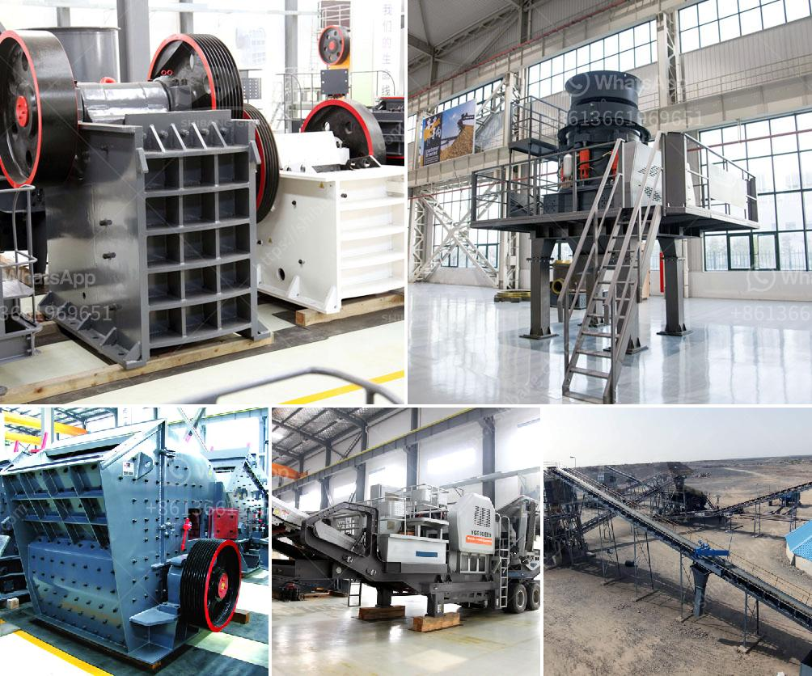

<h3>مصنع DMS للماس المستعمل للبيع في كيمبرلي</h3>
تقع مدينة كيمبرلي في جنوب أفريقيا وتعتبر من أهم مناطق إنتاج الألماس في العالم. واحدة من الشركات المشهورة التي تعمل في هذا المجال هي شركة DMS المتخصصة في إعادة بيع الماس المستعمل.

يتميز مصنع DMS بتاريخ طويل في صناعة الماس، مما يعزز سمعتها كواحدة من الشركات الرائدة في هذا المجال. يجمع مصنع DMS بين الجودة والتكنولوجيا العالية لإعادة تصنيع الماس المستعمل، مما يجعلها الخيار المثالي للعملاء الذين يبحثون عن الماس بأسعار مناسبة.

تقدم DMS تشكيلة واسعة من الماس المستعمل بمختلف الأحجام والألوان والقطع. يتم فحص وتقييم كل ماسة بدقة للتأكد من جودتها وسلامتها، ويتم إجراء الصيانة والتجديد اللازم لتحسين جودة الماسة قبل بيعها للعملاء.

علاوة على ذلك، يقوم مصنع DMS بتوفير خدمة شخصية واحترافية لعملائه. يعمل فريق المبيعات الماهر على تزويد العملاء بالمعلومات اللازمة والاستشارة في اختيار الماس المناسب وفقًا لاحتياجاتهم وميزانياتهم.

يتميز مصنع DMS بأسعاره العادلة والمناسبة للجميع، مما يجعله ملائمًا لعملاء مختلف الفئات الاقتصادية. كما توفر الشركة خيارات دفع مرنة لتسهيل عملية الشراء وتلبية احتياجات العملاء.

بالإضافة إلى ذلك، يلتزم مصنع DMS بمعايير صارمة في ما يتعلق بالمسؤولية الاجتماعية وحماية البيئة. تعتبر الشركة من الرواد في تطبيق ممارسات الاستدامة والحفاظ على الموارد الطبيعية.

بصفة عامة، يعتبر مصنع DMS هدفًا رائعًا لأولئك الذين يبحثون عن الماس المستعمل عالي الجودة وبأسعار معقولة. بفضل تاريخها العريق والمهارات المتنوعة لفريقها والتزامها بأعلى معايير الجودة والاستدامة، يمكن للعملاء الوثوق في منتجات DMS والاستفادة من تجربة شراء مميزة.
<h3>Contact us</h3><ul><li><strong>Whatsapp:&nbsp;<a href="https://wa.me/8613661969651">+8613661969651</a></strong></li><li><a href="https://swt.shibang-china.com/?git&amp;zhl&amp;مصنع DMS للماس المستعمل للبيع في كيمبرلي"><strong>Online Service(chat now)</strong></a></li></ul><h3>Related</h3><ul><li><a href='كسارة مخروطية أساسية.md'>كسارة مخروطية أساسية</a></li><li><a href='سعر آلة تصنيع لوحات الجبس.md'>سعر آلة تصنيع لوحات الجبس</a></li><li><a href='تكسير الحجر المصنوع في ألمانيا.md'>تكسير الحجر المصنوع في ألمانيا</a></li><li><a href='سعر مطحنة رايموند للكاولين.md'>سعر مطحنة رايموند للكاولين</a></li><li><a href='عملية إنتاج الجبس.md'>عملية إنتاج الجبس</a></li></ul>