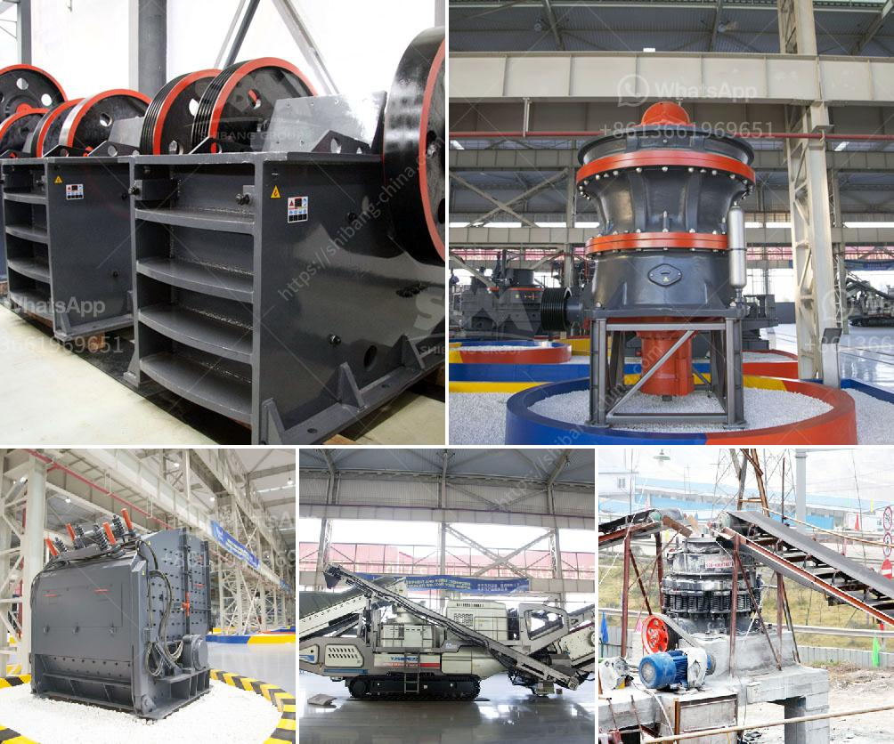

<h3>مصنع آلات كسارة الحجر الماسي في الهند</h3>
تعد صناعة تكسير الحجر الماسي في الهند من أهم الصناعات في البلاد، حيث تعتبر الهند أحد أكبر المنتجين والمصدرين للألماس في العالم. تلعب آلات كسارة الحجر الماسي دورًا حاسمًا في هذه الصناعة، وهناك العديد من المصانع في الهند التي تعمل على تصنيع هذه الآلات.

أحد هذه المصانع المهمة هو مصنع "Diamond Stone Crusher Machinery"، وهو واحد من أبرز مصانع تكسير الحجر الماسي في الهند. تأسست هذه المصانع في البداية لتزويد شركات التعدين وصناعة تكسير الصخور بآلات تعمل على تحويل الحجر الماسي إلى شكل يمكن تجهيزه واستخدامه في العديد من التطبيقات المختلفة.

يعتمد هذا المصنع على تقنية حديثة ومتطورة، حيث يتم تصميم وتصنيع الآلات باستخدام أحدث التقنيات والمعدات. يتكون هذا المصنع من مجموعة من الآلات المتخصصة مثل الكسارات الفكية والكسارات التصادمية والمطاحن والغرابيل ومجموعة متنوعة من الآلات الفرعية الأخرى. يتم تشغيل هذه الآلات بواسطة محركات قوية وفعالة تسمح بتحويل الحجر الماسي إلى قطع صغيرة من الحجم بسرعة وكفاءة عالية.

تتميز آلات كسارة الحجر الماسي المصنعة في الهند بالجودة العالية والموثوقية، مما يجعلها تحظى بشهرة واسعة على المستوى العالمي. تتمتع هذه الآلات بالقدرة على التعامل مع أنواع مختلفة من الحجر الماسي بكل سلاسة ودقة، وتوفر ميزة العمل الآمن والآمن للعمال. يتم تركيب هذه الآلات في مجموعة متنوعة من المواقع مثل مناجم الألماس وكسارات الحجر، وتستخدم لطحن وتكسير الحجر الماسي بسرعة وفعالية.

تعتبر صناعة التكسير الماسي في الهند مصدرًا هامًا للوظائف والإيرادات الاقتصادية، حيث تسهم في توفير العديد من فرص العمل للعمال المحليين وتعزز الاقتصاد المحلي. كما تساهم هذه الصناعة في تلبية الطلب المحلي والعالمي على الحجر الماسي المحول وتحسين جودته.

بخلاصة، تعد مصانع آلات كسارة الحجر الماسي في الهند حجر الزاوية في صناعة الألماس في البلاد، وتوفر آلات عالية الجودة وفعالة لتحويل الحجر الماسي إلى قطع صغيرة من الحجم. تعمل هذه الآلات بفعالية ودقة، وتساهم في دعم الاقتصاد المحلي وتوفير فرص العمل.
<h3>Contact us</h3><ul><li><strong>Whatsapp:&nbsp;<a href="https://wa.me/8613661969651">+8613661969651</a></strong></li><li><a href="https://swt.shibang-china.com/?git&amp;zhl&amp;مصنع آلات كسارة الحجر الماسي في الهند"><strong>Online Service(chat now)</strong></a></li></ul><h3>Related</h3><ul><li><a href='سعر مصنع كسارة الحجر بسعة 200 طن في الساعة.md'>سعر مصنع كسارة الحجر بسعة 200 طن في الساعة</a></li><li><a href='مطحنة الكرات لكربونات الكالسيوم.md'>مطحنة الكرات لكربونات الكالسيوم</a></li><li><a href='كسارة مخروطية غير مستخدمة في إثيوبيا للبيع.md'>كسارة مخروطية غير مستخدمة في إثيوبيا للبيع</a></li><li><a href='نظام مصنع البنتونيت.md'>نظام مصنع البنتونيت</a></li><li><a href='مطحنة ريموند لمعالجة البازلت الجاف.md'>مطحنة ريموند لمعالجة البازلت الجاف</a></li></ul>