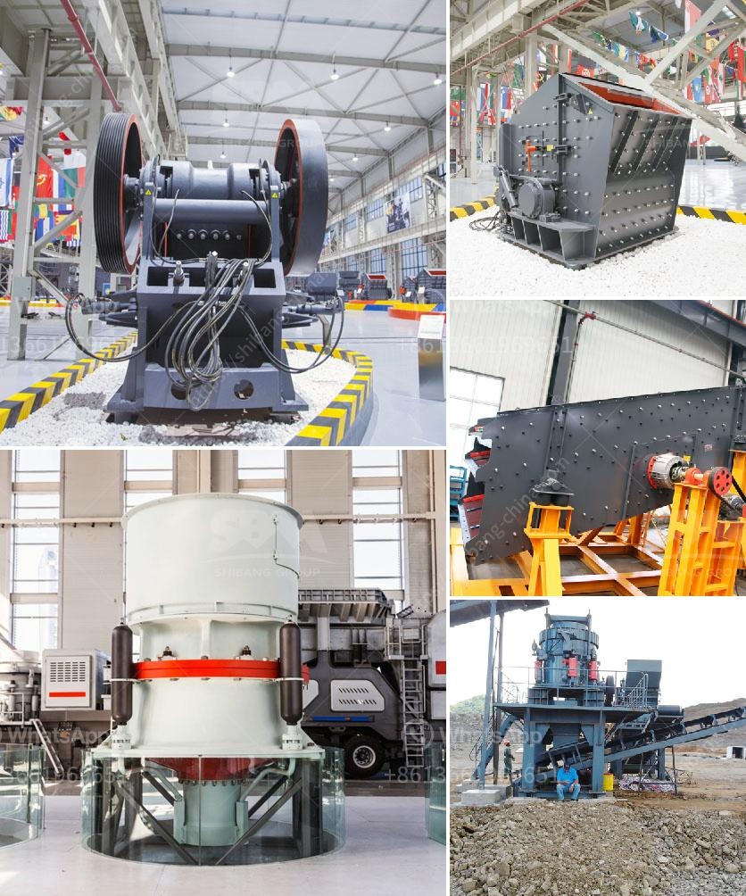

<h3>مصنع آلات مطحنة الكرة</h3>
تعتبر مطحنة الكرة واحدة من المعدات الأساسية في صناعة التكسير والطحن. وتعد مصانع تصنيع مطاحن الكرة من أكثر الصناعات التقنية تطوراً في مجال الآلات الثقيلة بسبب دورها الحاسم في تكسير المواد الخام وطحنها للحصول على مسحوق ناعم يستخدم في عمليات الإنتاج المختلفة.

تعمل مطاحن الكرة على طحن المواد الخام عن طريق تركيز القوة الاحتكاكية بين الكرات المعدنية والمواد الخام داخل الأسطوانة. وتتطلب هذه العملية تقنية متقدمة وتصميم دقيق للمكونات الداخلية للمطحنة لضمان سرعة دوران مناسبة وتوزيع متساوي للكرات المعدنية.

يتكون المصنع من مجموعة من المكونات الأساسية، بما في ذلك الأسطوانة الرئيسية التي تحتوي على الكرات المعدنية والمواد الخام، ومحرك لتشغيل الأسطوانة وتوجيه حركتها، ونظام لتفريغ المواد النهائية المطحونة من الأسطوانة. هذه المكونات تعمل بتنسيق وتزامن تام لتحقيق الأداء الأمثل للمطحنة.

يتم تصنيع مطاحن الكرة في مصانع خاصة متخصصة في هذا المجال. ويشتمل عملية التصنيع على مراحل مختلفة تتضمن التجميع الميكانيكي للمكونات وتثبيتها واختبارها للتأكد من سلامتها وعملها الفعال. كما يتم أيضاً تطبيق عمليات قياس دقيقة لضمان جودة المكونات والأداء المطلوب للمطحنة.

تستخدم مطاحن الكرة بشكل واسع في مختلف الصناعات مثل صناعة الإسمنت، والتعدين، وصناعة السيراميك، وصناعة المواد الكيميائية. وتلعب دوراً حيوياً في تكسير المواد الخام إلى مجموعة متنوعة من الأحجام والاستفادة منها في إنتاج المنتج النهائي. كما تتيح مطاحن الكرة أيضاً تحسين كثافة الشحنة ونقاء المنتج وتقليل استهلاك الطاقة.

باختصار، فإن مصانع تصنيع مطاحن الكرة تلعب دوراً حاسماً في صناعة التكسير والطحن. تعتبر هذه الآلات من أكثر الآلات التكنولوجية تقدماً وتطوراً في مجال الآلات الصناعية. وتعمل على تحقيق أداء عالٍ وفعالية في استخدام المواد الخام وتكسيرها وطحنها لاستخدامها في عمليات الإنتاج المختلفة.
<h3>Contact us</h3><ul><li><strong>Whatsapp:&nbsp;<a href="https://wa.me/8613661969651">+8613661969651</a></strong></li><li><a href="https://swt.shibang-china.com/?git&amp;zhl&amp;مصنع آلات مطحنة الكرة"><strong>Online Service(chat now)</strong></a></li></ul><h3>Related</h3><ul><li><a href='سعر كسارة الحجر pe 600 900.md'>سعر كسارة الحجر pe 600 900</a></li><li><a href='قمع التفريغ لمطحنة الكرة.md'>قمع التفريغ لمطحنة الكرة</a></li><li><a href='مشترين وبائعين لآلات مطحنة ريموند.md'>مشترين وبائعين لآلات مطحنة ريموند</a></li><li><a href='مصنع غسيل الكروم الطبيعي.md'>مصنع غسيل الكروم الطبيعي</a></li><li><a href='آلة طحن الحجر الجيري في بنغلاديش.md'>آلة طحن الحجر الجيري في بنغلاديش</a></li></ul>