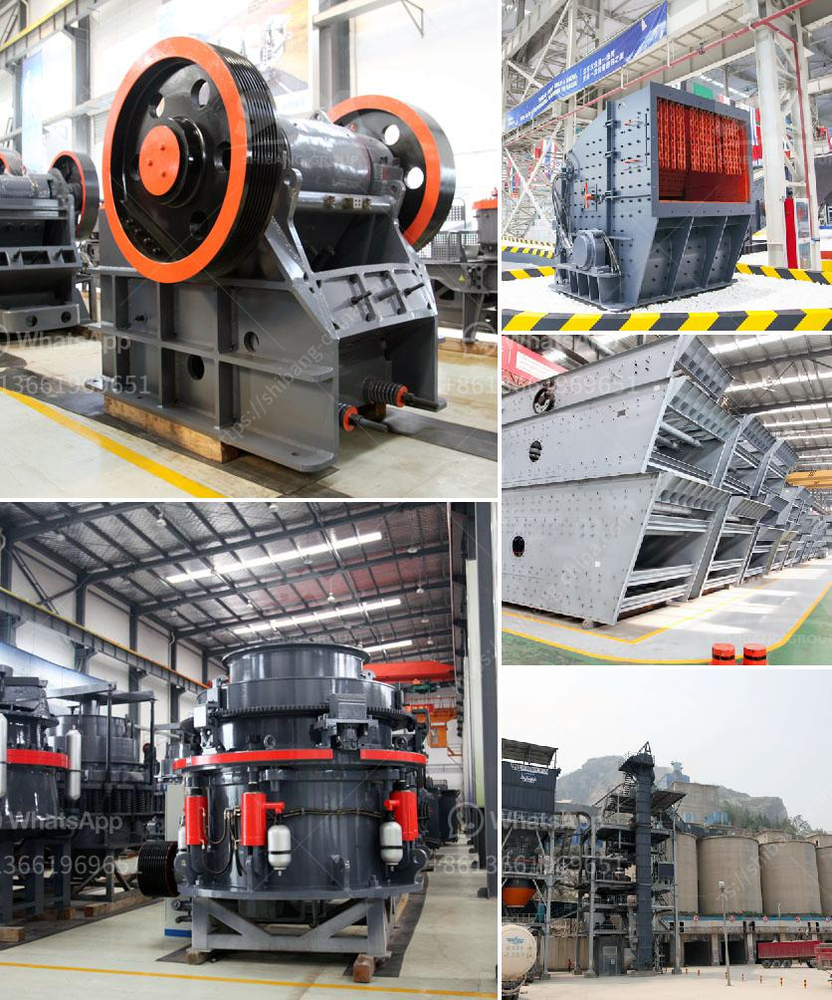

<h3>مصنع أسمنت صغير بسعة 100 طن في اليوم</h3>
يعتبر مصنع الأسمنت من المصانع الهامة في قطاع الصناعة، حيث يقوم بإنتاج الأسمنت الذي يستخدم في البناء والإنشاءات. في هذا المقال سنتحدث عن مصنع صغير للأسمنت بسعة يومية تبلغ 100 طن.

يتميز المصنع الصغير بأنه يحتاج إلى مساحة صغيرة مقارنة بالمصانع الأكبر، حيث يكفي مساحة تقدر بعدة آلاف من الأمتار المربعة. يتألف المصنع عادةً من عدة مراحل، بدءًا من تكسير الحجارة الكبيرة حتى الحصول على الحجر المطلوب لإنتاج الأسمنت. ثم يتم طحنه وخلطه بشكل يسمى الطحن النهائي ويضاف إليه بعض المكونات الأخرى مثل الجبس والفلدسبار.

تعتبر الآلات والمعدات المستخدمة في المصنع من أبرز العوامل التي تحدد القدرة الإنتاجية للمصنع، حيث يجب أن تكون هذه الآلات عالية الجودة وتعمل بكفاءة عالية للحصول على أفضل جودة للأسمنت. بالإضافة إلى ذلك، يجب أن يتوفر في المصنع جميع الأجهزة الضرورية لقياس ومراقبة جودة المنتج النهائي.

يعتبر المصنع الصغير بسعة 100 طن في اليوم مناسبًا للاحتياجات المحلية في العديد من البلدان. يعتمد حجم المصنع على حجم السوق المستهدف والطلب المتوقع. وقد يكون هذا الحجم مناسبًا للأسواق الصغيرة أو للمدن ذات الكثافة السكانية المحدودة.

بالإضافة إلى الجوانب الاقتصادية، يعتبر المصنع الصغير أيضًا أكثر استدامة من المصانع الكبيرة، حيث يستهلك كمية أقل من الطاقة ويولد كمية أقل من الانبعاثات الضارة للبيئة. لذلك فإن استثمار المصانع الصغيرة قد يكون خيارًا مفضلاً من الناحية البيئية أيضًا.

على الرغم من أهمية المصنع الصغير، يجب الأخذ في الاعتبار أن تشغيل مصنع الأسمنت يتطلب خبرة وكفاءة عالية، فضلاً عن الامتثال للمعايير الصحية والبيئية المحلية والدولية. وبشكل عام، يجب أن يتم تصميم وتشغيل المصنع بطريقة مستدامة للمحافظة على البيئة والصحة والسلامة.

في الختام، يعد المصنع الصغير بسعة 100 طن في اليوم خيارًا جيدًا لتلبية الاحتياجات المحلية للأسمنت. يجب أن يتم تصميم وتشغيل المصنع بعناية وفقًا للمعايير الفنية والبيئية والصحية. كما يعتبر استثمار المصانع الصغيرة أكثر استدامة وفاعلية من الناحية البيئية، ويمكن أن يسهم في تطور الصناعة المحلية وتوفير فرص العمل.
<h3>Contact us</h3><ul><li><strong>Whatsapp:&nbsp;<a href="https://wa.me/8613661969651">+8613661969651</a></strong></li><li><a href="https://swt.shibang-china.com/?git&amp;zhl&amp;مصنع أسمنت صغير بسعة 100 طن في اليوم"><strong>Online Service(chat now)</strong></a></li></ul><h3>Related</h3><ul><li><a href='سعر الكسارة من الصين.md'>سعر الكسارة من الصين</a></li><li><a href='آلة طحن الرخام للبيع.md'>آلة طحن الرخام للبيع</a></li><li><a href='مطحنة نيجيريا.md'>مطحنة نيجيريا</a></li><li><a href='كسارات الحجر في كاليفورنيا.md'>كسارات الحجر في كاليفورنيا</a></li><li><a href='سحق وفحص خام المنجنيز.md'>سحق وفحص خام المنجنيز</a></li></ul>