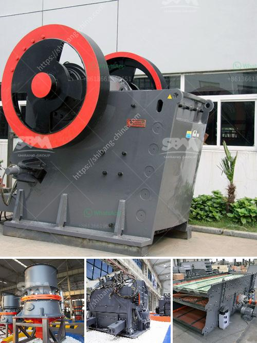

<h3>مصنع أسمنت للبيع في ألمانيا</h3>
تعد صناعة الأسمنت من أهم الصناعات في العالم حيث يتم استخدامه في البناء والتشييد وصناعة الخرسانة. وفي ألمانيا، توجد العديد من المصانع التي تنتج الأسمنت بكميات كبيرة وعالية الجودة.

يعد مصنع الإسمنت في ألمانيا الذي يعرض للبيع فرصة ممتازة للمستثمرين ورجال الأعمال. يقع المصنع في موقع استراتيجي متميز ومحاط بمواد خام عالية الجودة ومتاحة بكميات كبيرة. وبفضل البنية التحتية المتطورة في ألمانيا والتكنولوجيا الحديثة المستخدمة في المصنع، يتم توفير إنتاج ذي جودة عالية وبكفاءة عالية.

يشمل المصنع منشآت رئيسية مثل معدات الطحن والتجفيف والتسخين والحفر وغيرها. كما يحتوي على مخازن كبيرة لتخزين المواد الخام والمنتجات النهائية. وبفضل البناء الحديث والتقنيات المستخدمة في المصنع، يتم تحسين كفاءة الإنتاج والمحافظة على البيئة.

يتم تصدير المنتجات من المصنع لمختلف الأسواق العالمية مما يجعله مصدراً مربحاً ومرغوباً. بفضل جودة الإنتاج والتسليم في الوقت المحدد، تتمتع المنتجات بسمعة طيبة في السوق العالمية.

علاوة على ذلك، توفر المصانع الألمانية بيئة عمل آمنة وملائمة للعمال. حيث تتبع هذه المصانع معايير صارمة للسلامة والصحة المهنية لضمان عدم وقوع حوادث وحماية صحة العمال.

بالإضافة إلى ذلك، توفر الحكومة الألمانية مجموعة من الحوافز والدعم المالي للمستثمرين الذين يهتمون بالاستثمار في هذا المجال. تشمل هذه الحوافز التخفيضات الضريبية والتمويل الميسر والدعم التقني.

باختصار، فإن شراء مصنع الأسمنت في ألمانيا يعتبر فرصة ممتازة للمستثمرين. يحظى الأسمنت بطلب كبير على مستوى العالم وتتمتع المصانع الألمانية بسمعة طيبة وجودة عالية. بالإضافة إلى ذلك، توفر الحكومة الألمانية دعمًا كبيرًا للمستثمرين في هذا القطاع. إذا كنت ترغب في الاستثمار في هذا القطاع واستكشاف فرص الشراء المتاحة، فإن مصنع الأسمنت في ألمانيا هو خيار مثالي لك.
<h3>Contact us</h3><ul><li><strong>Whatsapp:&nbsp;<a href="https://wa.me/8613661969651">+8613661969651</a></strong></li><li><a href="https://swt.shibang-china.com/?git&amp;zhl&amp;مصنع أسمنت للبيع في ألمانيا"><strong>Online Service(chat now)</strong></a></li></ul><h3>Related</h3><ul><li><a href='مصنع سحق صغير بسعة 5 طن في الساعة.md'>مصنع سحق صغير بسعة 5 طن في الساعة</a></li><li><a href='مبدأ عمل حزام النقل.md'>مبدأ عمل حزام النقل</a></li><li><a href='سعر كسارة الح.md'>سعر كسارة الح</a></li><li><a href='شركة تبيع كسارة الحجر في كينيا.md'>شركة تبيع كسارة الحجر في كينيا</a></li><li><a href='تكلفة كسارة الرمل.md'>تكلفة كسارة الرمل</a></li></ul>