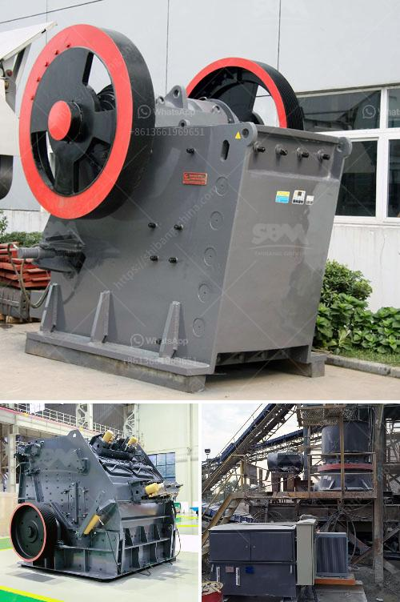

<h3>مصنع إسمنت مربح للبيع في تاميل نادو</h3>
يعتبر قطاع الإسمنت من أهم القطاعات الصناعية في الهند، وبالأخص في ولاية تاميل نادو التي تعرف بوجودها للعديد من المصانع الكبيرة. وفي الوقت الحالي، هناك فرصة مربحة للبيع لمصنع إسمنت في تاميل نادو، يمتلكه صاحبه ويبحث عن مستثمر جدي للإستفادة من تلك الفرصة الواعدة.

توجد العديد من الأسباب التي تجعل الاستثمار في صناعة الإسمنت في تاميل نادو مربحًا. ففي البداية، تاميل نادو تعد من أكبر الأسواق الاستهلاكية للإسمنت في الهند. حيث تشهد الولاية نموًا مستمرًا لقطاع البناء والتشييد، وهو ما يزيد من الطلب على الإسمنت. تجدر الإشارة إلى أنه تم تخصيص مبلغ كبير للبنية التحتية وتطوير المدن في تاميل نادو، وبالتالي هذا يعزز فرص نجاح المصانع لتلبية احتياجات السوق.

من الجوانب الأخرى التي تزيد من جاذبية الاستثمار في مصنع الإسمنت في تاميل نادو، هو الاستدامة البيئية. فالمصانع الحديثة تستخدم تقنيات متقدمة للحد من التلوث والاعتماد على موارد الطاقة المتجددة. هذا يساهم في جعل المصنع أكثر جاذبية للمستثمرين الذين يمتلكون اهتمامًا بالحفاظ على البيئة والاستدامة.

بالإضافة إلى ذلك، يعمل المصنع الحالي بأحدث التقنيات ومعدات الإنتاج، مما يضمن جودة عالية وإنتاجية ممتازة. المصنع يمتلك سمعة ممتازة في سوق الإسمنت ولديه شبكة قوية من العملاء والموردين. هذا يعني أن المشتري الجديد سيتمتع بمزايا تنافسية قوية في سوق الإسمنت المحلية والدولية.

وأخيرًا، تاميل نادو توفر بيئة أعمال متينة وداعمة. الولاية معروفة بتشجيعها للاستثمارات الصناعية وتسهيل إجراءات التراخيص والتنظيم. كما تمتلك حكومة الولاية خطة استراتيجية لتعزيز قطاع البناء والتشييد بشكل عام.

في الختام، يعتبر الاستثمار في مصنع الإسمنت في تاميل نادو فرصة مربحة للمستثمرين الباحثين عن العائد المالي الجيد. توجد العديد من الفرص التجارية في قطاع الإسمنت في الولاية، والمصنع المعروض للبيع يعد فرصة استثمارية مواتية تعد بالنجاح والتوسع في السوق المحلية والخارجية. لذا، يمكن القول بأن استثمارك في هذا المصنع سيكون استثمارًا موفقًا ومربحًا في ولاية تاميل نادو.
<h3>Contact us</h3><ul><li><strong>Whatsapp:&nbsp;<a href="https://wa.me/8613661969651">+8613661969651</a></strong></li><li><a href="https://swt.shibang-china.com/?git&amp;zhl&amp;مصنع إسمنت مربح للبيع في تاميل نادو"><strong>Online Service(chat now)</strong></a></li></ul><h3>Related</h3><ul><li><a href='كسارة الحجر المحمولة للبيع في الفلبين.md'>كسارة الحجر المحمولة للبيع في الفلبين</a></li><li><a href='أسعار كسارة الحجر بسعة 500 طن في الساعة.md'>أسعار كسارة الحجر بسعة 500 طن في الساعة</a></li><li><a href='كسارة للبيع في الفلبين.md'>كسارة للبيع في الفلبين</a></li><li><a href='آلة طحن المطحنة في نيجيريا.md'>آلة طحن المطحنة في نيجيريا</a></li><li><a href='عملية تصنيع الإسمنت بالطريقة الرطبة.md'>عملية تصنيع الإسمنت بالطريقة الرطبة</a></li></ul>