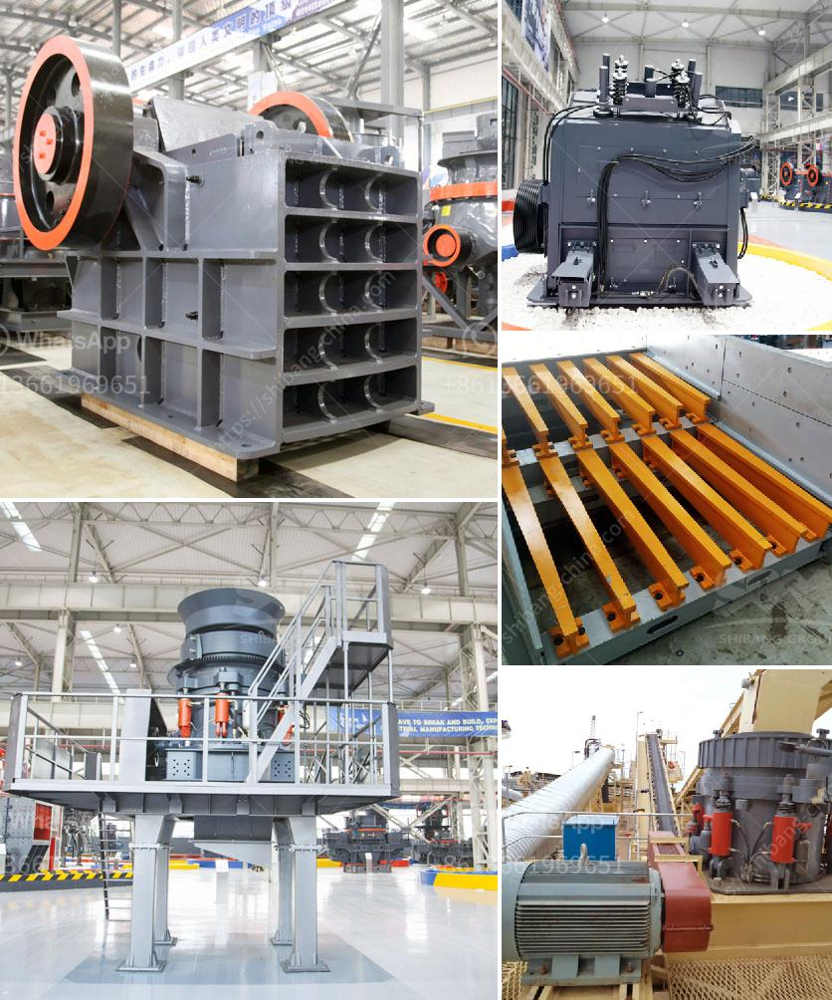

<h3>مصنع إعادة تدوير الخرسانة للبيع</h3>
مصنع إعادة تدوير الخرسانة هو مكان يستخدم لمعالجة وإعادة تدوير الخرسانة القديمة واستخدامها ثانيةً في إنشاءات جديدة. يعد هذا النوع من المصانع من الوحدات الصناعية المهمة في صناعة البناء والتشييد، حيث يساهم في حماية البيئة وتقليل استهلاك الموارد الطبيعية.

تعتمد عملية إعادة تدوير الخرسانة على جمع الخرسانة القديمة، ثم طحنها وفرزها إلى حجم واحد أو أكثر من الأحجام المطلوبة. يتم استخدام طاحونات خاصة لهذا الغرض وتعمل على طحن الخرسانة بشكل فعال وتفصلها عن الشوائب الموجودة بها.

من المنتجات التي يمكن الحصول عليها من مصانع إعادة تدوير الخرسانة: حصمات الخرسانة والحصمات الرملية والحصمات الخرسانية المكسرة والرمل المكسر والزلط. يتم استخدام هذه المنتجات في أعمال البناء المختلفة مثل الأساسات والطرق والجسور والحوائط.

واحدة من المزايا الرئيسية لمصانع إعادة تدوير الخرسانة هي أنها تساهم في حماية البيئة والحفاظ على الموارد الطبيعية. إذا لم يتم إعادة تدوير الخرسانة القديمة، فإنها ستلقى في المزابل أو تتم دفنها في الأرض مما قد يؤدي إلى تلوث التربة والمياه الجوفية.

بالإضافة إلى ذلك، فإعادة تدوير الخرسانة يوفر تكاليف الإنشاءات بشكل عام. فعند استخدام الحصمات المعاد تدويرها، يمكن تقليل استهلاك المواد الأولية مثل الزلط والرمل، مما ينعكس على الأسعار النهائية للمشاريع الإنشائية.

من الناحية الاقتصادية، يمكن لمصانع إعادة تدوير الخرسانة أن تكون مربحة جدًا. فإعادة تدوير الخرسانة يمكن أن تكون بديلاً رخيصًا وفعالًا لشراء مواد جديدة من مواقع التعدين. بالإضافة إلى ذلك، يمكن لأصحاب المصانع كسب المزيد من الدخل من بيع المنتجات المعاد تدويرها.

بالنظر إلى هذه الفوائد، فإن مصانع إعادة تدوير الخرسانة تصبح خيارًا أكثر جاذبية للشركات والمقاولين في صناعة البناء والتشييد. وبالتالي، فمن الممكن أن نشهد زيادة في عدد هذه المصانع في المستقبل المنظور.
<h3>Contact us</h3><ul><li><strong>Whatsapp:&nbsp;<a href="https://wa.me/8613661969651">+8613661969651</a></strong></li><li><a href="https://swt.shibang-china.com/?git&amp;zhl&amp;مصنع إعادة تدوير الخرسانة للبيع"><strong>Online Service(chat now)</strong></a></li></ul><h3>Related</h3><ul><li><a href='سعر كسارة الحجر pe 600 900.md'>سعر كسارة الحجر pe 600 900</a></li><li><a href='مصنع غسيل رمل السيليكا في الهند.md'>مصنع غسيل رمل السيليكا في الهند</a></li><li><a href='مطحنة ريموند في تشيناي.md'>مطحنة ريموند في تشيناي</a></li><li><a href='آلة سحق الدولوميت للبيع في دبي.md'>آلة سحق الدولوميت للبيع في دبي</a></li><li><a href='مصنع تكسير خام البوكسيت.md'>مصنع تكسير خام البوكسيت</a></li></ul>