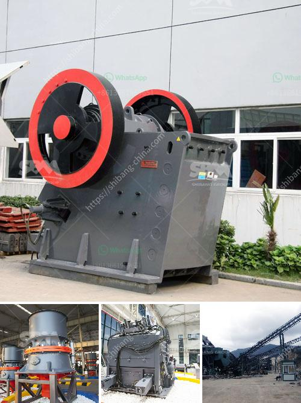

<h3>مصنع إنتاج كربونات الكالسيوم</h3>
مصنع إنتاج كربونات الكالسيوم هو مكان يتم فيه إنتاج وتصنيع مادة كيميائية تسمى كربونات الكالسيوم، وهي مركب كيميائي يتكون من عنصري الكالسيوم والكربون ويُعرف أيضًا باسم الجبس البلوري أو الكالسيت البلوري. يجري استخدام كربونات الكالسيوم في مجموعة واسعة من التطبيقات الصناعية، بما في ذلك صناعة البلاستيك والطلاء والورق والزجاج والأسمنت.

يتم إنتاج كربونات الكالسيوم في مصنع البداية من خلال استخلاص الحجر الجيري. يتم تكسير الحجر الجيري إلى جزيئات صغيرة ثم تسخينه بدرجة حرارة عالية في أفران خاصة. عند تسخين الحجر الجيري، يتفكك ليعطي أكاسيد الكالسيوم وثاني أكسيد الكربون. هذا الغاز يتم تجميعه وتوجيهه إلى عملية الأمتصاص لإنتاج كربونات الكالسيوم.

في خطوة تالية، يتم تمرير ثاني أكسيد الكربون المجموع في محلول مائي يحتوي على أملاح الكالسيوم، مثل كلوريد الكالسيوم أو نترات الكالسيوم. تتفاعل الغاز مع المحلول المائي لتكوين كربونات الكالسيوم، ويستخدم الطراز الكيميائي لهذه العملية اسم "عملية الأمتصاص الحافي"، حيث يتم تحويل المحلول المائي إلى منتج رقيق يحتوي على الغاز المحدد ومادة صلبة تتكون من كربونات الكالسيوم، وتسمى المادة الصلبة باسم "ترسب الأمتصاص".

يتم تكرار هذه الخطوة عدة مرات لتحقيق التركيز الأمثل لكربونات الكالسيوم في المنتج النهائي. يتم تجفيف المنتج باستخدام أفران خاصة، ومن ثم يتم طحنه للحصول على حجم الجسيمات المطلوبة وتصنيفه إلى الفئات المختلفة.

في الختام، تتطلب صناعة كربونات الكالسيوم مصانع متخصصة تعتمد تقنيات متقدمة لضمان جودة المنتج النهائي. يعتبر استخدام كربونات الكالسيوم في العديد من الصناعات حاسمًا، ويساهم في تحسين الكفاءة والأداء والاستدامة البيئية في هذه الصناعات.
<h3>Contact us</h3><ul><li><strong>Whatsapp:&nbsp;<a href="https://wa.me/8613661969651">+8613661969651</a></strong></li><li><a href="https://swt.shibang-china.com/?git&amp;zhl&amp;مصنع إنتاج كربونات الكالسيوم"><strong>Online Service(chat now)</strong></a></li></ul><h3>Related</h3><ul><li><a href='شركات المحاجر في بوكواس وأماسامان.md'>شركات المحاجر في بوكواس وأماسامان</a></li><li><a href='تقدير تكلفة مصنع تعدين النحاس.md'>تقدير تكلفة مصنع تعدين النحاس</a></li><li><a href='مورد آلة كسارة النفايات الفلبين.md'>مورد آلة كسارة النفايات الفلبين</a></li><li><a href='ريموند مطحنة في كولينز.md'>ريموند مطحنة في كولينز</a></li><li><a href='كسارة الفك المحمولة في غرب أفريقيا تجار.md'>كسارة الفك المحمولة في غرب أفريقيا تجار</a></li></ul>