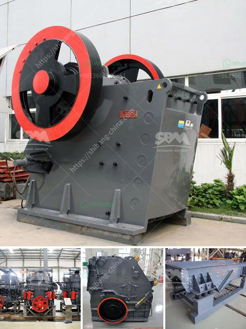

<h3>مصنع إنتاج مسحوق الجبس بسعة 500 طن</h3>
يعتبر مسحوق الجبس من المواد التي تستخدم في العديد من الصناعات مثل صناعة الأسمنت وبناء الجدران وصناعة الأسقف، لذا يتطلب إقامة مصنع إنتاج مسحوق الجبس بسعة 500 طن من التخطيط الجيد والاهتمام بالتفاصيل الدقيقة.

تبدأ عملية إقامة المصنع بتحديد الموقع الذي يلبي احتياجات الإنتاج والتوزيع. يجب أن يتم اختيار موقع قريب من مناطق استخراج الجبس لتقليل تكاليف النقل وتجنب تلوث البيئة.

يتكون المصنع من عدة أقسام رئيسية بما في ذلك وحدة الكسارة والمطحنة وجهاز تنقية وتنقية الغبار ووحدة تعبئة المسحوق. تتم عملية إنتاج مسحوق الجبس بعدة خطوات، حيث يتم سحق قوالب الجبس الخام ثم طحنها في المطحنة للحصول على مسحوق ناعم ونقي.

يجب أن يتم توفير معدات وتقنيات حديثة في المصنع لتحقيق الكفاءة العالية في الإنتاج والخفض من تلوث البيئة والتكاليف العامة. يجب أيضًا تزويد المصنع بأنظمة مراقبة ومراقبة صارمة لضمان جودة المنتج النهائي والامتثال للمعايير الصحية والبيئية.

علاوة على ذلك، يجب وضع خطة لتوزيع المنتج النهائي إلى العملاء المحتملين. يجب توفير وسائل نقل مناسبة والشراكة مع شركات الشحن الرائدة لضمان تسليم المنتجات بأمان وفي الوقت المحدد.

لضمان استدامة المصنع وتحقيق الربحية المستدامة، يجب أن يتم تحليل السوق ودراسة التوجهات والتطورات الصناعية المحلية والعالمية للحفاظ على تحديث المعدات والتكنولوجيا المستخدمة.

في النهاية، يعتبر مصنع إنتاج مسحوق الجبس بسعة 500 طن فرصة مثالية للاستثمار في صناعة البناء والتشييد. يجب وضع خطط شاملة وتوفير الموارد المالية والتقنية والبشرية اللازمة لإقامة مصنع ناجح ومربح.
<h3>Contact us</h3><ul><li><strong>Whatsapp:&nbsp;<a href="https://wa.me/8613661969651">+8613661969651</a></strong></li><li><a href="https://swt.shibang-china.com/?git&amp;zhl&amp;مصنع إنتاج مسحوق الجبس بسعة 500 طن"><strong>Online Service(chat now)</strong></a></li></ul><h3>Related</h3><ul><li><a href='سعر مصنع التكسير والفرز في جنوب أفريقيا.md'>سعر مصنع التكسير والفرز في جنوب أفريقيا</a></li><li><a href='مصنع معالجة الحجر الجيري.md'>مصنع معالجة الحجر الجيري</a></li><li><a href='مصنع معالجة الحجر الفلدسباري.md'>مصنع معالجة الحجر الفلدسباري</a></li><li><a href='جوال محطم الحجر الجيري.md'>جوال محطم الحجر الجيري</a></li><li><a href='آلة قطع الحجر المستخدمة من اليابان.md'>آلة قطع الحجر المستخدمة من اليابان</a></li></ul>