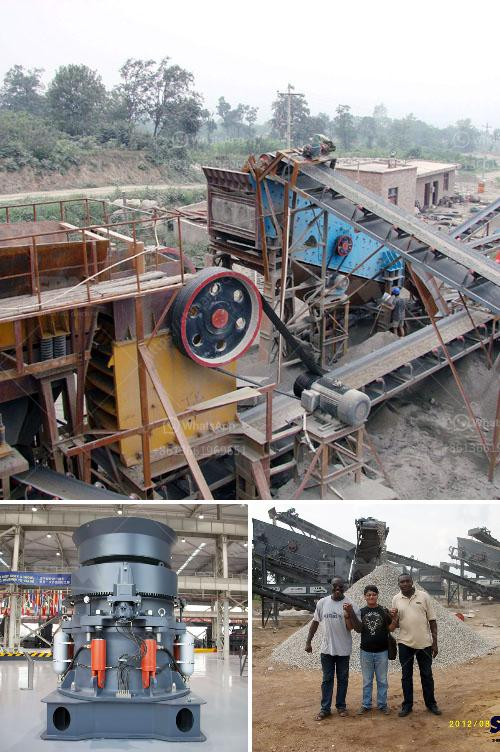

<h3>مصنع إنتاج مسحوق الجبس في أوروبا</h3>
تعتبر صناعة مسحوق الجبس واحدة من الصناعات الهامة والمتقدمة في أوروبا. وتحظى هذه الصناعة بشعبية كبيرة في العديد من القطاعات مثل صناعة البناء والديكور. وتعد مصانع إنتاج مسحوق الجبس في أوروبا من بين أكبر المصانع في العالم.

يتم استخدام الجبس كمادة خام في إنتاج مسحوق الجبس، ويتم استخراجه من مناجم معدنية في أماكن مختلفة في أوروبا. ويتمّ تحويل الجبس إلى مسحوق من خلال عملية التكسير والطحن والتجفيف. وتتم هذه العمليات في مصانع مخصصة لإنتاج مسحوق الجبس.

تبدأ هذه العملية من خلال تكسير الجبس إلى قطع صغيرة بمساعدة المعدات المتخصصة. وبعد ذلك، يتم طحن الجبس في مطاحن خاصة حتى يتم تحويله إلى مسحوق ناعم. ثم يتم تجفيف المسحوق عن طريق تعريضه للحرارة في فرن خاص.

بعد الانتهاء من عملية التحويل والتجفيف، يتم تعبئة المسحوق في أكياس أو حاويات خاصة وتوزيعها في الأسواق المحلية والدولية. ويتم استخدام مسحوق الجبس في صناعة البناء لتشكيل الجدران الداخلية والأسقف والأرضيات. كما يُستخدم أيضًا في صناعة الديكور لتصنيع الأعمال الفنية والزخرفية.

تعتبر مصانع إنتاج مسحوق الجبس في أوروبا من بين أكثر المصانع تطورًا وتكنولوجيًا في العالم. وتستثمر هذه المصانع في معدات حديثة وتقنيات متقدمة لتحسين جودة المنتج وتحقيق أعلى مستويات الكفاءة والإنتاجية.

وتلتزم هذه المصانع أيضًا بمعايير الجودة العالمية وتطبيق أفضل الممارسات البيئية. فهي تعتمد على استخدام تكنولوجيا الإنتاج النظيفة والمستدامة للحفاظ على البيئة وتقليل التأثيرات السلبية.

بالاستفادة من المواد الخام الغنية التي تتواجد في أوروبا والتحسين المستمر في عمليات الإنتاج والمعرفة التقنية المتقدمة، تحقق مصانع إنتاج مسحوق الجبس في أوروبا نجاحًا كبيرًا وتلبي احتياجات السوق المحلية والعالمية.

وبهذه الطريقة، تشكل مصانع إنتاج مسحوق الجبس في أوروبا حجر الزاوية لصناعة البناء والديكور، وتسهم في تطور هذه الصناعة وتعزيز الاقتصاد والتوظيف في المنطقة.
<h3>Contact us</h3><ul><li><strong>Whatsapp:&nbsp;<a href="https://wa.me/8613661969651">+8613661969651</a></strong></li><li><a href="https://swt.shibang-china.com/?git&amp;zhl&amp;مصنع إنتاج مسحوق الجبس في أوروبا"><strong>Online Service(chat now)</strong></a></li></ul><h3>Related</h3><ul><li><a href='معدات كسارة المحجر للبيع.md'>معدات كسارة المحجر للبيع</a></li><li><a href='كسارة الرمال والحجر في فرايبورج.md'>كسارة الرمال والحجر في فرايبورج</a></li><li><a href='مطاحن الحجر الجيري المستخدمة في الفلبين.md'>مطاحن الحجر الجيري المستخدمة في الفلبين</a></li><li><a href='كم تكلف مصنع التكسير.md'>كم تكلف مصنع التكسير</a></li><li><a href='تجارة سحق الخرسانة للبيع.md'>تجارة سحق الخرسانة للبيع</a></li></ul>