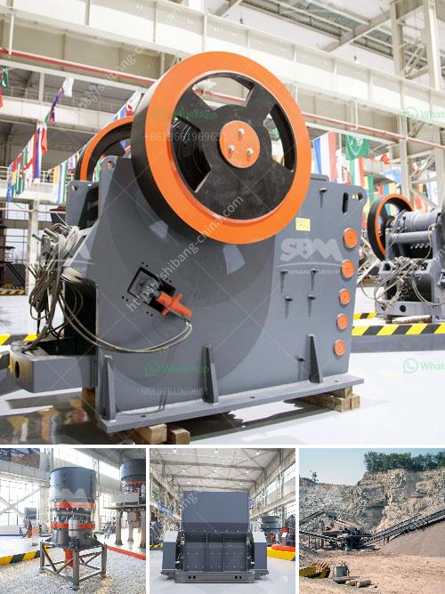

<h3>مصنع استخراج النحاس الصغير</h3>
يُعتبر استخراج النحاس أحد الصناعات المهمة في عالم الصناعة الحديثة، حيث يُستخدم النحاس في العديد من التطبيقات المختلفة مثل صناعة الأسلاك الكهربائية والسبائك وأنابيب الماء. ولكي يتم استخلاص هذا المعدن الثمين بكفاءة عالية، يتوجب بناء مصنع استخراج نحاس صغير وفعال.

يتكون مصنع استخراج النحاس الصغير من عدة مكونات أساسية. أولاً، يتم جمع خام النحاس من المناجم المختلفة، حيث يكون النحاس متواجدًا بصورة حبيبية في الصخور. ثم يتم نقل الخام إلى المصنع لبدء عملية الاستخلاص.

تبدأ عملية الاستخلاص بطحن الخام، حيث يتم سحق الصخور الحبيبية إلى قطع صغيرة باستخدام الكسارات والمطاحن. يتم بعد ذلك نقل الخام المجروش إلى وحدة معالجة تسمى الطاحونة، حيث يتم تعويم الخام. تعويم الخام هو عملية تفصل بين الخام والمواد الغير مرغوب فيها، حيث تتم هذه العملية بإضافة مواد كيميائية خاصة لجعل الجزيئات الحبيبية تطفو على سطح السائل.

ثم يتم جمع النحاس المطفوق في وحدة تعرف بالفاصل المغناطيسي، حيث يحدد مغناطيس قوي المعدن النحاس ويجذبه بعيدًا عن المواد الأخرى الموجودة في الخام. يتم بعد ذلك تنقية النحاس المجمع باستخدام الفصل الكهروستاتيكي، حيث تفصل الشوائب في المعدن مستخدمةً تأثير الكهرباء.

تعد عملية التكرير أكثر مرحلة مهمة في مصنع استخراج النحاس الصغير. في هذه المرحلة، يتم تنقية النحاس ليكون جاهزًا للاستخدام في الصناعات المختلفة. تشمل عملية التكرير عدة خطوات مثل الترشيح والتي تزيل الشوائب المتبقية، والتحكم في درجة الحموضة ودرجة الحرارة لتحقيق نقاء عالٍ للمعدن.

وفي النهاية، يتم تخزين النحاس النقي في العبوات المناسبة ويتم شحنه إلى الأماكن التي تحتاجه في الصناعة. يعد مصنع استخراج النحاس الصغير من الصناعات المهمة في العالم، حيث يلعب النحاس دورًا رئيسيًا في تطوير الاقتصاد والتكنولوجيا في العديد من الدول.

في الختام، يُعد مصنع استخراج النحاس الصغير أحد الأماكن الحاسمة في صناعة استخراج النحاس. إن عملية استخلاص النحاس تتطلب الكثير من الدقة والعناية والمعرفة التقنية. من خلال تقديم مواد نقية بكفاءة، يمكن لمصنع استخراج النحاس الصغير أن يسهم في تلبية احتياجات الصناعة المختلفة والمساهمة في تنمية الاقتصاد المحلي والعالمي.
<h3>Contact us</h3><ul><li><strong>Whatsapp:&nbsp;<a href="https://wa.me/8613661969651">+8613661969651</a></strong></li><li><a href="https://swt.shibang-china.com/?git&amp;zhl&amp;مصنع استخراج النحاس الصغير"><strong>Online Service(chat now)</strong></a></li></ul><h3>Related</h3><ul><li><a href='كسارات الحجر والرمل المحمولة على نطاق صغير.md'>كسارات الحجر والرمل المحمولة على نطاق صغير</a></li><li><a href='سعر مصنع الرمل والحصى في الهند.md'>سعر مصنع الرمل والحصى في الهند</a></li><li><a href='تقرير مشروع الكسارة 100 tph.md'>تقرير مشروع الكسارة 100 tph</a></li><li><a href='كسارات الحجر في بيلين.md'>كسارات الحجر في بيلين</a></li><li><a href='مطحنة طحن السخام في الهند.md'>مطحنة طحن السخام في الهند</a></li></ul>