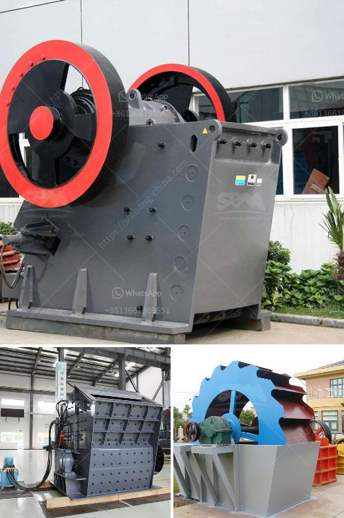

<h3>مصنع الأسمنت في تركيا</h3>
مصانع الأسمنت في تركيا هي من أهم الصناعات التي تلعب دوراً بارزاً في تحقيق التنمية الصناعية والاقتصادية في البلاد. وتعتبر تركيا من أكبر منتجي الأسمنت في العالم.

تاريخ صناعة الأسمنت في تركيا يعود إلى عام 1911، حينما تم بناء أول مصنع للأسمنت في مدينة داريك في الجزء الغربي من تركيا. ومنذ ذلك الحين، توسعت الصناعة بشكل كبير وزادت عدد المصانع في جميع أنحاء البلاد.

توجد العديد من مصانع الأسمنت في تركيا التي تعتمد على موارد طبيعية غنية، مثل الحجر الجيري والطين، والتي توفر مواد خام ضرورية لإنتاج الأسمنت بكميات كبيرة. وتتميز مصانع الأسمنت في تركيا بتكنولوجيا عالية وبيئة عمل آمنة وصحية.

مصانع الأسمنت تلعب دوراً حيوياً في البنية التحتية للبلاد، حيث يتم استخدام الأسمنت لإنشاء الطرق والجسور والمباني والمصانع والمشاريع الأخرى. وتوفر هذه المشاريع فرص عمل للكثير من العمال وتعزز النمو الاقتصادي.

وتعتبر صناعة الأسمنت في تركيا قطاعاً حيوياً من الناحية البيئية أيضاً. فهي تكون عادةً منخفضة الكربون وصديقة للبيئة، حيث يستخدم العديد من المصانع تقنيات حديثة للاحتراق وتوليد الطاقة بشكل فعال. وتلتزم مصانع الأسمنت بتطبيق المعايير البيئية الصارمة التي تضمن حماية البيئة المحيطة وصحة العاملين.

علاوة على ذلك، فإن صناعة الأسمنت في تركيا تسعى للابتكار وتطوير منتجات جديدة تلبي احتياجات السوق المحلية والعالمية. وتستثمر الشركات في البحث والتطوير لتحسين جودة المنتجات وزيادة الاستدامة البيئية.

وفي الختام، فإن مصانع الأسمنت في تركيا تلعب دوراً مهماً في دعم النمو الاقتصادي وتحسين البنية التحتية للبلاد. وتعتبر هذه الصناعة ملتزمة بتطبيق المعايير البيئية والصحية العالمية، مما يجعلها قادرة على تلبية احتياجات السوق المحلية والعالمية بشكل مستدام.
<h3>Contact us</h3><ul><li><strong>Whatsapp:&nbsp;<a href="https://wa.me/8613661969651">+8613661969651</a></strong></li><li><a href="https://swt.shibang-china.com/?git&amp;zhl&amp;مصنع الأسمنت في تركيا"><strong>Online Service(chat now)</strong></a></li></ul><h3>Related</h3><ul><li><a href='مطحنة طحن الطين الصيني.md'>مطحنة طحن الطين الصيني</a></li><li><a href='مطحنة طحن عمودية مستعملة بسعة 100 طن في الساعة.md'>مطحنة طحن عمودية مستعملة بسعة 100 طن في الساعة</a></li><li><a href='مصنع كسارة الدولوميت في الكويت.md'>مصنع كسارة الدولوميت في الكويت</a></li><li><a href='كسارة الحجر في الفلبين للبيع.md'>كسارة الحجر في الفلبين للبيع</a></li><li><a href='مطحنة الأسطوانة للحجر.md'>مطحنة الأسطوانة للحجر</a></li></ul>