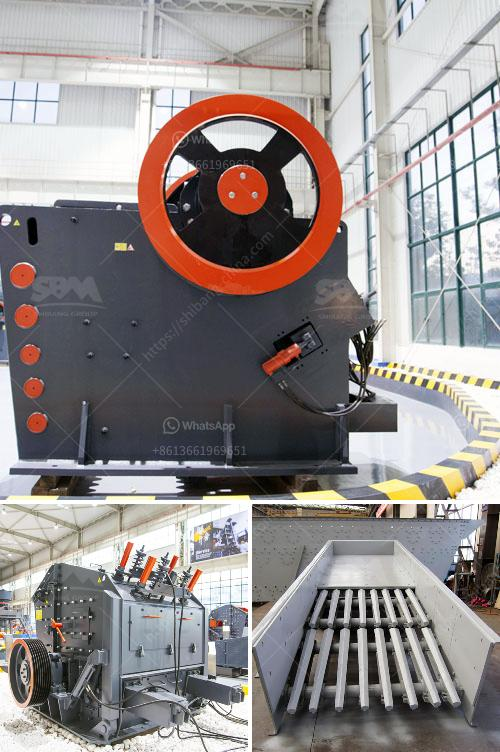

<h3>مصنع الأسمنت من الصهر 100 طن</h3>
يُعد مصنع الأسمنت من الصهر أحد المصانع الهامة التي تلعب دورًا في صناعة البناء والتشييد. قد يتألف مصنع الأسمنت من الصهر من العديد من العناصر والعمليات لإنتاج 100 طن من الأسمنت يوميًا.

يبدأ عملية تصنيع الأسمنت من الصهر بتجهيز وسحق المواد الخام المستخدمة في العملية التصنيعية، مثل الحجر الجيري والصوان والطين. تُرسل هذه المواد إلى آلة التكسير حيث يتم سحقها إلى أجزاء صغيرة. ثم يتم خلط المواد معاً في النسب المناسبة للحصول على خليط الأسمنت.

تأتي المرحلة التالية في عملية التصنيع بعد عملية الخلط، حيث يتم وضع خليط الأسمنت في فرن الصهر الدوار. يُسخن الفرن بدرجة حرارة تصل إلى 1450 درجة مئوية. وتحدث في هذا الفرن عملية الصهر والتفاعل الكيميائي بين المواد الخام لتتحول إلى قُطع الكلينكر، وهو المنتج النهائي لهذه العملية.

بمجرد خروج قُطع الكلينكر من فرن الصهر، يتم تبريدها بسرعة باستخدام هواء أو ماء. ثم يتم طحن قُطع الكلينكر في طواحين الأسمنت حتى تتحول إلى مسحوق الأسمنت. يُضاف إلى المسحوق بعض المواد المضافة، مثل الجبس، لضبط خصائص الأسمنت وتحسينه.

أخيرًا، يتم تعبئة الأسمنت في أكياس أو حاويات ليكون جاهزًا للاستخدام في صناعة البناء والتشييد. يتم نقلها بعد ذلك إلى مواقع البناء حيث يتم استخدامها في تشكيل الخرسانة أو الجص أو غيرها من المواد اللازمة.

مصنع الأسمنت من الصهر بوزن 100 طن يعد منشأة هائلة تتطلب توفر العديد من الأجهزة والمعدات وإجراءات السلامة. يتطلب أيضًا رقابة دقيقة لمراحل العمل لضمان جودة الأسمنت النهائية.

في الختام، يُعد مصنع الأسمنت من الصهر حلقة مهمة في سلسلة صناعة البناء والتشييد. يتطلب إجراءات متعددة ودقيقة لإنتاج أسمنت ذو جودة عالية، ويسهم في توفير المواد اللازمة للمشاريع الكبيرة والصغيرة على حد سواء.
<h3>Contact us</h3><ul><li><strong>Whatsapp:&nbsp;<a href="https://wa.me/8613661969651">+8613661969651</a></strong></li><li><a href="https://swt.shibang-china.com/?git&amp;zhl&amp;مصنع الأسمنت من الصهر 100 طن"><strong>Online Service(chat now)</strong></a></li></ul><h3>Related</h3><ul><li><a href='كسارات الخرسانة الصغيرة للسعة المنخفضة.md'>كسارات الخرسانة الصغيرة للسعة المنخفضة</a></li><li><a href='تكلفة كسارة الفلسبار.md'>تكلفة كسارة الفلسبار</a></li><li><a href='كسارة الكوارتز السيليكون.md'>كسارة الكوارتز السيليكون</a></li><li><a href='كسارة محجر الجرانيت في نيجيريا.md'>كسارة محجر الجرانيت في نيجيريا</a></li><li><a href='معدات طحن فائقة الدقة.md'>معدات طحن فائقة الدقة</a></li></ul>