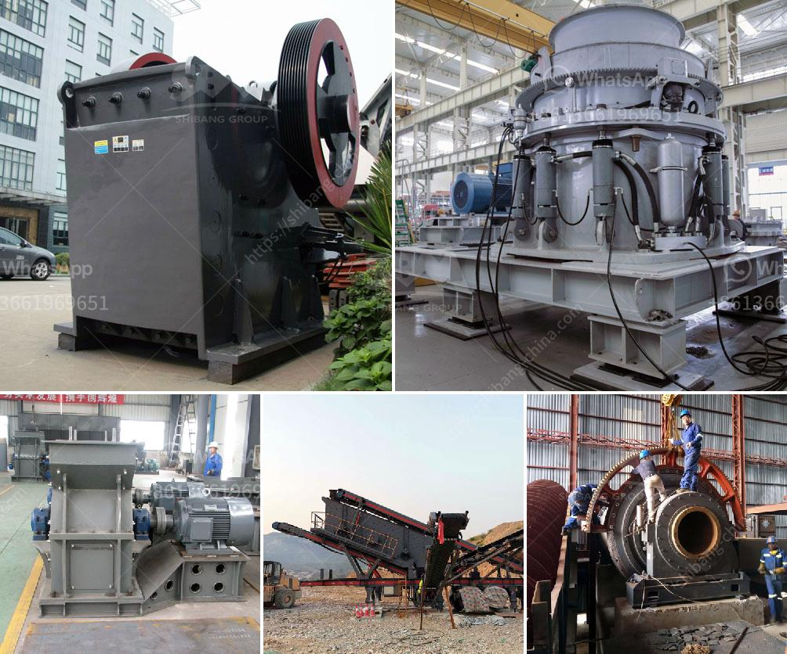

<h3>مصنع الإسمنت الصغير المصنوع في الصين</h3>
تعتبر صناعة الإسمنت من الصناعات الأساسية التي تلعب دورًا هامًا في تطوير البنى التحتية والإنشاءات في العديد من البلدان. وتمتاز الصين بأنها أحد أكبر المنتجين للإسمنت في العالم، حيث تحتل المرتبة الأولى فيما يتعلق بإنتاج الكميات الضخمة من الإسمنت.

على الرغم من أن معظم المصانع في الصين تعتبر كبيرة الحجم وتستخدم تكنولوجيا متقدمة، إلا أن هناك العديد من المصانع الصغيرة التي تلبي احتياجات الأسواق المحلية في مناطق نائية وصعبة الوصول. يتم تصميم وتصنيع هذه المصانع بحجم صغير لتنتج كميات صغيرة من الإسمنت وتتميز بتقنيات بسيطة وتكلفة منخفضة.

تنطبق معظم تلك المصانع الصغيرة في المناطق الريفية بسبب توفر المواد الخام، وكذلك للحد من تكاليف الشحن والنقل. تتميز هذه المصانع بسهولة التشغيل وصيانتها وأيضًا بالقدرة على تلبية الحاجة المحلية في المباني والمشاريع الصغيرة.

يتألف مصنع الإسمنت الصغير في الصين عادةً من العديد من المكونات الرئيسية، بما في ذلك منطقة إنتاج الكلنكر وأفران التجفيف ومناطق التخزين والتعبئة. تختلف السعات الإنتاجية لتلك المصانع بين 100 إلى 400 طن من الإسمنت يوميًا، وتعتمد على حجم المصنع واحتياجات السوق المحلية.

تتمتع مصانع الإسمنت الصغيرة بالعديد من المزايا. فهي تعمل بفعالية وتوفر الطاقة، وتحقق توازنًا بيئيًا أفضل من المصانع الكبيرة، وتوفر فرص عمل محلية وتساهم في التنمية المستدامة للمجتمعات القروية. علاوة على ذلك، فإن تكلفة إنشاء وتشغيل تلك المصانع تكون أقل من المصانع الكبيرة، مما يجعلها خيارًا مثاليًا للمساهمة في تحسين البنية التحتية في المناطق النائية.

وفي الختام، يجب أن نلاحظ أن الصين تعتبر رائدة في صناعة الإسمنت، حيث تلبي الاحتياجات المحلية والدولية في قطاع البناء والتنمية. وتحظى المصانع الصغيرة بالاهتمام الشديد في الصين لما تقدمه من فوائد اقتصادية وبيئية واجتماعية. ومن المتوقع أن تستمر الصين في تطوير وتحسين هذا القطاع في المستقبل، ليظل لها الريادة في صناعة الإسمنت.
<h3>Contact us</h3><ul><li><strong>Whatsapp:&nbsp;<a href="https://wa.me/8613661969651">+8613661969651</a></strong></li><li><a href="https://swt.shibang-china.com/?git&amp;zhl&amp;مصنع الإسمنت الصغير المصنوع في الصين"><strong>Online Service(chat now)</strong></a></li></ul><h3>Related</h3><ul><li><a href='متطلبات أعمال مصنع الكسارة في باكستان.md'>متطلبات أعمال مصنع الكسارة في باكستان</a></li><li><a href='مطاحن الحجر للبيع في كينيا.md'>مطاحن الحجر للبيع في كينيا</a></li><li><a href='صانع كسارة في مدينة سيبو.md'>صانع كسارة في مدينة سيبو</a></li><li><a href='غربال وكسارة للبيع.md'>غربال وكسارة للبيع</a></li><li><a href='تعدين الكاولين في إندونيسيا.md'>تعدين الكاولين في إندونيسيا</a></li></ul>