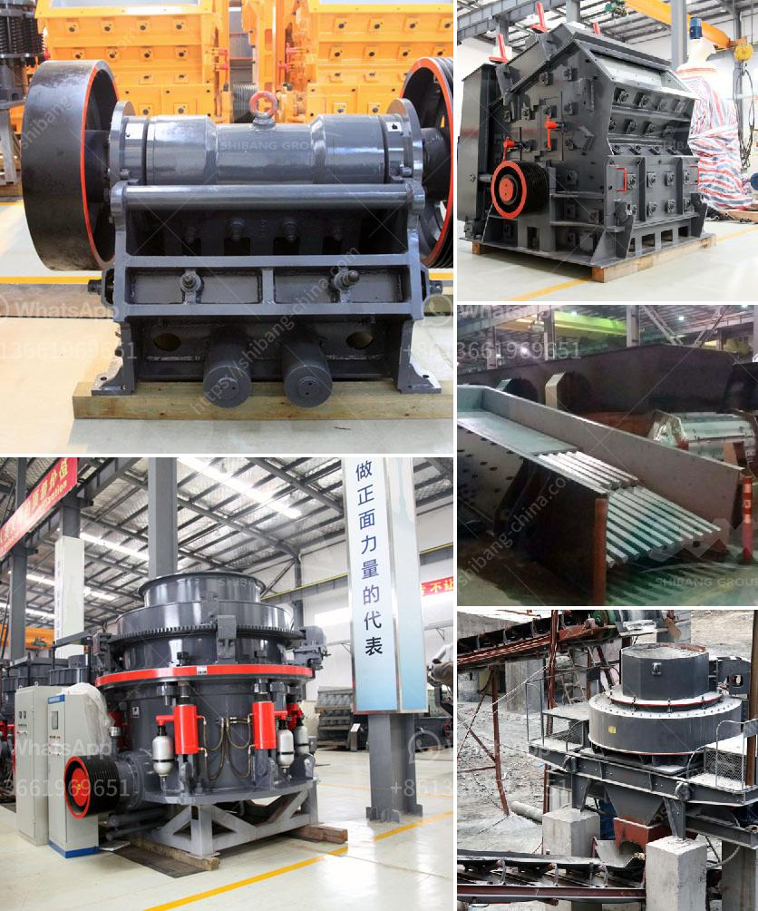

<h3>مصنع الإسمنت بسعة 100 طن في الهند</h3>
تعد صناعة الإسمنت من الصناعات الأساسية التي تلعب دورًا حيويًا في تطور اقتصاد البلدان، وتوفير فرص العمل، وتحسين البنية التحتية. ومن أبرز الدول المنتجة للإسمنت في العالم الهند، التي تقوم بتصنيع الكميات الهائلة من الإسمنت لتلبية احتياجات سوقها المحلية والعالمية.

يعتبر مصنع الإسمنت بسعة 100 طن في الهند من أكبر المصانع في البلاد، حيث يعمل بقدرة إنتاجية تصل إلى 100 طن يوميًا. يعتمد مصنع الإسمنت على تقنيات حديثة ومتقدمة في عملية التصنيع لضمان جودة المنتج النهائي وتوفير الكفاءة في العمل.

تتكون عملية تصنيع الإسمنت في المصنع من عدة خطوات رئيسية. يتم استخراج المواد الخام مثل الحجر الجيري والطين من المناجم، ثم يتم سحق وطحنها للحصول على مساحيق دقيقة. بعد ذلك، يتم خلط المسحوق مع الألواح المعدنية والمواد الأخرى لتحضير الخليط النهائي. يتم تسخين الخليط في أفران الإسمنت لدرجات حرارة عالية تصل إلى 1500 درجة مئوية، ويتم خبطه لتشكيل الكلنكر. يتم طحن الكلنكر وتغليفه للحصول على الإسمنت النهائي المستخدم في البناء.

إن إقامة مصنع الإسمنت بسعة 100 طن في الهند يعتبر استثمارًا رائعًا. حيث تحتوي الهند على أحد أكبر أسواق الإسمنت في العالم نظرًا لحاجتها المتزايدة إلى المواد الإنشائية لمواجهة التحديات العمرانية والتطور السكاني. كما أنها تمتلك قدرة لتلبية الطلب المحلي والتصدير للأسواق العالمية، مما يتيح فرص جيدة لتحقيق أرباح مالية مستقرة.

يعمل مصنع الإسمنت بسعة 100 طن على توفير فرص عمل للكثير من العاملين في هذه الصناعة. فالمصنع يحتاج إلى فريق مؤهل من العمال والفنيين لضمان سلامة وكفاءة عمل الآلات والمعدات. بالإضافة إلى ذلك، فإن مصنع الإسمنت يقدم نموذجًا للتنمية المستدامة، حيث يُعَد الإسمنت منتج أساسي للبناء والتشييد، ويسهم في تطوير البنية التحتية وتوفير الإسكان للسكان.

باختصار، مصنع الإسمنت بسعة 100 طن في الهند يمثل استثمارًا مجديًا نظرًا للطلب المتزايد على الإسمنت في الهند والأسواق العالمية. كما يعتبر مصدر عمل هام للعديد من العمال، فضلاً عن دوره في تطوير البنية التحتية وتحسين الاقتصاد المحلي والمستدامة.
<h3>Contact us</h3><ul><li><strong>Whatsapp:&nbsp;<a href="https://wa.me/8613661969651">+8613661969651</a></strong></li><li><a href="https://swt.shibang-china.com/?git&amp;zhl&amp;مصنع الإسمنت بسعة 100 طن في الهند"><strong>Online Service(chat now)</strong></a></li></ul><h3>Related</h3><ul><li><a href='سعر الكسارة بمقدار الطن في الساعة.md'>سعر الكسارة بمقدار الطن في الساعة</a></li><li><a href='كسارة هيدروليكية.md'>كسارة هيدروليكية</a></li><li><a href='كسارة الحجر وأسعارها.md'>كسارة الحجر وأسعارها</a></li><li><a href='سير الناقل في زامبيا.md'>سير الناقل في زامبيا</a></li><li><a href='كسارة الصخور بوسطن.md'>كسارة الصخور بوسطن</a></li></ul>