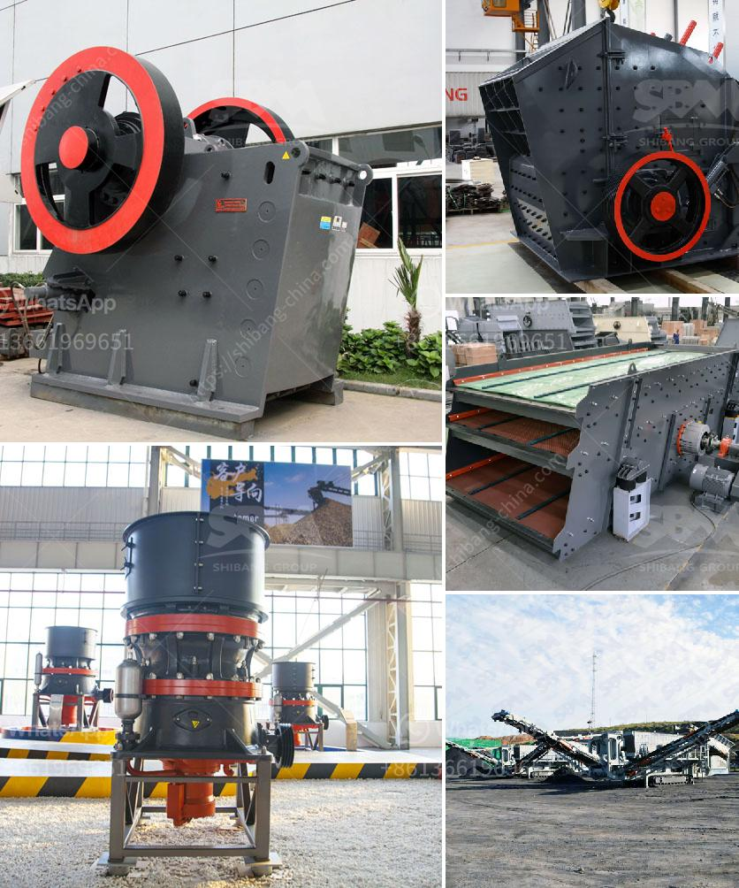

<h3>مصنع البنتونيت في الهند</h3>
تُعدّ الهند من بين الدول الرائدة في صناعة البنتونيت، حيث تحتوي على إحدى أكبر مناجم البنتونيت في العالم. يتم استخراج البنتونيت في الهند من موقع واحد رئيسي يقع في ولاية راجاستان، وهو يُعرف بمصنع البنتونيت.

يتمتع مصنع البنتونيت في الهند بسمعة عالمية عالية لجودة المنتجات التي يُنتجها. يتم استخراج البنتونيت من الطبقات الصخرية العميقة تحت الأرض، ويتم نقلها إلى المصنع لإجراء العمليات المعدنية عليها. يتم تكسير الصخور الخام وطحنها بدقة للحصول على البنتونيت في صورته المعدنية.

تستخدم صناعة البنتونيت في العديد من التطبيقات المختلفة، بدءًا من الصناعة البتروكيماوية حيث يُستخدم البنتونيت كعازل للطين أو كتساعد في عملية الحفر والاستخراج. كما يُستخدم البنتونيت في صناعة الأدوية ومستحضرات التجميل بوصفه مادة ممتازة لامتصاص الرطوبة وتجميل البشرة. يستخدم أيضًا البنتونيت في العديد من التطبيقات الزراعية، حيث يُضاف إلى التربة لتحسين خواص التربة ومحو الملوثات.

تحظى صناعة البنتونيت في الهند بتوافر موارد طبيعية غنية وعملية إنتاج متقدمة. يوفر هذا المصنع فرص عمل للعديد من السكان المحليين وتحسين الظروف المعيشية في المنطقة. يساهم النشاط المستمر لهذا المصنع في تعزيز الاقتصاد المحلي وزيادة الصادرات، وبالتالي يساهم في تنمية البنية التحتية الاقتصادية في الهند.

على الرغم من فوائد صناعة البنتونيت في الهند، إلا أن هناك أيضًا تحديات تواجه هذا القطاع. يواجه المصنع تحديات فيما يتعلق بالحصول على التراخيص والموافقات البيئية، بالإضافة إلى التحديات في إدارة المخلفات المتولدة من عملية الإنتاج.

في الختام، يُعتبر مصنع البنتونيت في الهند مرجعًا عالميًا في صناعة البنتونيت، حيث يُنتج منتجات عالية الجودة ومتميزة. تساهم هذه الصناعة في تطوير الاقتصاد المحلي وتوفير فرص العمل، مما يجعل الهند محطّة مهمة في سوق البنتونيت العالمي.
<h3>Contact us</h3><ul><li><strong>Whatsapp:&nbsp;<a href="https://wa.me/8613661969651">+8613661969651</a></strong></li><li><a href="https://swt.shibang-china.com/?git&amp;zhl&amp;مصنع البنتونيت في الهند"><strong>Online Service(chat now)</strong></a></li></ul><h3>Related</h3><ul><li><a href='كسارات الحجر المحمولة للبيع في جنوب أفريقيا.md'>كسارات الحجر المحمولة للبيع في جنوب أفريقيا</a></li><li><a href='مطحنة الكرات لكربونات الكالسيوم.md'>مطحنة الكرات لكربونات الكالسيوم</a></li><li><a href='كسارة الصخور الصين.md'>كسارة الصخور الصين</a></li><li><a href='محرك مطحنة الإسمنت للبيع في المملكة المتحدة.md'>محرك مطحنة الإسمنت للبيع في المملكة المتحدة</a></li><li><a href='كسارة VSI لسحق الرمل.md'>كسارة VSI لسحق الرمل</a></li></ul>